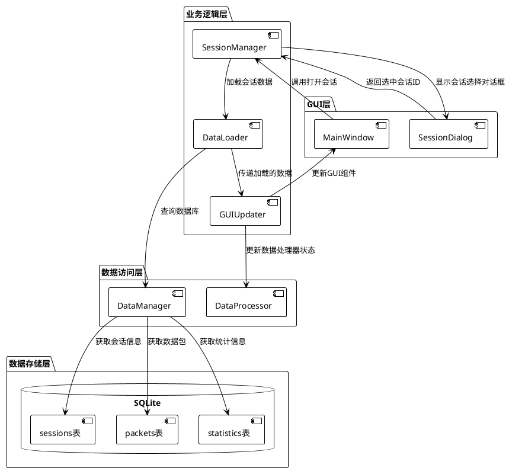
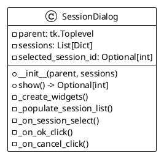
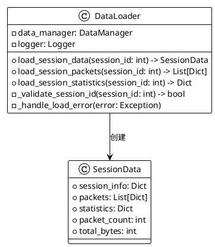
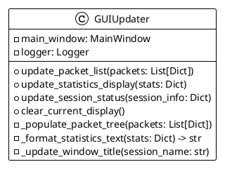
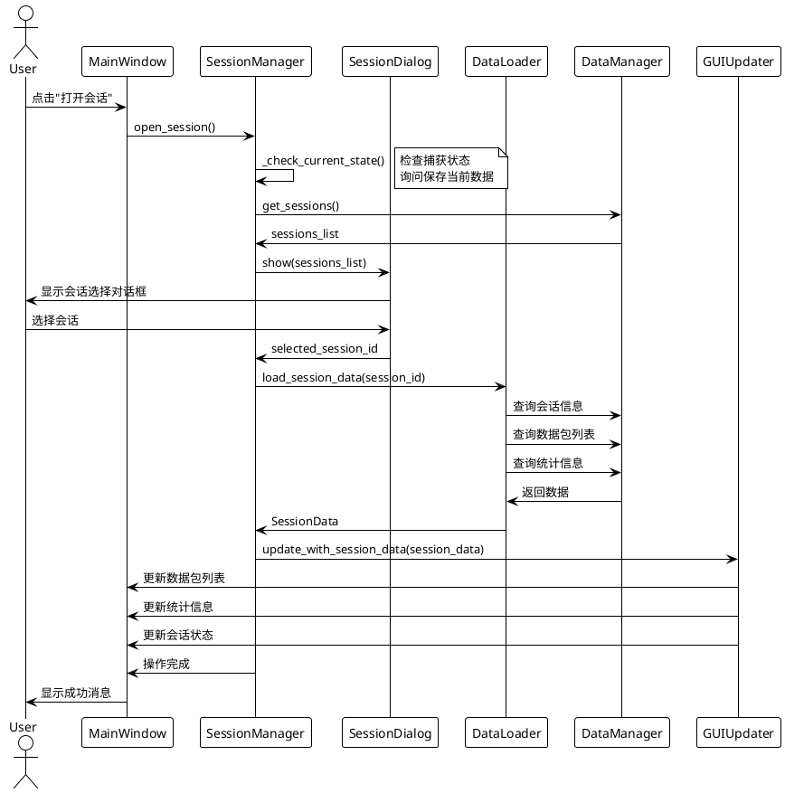
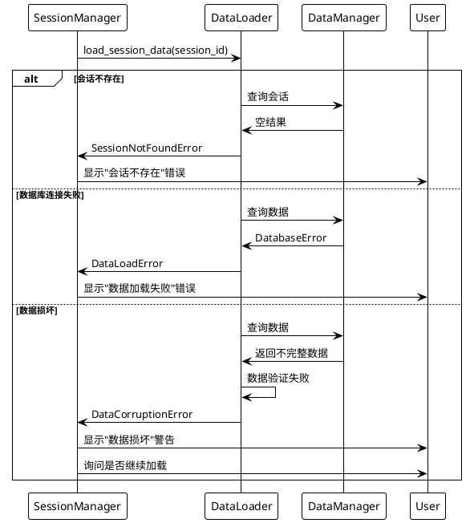
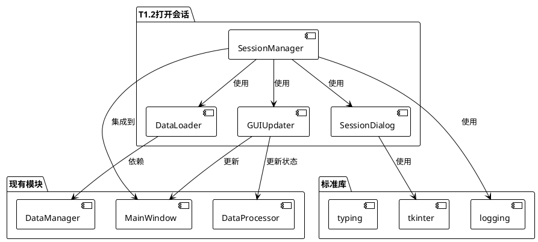

# T1.2 打开会话功能 - 架构设计文档

## 文档信息
- **任务**: T1.2 打开会话功能
- **阶段**: Architect (架构设计)
- **创建时间**: 2024-12-19
- **基于文档**: ALIGNMENT_T1.2打开会话.md

## 1. 整体架构设计

### 1.1 系统架构图



### 1.2 分层设计

#### GUI层 (Presentation Layer)
- **MainWindow**: 主窗口，提供用户交互入口
- **SessionDialog**: 会话选择对话框，显示会话列表

#### 业务逻辑层 (Business Logic Layer)
- **SessionManager**: 会话管理器，协调整个打开会话流程
- **DataLoader**: 数据加载器，负责从数据库加载会话相关数据
- **GUIUpdater**: GUI更新器，负责更新界面组件状态

#### 数据访问层 (Data Access Layer)
- **DataManager**: 数据管理器，提供数据库访问接口
- **DataProcessor**: 数据处理器，管理统计信息和状态

#### 数据存储层 (Data Storage Layer)
- **SQLite数据库**: 存储会话、数据包和统计信息

## 2. 核心组件设计

### 2.1 会话选择对话框 (SessionDialog)

#### 组件职责
- 显示历史会话列表
- 提供会话选择界面
- 支持取消操作

#### 设计规范


#### 界面布局
- 会话列表：显示会话名称、创建时间、数据包数量、总字节数
- 按钮区域：确定、取消按钮
- 排序方式：按创建时间倒序排列

### 2.2 数据加载器 (DataLoader)

#### 组件职责
- 根据会话ID加载相关数据
- 处理数据加载异常
- 提供加载进度反馈

#### 设计规范


### 2.3 GUI更新器 (GUIUpdater)

#### 组件职责
- 更新数据包列表显示
- 更新统计信息显示
- 更新会话状态和窗口标题
- 重置GUI组件状态

#### 设计规范


## 3. 接口契约定义

### 3.1 主要接口规范

#### SessionManager接口
```python
class SessionManager:
    def open_session(self) -> bool:
        """
        打开会话主流程
        
        Returns:
            bool: 操作成功返回True，失败或取消返回False
        """
        pass
    
    def _check_current_state(self) -> str:
        """
        检查当前状态
        
        Returns:
            str: 'continue' | 'cancel'
        """
        pass
    
    def _show_session_selection(self) -> Optional[int]:
        """
        显示会话选择对话框
        
        Returns:
            Optional[int]: 选中的会话ID，取消返回None
        """
        pass
```

#### DataLoader接口
```python
class DataLoader:
    def load_session_data(self, session_id: int) -> SessionData:
        """
        加载会话完整数据
        
        Args:
            session_id: 会话ID
            
        Returns:
            SessionData: 会话数据对象
            
        Raises:
            SessionNotFoundError: 会话不存在
            DataLoadError: 数据加载失败
        """
        pass
```

#### GUIUpdater接口
```python
class GUIUpdater:
    def update_with_session_data(self, session_data: SessionData) -> None:
        """
        使用会话数据更新GUI
        
        Args:
            session_data: 会话数据对象
        """
        pass
```

### 3.2 数据结构定义

#### SessionData数据结构
```python
@dataclass
class SessionData:
    session_info: Dict[str, Any]  # 会话基本信息
    packets: List[Dict[str, Any]]  # 数据包列表
    statistics: Dict[str, Any]     # 统计信息
    
    @property
    def session_id(self) -> int:
        return self.session_info['id']
    
    @property
    def session_name(self) -> str:
        return self.session_info['session_name']
    
    @property
    def packet_count(self) -> int:
        return len(self.packets)
```

## 4. 数据流向设计

### 4.1 主要数据流



### 4.2 异常处理流



## 5. 模块依赖关系

### 5.1 依赖关系图



### 5.2 集成点分析

#### 与MainWindow的集成
- **集成位置**: `main_window.py`中的`_open_session()`方法
- **集成方式**: 替换现有占位符实现
- **状态同步**: 更新`current_session_id`和`current_session_name`属性

#### 与DataManager的集成
- **使用接口**: `get_sessions()`, `get_packets()`, 现有统计查询方法
- **数据格式**: 复用现有数据结构，无需修改

#### 与DataProcessor的集成
- **状态更新**: 重置统计信息，更新当前会话状态
- **数据同步**: 确保统计信息与加载的数据一致

## 6. 性能和安全考虑

### 6.1 性能优化策略
- **数据分页**: 对于大量数据包，考虑分页加载
- **异步加载**: 使用后台线程加载数据，避免界面冻结
- **缓存机制**: 缓存会话列表，减少数据库查询

### 6.2 安全考虑
- **输入验证**: 验证会话ID的有效性
- **异常处理**: 完善的错误处理和用户提示
- **数据完整性**: 验证加载数据的完整性和一致性

## 7. 测试策略

### 7.1 单元测试覆盖
- SessionManager各方法的单元测试
- DataLoader数据加载逻辑测试
- GUIUpdater界面更新逻辑测试
- SessionDialog用户交互测试

### 7.2 集成测试
- 完整的打开会话流程测试
- 异常情况处理测试
- 与现有功能的兼容性测试

## 8. 下一步行动

### 8.1 进入Atomize阶段
- 基于此架构设计，拆分具体的原子任务
- 定义每个任务的输入输出契约
- 确定任务间的依赖关系

### 8.2 关键实现要点
- 优先实现SessionManager核心流程
- 重点关注与现有代码的集成
- 确保异常处理的完整性

---

**文档状态**: ✅ 架构设计完成  
**下一阶段**: Atomize - 原子任务拆分  
**预计完成时间**: 架构设计已完成，可进入下一阶段