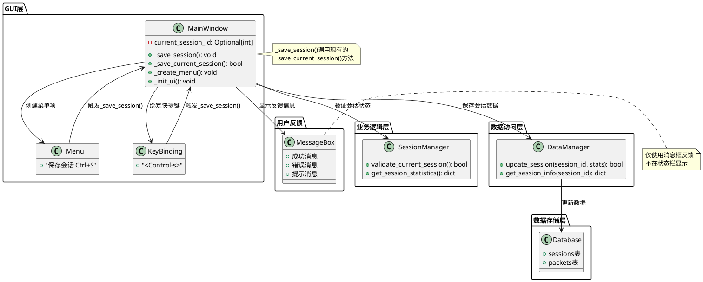
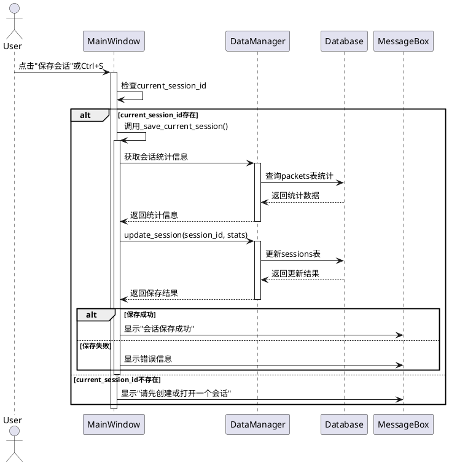

# T1.3 保存会话功能 - 架构设计文档

## 整体架构设计

### 系统架构图



### 核心组件设计

#### 1. MainWindow类修改

**现有方法增强:**
- `_save_session()`: 从占位符改为实际实现
- `_create_menu()`: 添加快捷键显示
- `_init_ui()`: 添加键盘绑定

**新增逻辑:**
- 会话状态检查
- 用户反馈处理
- 错误处理增强

#### 2. 菜单系统集成

**菜单项配置:**
```python
file_menu.add_command(
    label="保存会话", 
    command=self._save_session,
    accelerator="Ctrl+S"
)
```

**键盘绑定:**
```python
self.root.bind('<Control-s>', lambda e: self._save_session())
```

### 数据流向设计

#### 保存会话数据流



### 接口契约定义

#### 1. _save_session()方法接口

```python
def _save_session(self) -> None:
    """
    保存当前会话
    
    功能:
    - 检查当前会话状态
    - 调用现有的_save_current_session()方法
    - 提供用户反馈
    
    前置条件:
    - GUI已初始化
    - DataManager已创建
    
    后置条件:
    - 如有当前会话，则保存成功或显示错误
    - 如无当前会话，则显示提示信息
    
    异常处理:
    - 捕获所有异常并显示用户友好信息
    - 记录详细错误日志
    """
```

#### 2. 菜单配置接口

```python
# 在_create_menu()方法中添加
file_menu.add_command(
    label="保存会话", 
    command=self._save_session,
    accelerator="Ctrl+S"  # 显示快捷键提示
)
```

#### 3. 键盘绑定接口

```python
# 在_init_ui()方法中添加
self.root.bind('<Control-s>', lambda event: self._save_session())
```

### 异常处理策略

#### 异常分类和处理

1. **会话状态异常**
   - 无当前会话: 提示用户创建或打开会话
   - 会话ID无效: 显示错误并建议重新打开

2. **数据库异常**
   - 连接失败: 显示数据库连接错误
   - 更新失败: 显示保存失败信息

3. **系统异常**
   - 未知错误: 显示通用错误信息并记录日志

#### 错误信息设计

```python
ERROR_MESSAGES = {
    'no_session': '请先创建或打开一个会话',
    'save_failed': '保存会话失败，请检查数据库连接',
    'unknown_error': '保存过程中发生未知错误，请查看日志'
}

SUCCESS_MESSAGES = {
    'save_success': '会话保存成功'
}
```

### 性能考虑

#### 响应时间要求
- 菜单点击响应: < 100ms
- 保存操作完成: < 1s
- 错误提示显示: < 200ms

#### 资源使用
- 不增加内存占用
- 复用现有数据库连接
- 最小化UI阻塞时间

### 兼容性设计

#### 向后兼容
- 不修改现有API
- 不改变现有行为
- 保持现有快捷键不冲突

#### 向前扩展
- 预留自动保存功能接口
- 支持未来的保存选项扩展
- 保持代码结构清晰

---

**文档创建时间**: 2024-12-19  
**状态**: 架构设计完成  
**下一阶段**: Atomize（任务原子化）