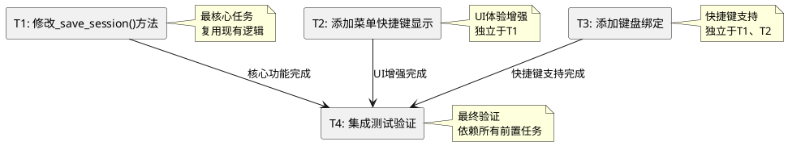

# T1.3 保存会话功能 - 任务拆分文档

## 任务依赖关系图

## 原子任务详细定义

### T1: 修改_save_session()方法实现

#### 输入契约
- **前置依赖**: 无（基于现有代码）
- **输入数据**: 无（使用实例变量）
- **环境依赖**: 
  - MainWindow实例已初始化
  - DataManager实例可用
  - current_session_id状态可访问

#### 输出契约
- **输出数据**: 无（方法无返回值）
- **交付物**: 修改后的`_save_session()`方法
- **验收标准**:
  1. 方法能正确检查会话状态
  2. 无会话时显示提示"请先创建或打开一个会话"
  3. 有会话时调用`_save_current_session()`
  4. 根据保存结果显示相应消息
  5. 异常处理完善，不会导致程序崩溃

#### 实现约束
- **技术栈**: Python + Tkinter
- **接口规范**: 保持方法签名不变 `def _save_session(self) -> None`
- **质量要求**: 
  - 复用现有`_save_current_session()`方法
  - 遵循现有代码风格
  - 添加适当的日志记录
  - 异常处理完善

#### 依赖关系
- **后置任务**: T4（集成测试验证）
- **并行任务**: T2、T3（可同时进行）

---

### T2: 添加菜单快捷键显示

#### 输入契约
- **前置依赖**: 无（基于现有菜单结构）
- **输入数据**: 无
- **环境依赖**: 
  - `_create_menu()`方法存在
  - 文件菜单已创建

#### 输出契约
- **输出数据**: 无
- **交付物**: 修改后的菜单创建代码
- **验收标准**:
  1. "保存会话"菜单项显示"Ctrl+S"快捷键提示
  2. 菜单外观与其他菜单项一致
  3. 不影响现有菜单功能

#### 实现约束
- **技术栈**: Tkinter Menu组件
- **接口规范**: 在现有菜单项添加`accelerator="Ctrl+S"`参数
- **质量要求**: 
  - 保持菜单布局一致性
  - 不破坏现有菜单功能

#### 依赖关系
- **后置任务**: T4（集成测试验证）
- **并行任务**: T1、T3（可同时进行）

---

### T3: 添加键盘绑定

#### 输入契约
- **前置依赖**: 无（基于现有UI初始化）
- **输入数据**: 无
- **环境依赖**: 
  - `_init_ui()`方法存在
  - root窗口已创建

#### 输出契约
- **输出数据**: 无
- **交付物**: 修改后的UI初始化代码
- **验收标准**:
  1. Ctrl+S快捷键能触发保存功能
  2. 快捷键不与现有快捷键冲突
  3. 在各种窗口状态下都能正常工作

#### 实现约束
- **技术栈**: Tkinter事件绑定
- **接口规范**: 使用`self.root.bind('<Control-s>', callback)`
- **质量要求**: 
  - 事件处理函数正确
  - 不影响现有键盘绑定

#### 依赖关系
- **后置任务**: T4（集成测试验证）
- **并行任务**: T1、T2（可同时进行）

---

### T4: 集成测试验证

#### 输入契约
- **前置依赖**: T1、T2、T3全部完成
- **输入数据**: 完整的修改后代码
- **环境依赖**: 
  - 完整的应用程序环境
  - 测试数据库可用

#### 输出契约
- **输出数据**: 测试结果报告
- **交付物**: 
  - 验证通过的功能
  - 测试用例执行结果
  - 问题修复记录（如有）
- **验收标准**:
  1. 所有功能测试用例通过
  2. 用户体验符合预期
  3. 性能满足要求（响应时间< 1s）
  4. 异常情况处理正确

#### 实现约束
- **技术栈**: 手动测试 + 自动化测试
- **接口规范**: 按照验收标准执行测试
- **质量要求**: 
  - 覆盖所有使用场景
  - 验证边界条件
  - 确保向后兼容

#### 依赖关系
- **后置任务**: 无（最终任务）
- **并行任务**: 无

## 测试用例设计

### 功能测试用例

#### TC1: 有当前会话时保存
- **前置条件**: 已创建或打开一个会话
- **操作步骤**: 点击"文件 -> 保存会话"
- **预期结果**: 显示"会话保存成功"消息

#### TC2: 无当前会话时保存
- **前置条件**: 没有当前会话
- **操作步骤**: 点击"文件 -> 保存会话"
- **预期结果**: 显示"请先创建或打开一个会话"消息

#### TC3: 快捷键保存（有会话）
- **前置条件**: 已创建或打开一个会话
- **操作步骤**: 按Ctrl+S
- **预期结果**: 显示"会话保存成功"消息

#### TC4: 快捷键保存（无会话）
- **前置条件**: 没有当前会话
- **操作步骤**: 按Ctrl+S
- **预期结果**: 显示"请先创建或打开一个会话"消息

#### TC5: 菜单显示验证
- **前置条件**: 应用程序启动
- **操作步骤**: 打开"文件"菜单
- **预期结果**: "保存会话"项显示"Ctrl+S"快捷键提示

### 异常测试用例

#### TC6: 数据库连接异常
- **前置条件**: 数据库不可用
- **操作步骤**: 尝试保存会话
- **预期结果**: 显示数据库错误信息，不崩溃

#### TC7: 会话数据异常
- **前置条件**: 会话ID存在但数据异常
- **操作步骤**: 尝试保存会话
- **预期结果**: 显示保存失败信息，记录错误日志

## 风险评估和应对策略

### 技术风险
1. **现有功能破坏**: 低风险
   - **应对**: 充分测试现有功能
   - **验证**: 回归测试

2. **快捷键冲突**: 低风险
   - **应对**: 检查现有快捷键绑定
   - **验证**: 快捷键功能测试

### 时间风险
1. **开发时间**: 预估2小时，风险低
2. **测试时间**: 预估1小时，风险低

---

**文档创建时间**: 2024-12-19  
**状态**: 任务拆分完成  
**下一阶段**: Approve（审批确认）