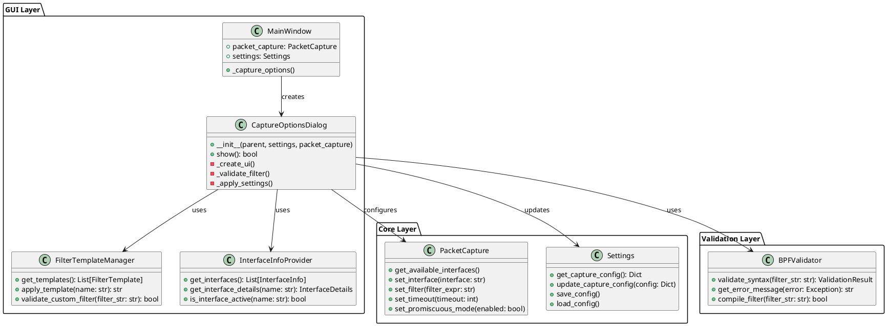
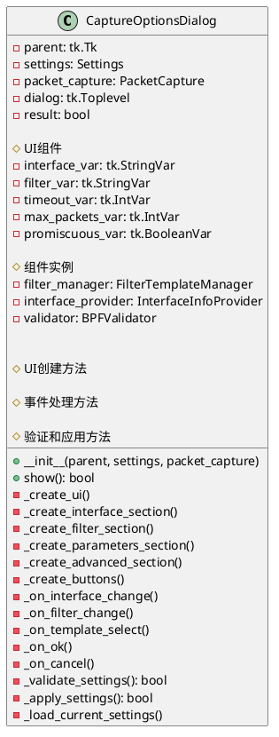
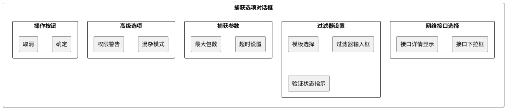
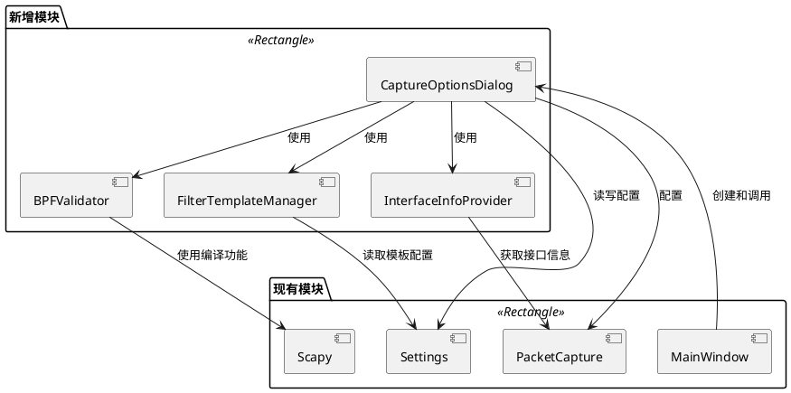
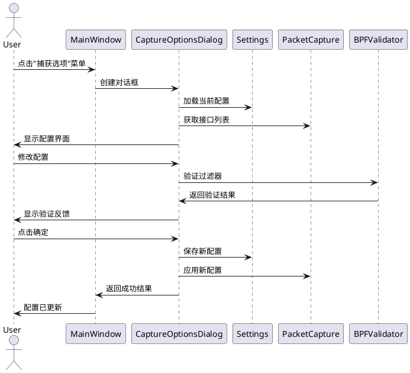

# 捕获选项功能 - 架构设计文档 (DESIGN)

## 项目信息
- **任务名称**: 捕获选项功能
- **创建时间**: 2025-01-27
- **阶段**: Architect - 架构设计
- **状态**: 设计中

## 1. 整体架构图



## 2. 分层设计

### 2.1 GUI层 (Presentation Layer)
**职责**: 用户界面展示和交互处理

#### CaptureOptionsDialog
- **功能**: 主对话框，协调各个组件
- **输入**: Settings配置、PacketCapture实例
- **输出**: 更新后的配置
- **关键方法**:
  - `show()`: 显示对话框并返回结果
  - `_create_ui()`: 创建界面组件
  - `_validate_and_apply()`: 验证并应用设置

#### FilterTemplateManager
- **功能**: 管理预定义过滤器模板
- **数据源**: 内置模板 + 用户自定义
- **关键功能**:
  - 提供常用过滤器模板
  - 支持模板分类（协议、端口、主机等）
  - 模板应用和自定义

#### InterfaceInfoProvider
- **功能**: 提供网络接口详细信息
- **数据源**: 系统网络接口
- **关键功能**:
  - 获取接口列表和状态
  - 显示IP地址、MAC地址等详细信息
  - 检测接口活跃状态

### 2.2 验证层 (Validation Layer)
**职责**: 输入验证和语法检查

#### BPFValidator
- **功能**: BPF过滤器语法验证
- **实现**: 基于Scapy的compile_filter
- **关键功能**:
  - 实时语法检查
  - 错误信息提取和友好化
  - 过滤器编译测试

### 2.3 核心层 (Core Layer)
**职责**: 业务逻辑和数据管理

#### PacketCapture (现有)
- **扩展功能**: 配置接口增强
- **新增方法**: 配置验证和状态查询

#### Settings (现有)
- **扩展功能**: 捕获配置管理
- **新增配置项**: 模板、验证选项等

## 3. 核心组件设计

### 3.1 CaptureOptionsDialog 详细设计



### 3.2 界面布局设计



## 4. 模块依赖关系图



## 5. 数据流向图



## 6. 接口契约定义

### 6.1 CaptureOptionsDialog接口

```python
class CaptureOptionsDialog:
    def __init__(self, parent: tk.Tk, settings: Settings, packet_capture: PacketCapture):
        """
        初始化捕获选项对话框
        
        Args:
            parent: 父窗口
            settings: 设置管理器
            packet_capture: 包捕获器实例
        """
        pass
    
    def show(self) -> bool:
        """
        显示对话框
        
        Returns:
            bool: True表示用户确认并应用了设置，False表示取消
        """
        pass
```

### 6.2 FilterTemplateManager接口

```python
class FilterTemplateManager:
    def get_templates(self) -> List[Dict[str, str]]:
        """
        获取所有过滤器模板
        
        Returns:
            List[Dict]: 模板列表，每个模板包含name和filter字段
        """
        pass
    
    def validate_filter(self, filter_str: str) -> Tuple[bool, str]:
        """
        验证过滤器语法
        
        Args:
            filter_str: 过滤器字符串
            
        Returns:
            Tuple[bool, str]: (是否有效, 错误信息)
        """
        pass
```

### 6.3 InterfaceInfoProvider接口

```python
class InterfaceInfoProvider:
    def get_interfaces(self) -> List[Dict[str, Any]]:
        """
        获取网络接口列表
        
        Returns:
            List[Dict]: 接口信息列表
        """
        pass
    
    def get_interface_details(self, interface_name: str) -> Dict[str, Any]:
        """
        获取指定接口的详细信息
        
        Args:
            interface_name: 接口名称
            
        Returns:
            Dict: 接口详细信息
        """
        pass
```

## 7. 异常处理策略

### 7.1 异常分类
- **用户输入异常**: 无效的过滤器语法、超出范围的参数
- **系统异常**: 网络接口不可用、权限不足
- **配置异常**: 配置文件损坏、设置冲突

### 7.2 处理策略
- **输入验证**: 实时验证用户输入，提供即时反馈
- **优雅降级**: 接口不可用时提供备选方案
- **错误恢复**: 配置异常时恢复默认设置
- **用户提示**: 友好的错误信息和解决建议

## 8. 性能考虑

### 8.1 响应时间要求
- 界面打开: < 200ms
- 过滤器验证: < 100ms
- 接口信息获取: < 500ms
- 配置保存: < 50ms

### 8.2 优化策略
- **延迟加载**: 接口详细信息按需获取
- **缓存机制**: 缓存接口信息和验证结果
- **异步处理**: 耗时操作使用后台线程
- **批量操作**: 配置更新批量提交

## 9. 安全考虑

### 9.1 权限管理
- 混杂模式需要管理员权限
- 敏感配置加密存储
- 输入参数严格验证

### 9.2 安全措施
- BPF过滤器语法检查防止注入
- 接口访问权限验证
- 配置文件完整性检查

## 质量门控

- [x] 架构图清晰准确
- [x] 接口定义完整
- [x] 与现有系统无冲突
- [x] 设计可行性验证
- [x] 性能和安全考虑充分

**下一步**: 进入原子化任务拆分阶段 (Atomize)