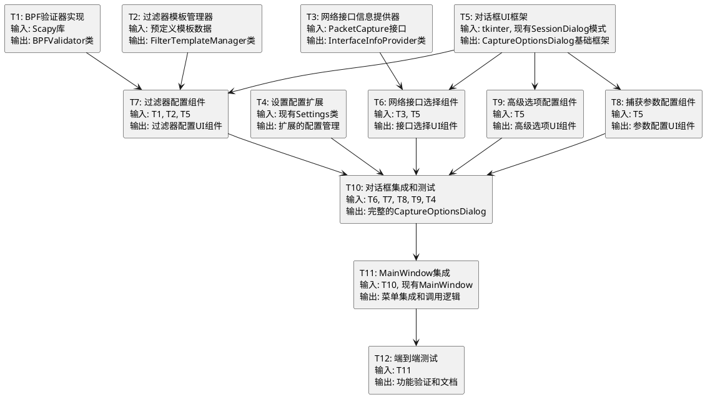

# 捕获选项功能 - 原子任务拆分 (TASK)

## 项目信息
- **任务名称**: 捕获选项功能
- **创建时间**: 2025-01-27
- **阶段**: Atomize - 原子任务拆分
- **状态**: 任务规划中

## 任务依赖关系图



## 原子任务详细定义

### T1: BPF验证器实现
**复杂度**: 中等 | **预估时间**: 2小时 | **优先级**: 高

#### 输入契约
- **前置依赖**: 无
- **输入数据**: BPF过滤器字符串
- **环境依赖**: Scapy库已安装

#### 输出契约
- **输出数据**: 验证结果(bool)和错误信息(str)
- **交付物**: `src/network_analyzer/gui/validators.py`
- **验收标准**: 
  - 能正确验证有效的BPF语法
  - 能识别无效语法并返回友好错误信息
  - 支持常见过滤器语法(tcp, udp, host, port等)

#### 实现约束
- **技术栈**: Python 3.x + Scapy
- **接口规范**: 
  ```python
  class BPFValidator:
      def validate_filter(self, filter_str: str) -> Tuple[bool, str]
      def compile_filter(self, filter_str: str) -> bool
  ```
- **质量要求**: 单元测试覆盖率 > 80%

---

### T2: 过滤器模板管理器
**复杂度**: 简单 | **预估时间**: 1.5小时 | **优先级**: 中

#### 输入契约
- **前置依赖**: 无
- **输入数据**: 预定义模板配置
- **环境依赖**: 无特殊依赖

#### 输出契约
- **输出数据**: 模板列表和应用功能
- **交付物**: `src/network_analyzer/gui/filter_templates.py`
- **验收标准**:
  - 提供至少10个常用过滤器模板
  - 支持模板分类(协议、端口、主机等)
  - 支持模板应用到输入框

#### 实现约束
- **技术栈**: Python 3.x
- **接口规范**:
  ```python
  class FilterTemplateManager:
      def get_templates(self) -> List[Dict[str, str]]
      def get_categories(self) -> List[str]
      def apply_template(self, template_name: str) -> str
  ```
- **质量要求**: 模板数据结构清晰，易于扩展

---

### T3: 网络接口信息提供器
**复杂度**: 中等 | **预估时间**: 2小时 | **优先级**: 高

#### 输入契约
- **前置依赖**: 现有PacketCapture类
- **输入数据**: 系统网络接口
- **环境依赖**: 网络接口访问权限

#### 输出契约
- **输出数据**: 接口列表和详细信息
- **交付物**: `src/network_analyzer/gui/interface_info.py`
- **验收标准**:
  - 获取所有可用网络接口
  - 显示接口状态(活跃/非活跃)
  - 提供IP地址、MAC地址等详细信息

#### 实现约束
- **技术栈**: Python 3.x + 现有PacketCapture
- **接口规范**:
  ```python
  class InterfaceInfoProvider:
      def get_interfaces(self) -> List[Dict[str, Any]]
      def get_interface_details(self, name: str) -> Dict[str, Any]
      def is_interface_active(self, name: str) -> bool
  ```
- **质量要求**: 异常处理完善，权限不足时优雅降级

---

### T4: 设置配置扩展
**复杂度**: 简单 | **预估时间**: 1小时 | **优先级**: 中

#### 输入契约
- **前置依赖**: 现有Settings类
- **输入数据**: 捕获配置参数
- **环境依赖**: 配置文件读写权限

#### 输出契约
- **输出数据**: 扩展的配置管理功能
- **交付物**: 修改现有`src/network_analyzer/core/settings.py`
- **验收标准**:
  - 支持捕获选项配置的保存和加载
  - 配置项包括接口、过滤器、参数等
  - 向后兼容现有配置格式

#### 实现约束
- **技术栈**: Python 3.x + JSON
- **接口规范**: 扩展现有Settings类方法
- **质量要求**: 不破坏现有功能，配置迁移平滑

---

### T5: 对话框UI框架
**复杂度**: 中等 | **预估时间**: 2.5小时 | **优先级**: 高

#### 输入契约
- **前置依赖**: 现有SessionDialog设计模式
- **输入数据**: 父窗口、Settings、PacketCapture实例
- **环境依赖**: tkinter GUI环境

#### 输出契约
- **输出数据**: 对话框基础框架
- **交付物**: `src/network_analyzer/gui/capture_options_dialog.py`(框架部分)
- **验收标准**:
  - 对话框能正常显示和关闭
  - 实现基本的确定/取消逻辑
  - 遵循现有SessionDialog的设计模式

#### 实现约束
- **技术栈**: Python 3.x + tkinter/ttk
- **接口规范**: 
  ```python
  class CaptureOptionsDialog:
      def __init__(self, parent, settings, packet_capture)
      def show(self) -> bool
  ```
- **质量要求**: UI布局合理，响应式设计

---

### T6: 网络接口选择组件
**复杂度**: 中等 | **预估时间**: 2小时 | **优先级**: 高

#### 输入契约
- **前置依赖**: T3(InterfaceInfoProvider), T5(对话框框架)
- **输入数据**: 接口列表和详细信息
- **环境依赖**: GUI环境

#### 输出契约
- **输出数据**: 接口选择UI组件
- **交付物**: T5文件中的接口选择部分
- **验收标准**:
  - 下拉框显示所有可用接口
  - 显示接口详细信息(IP、MAC、状态)
  - 支持接口状态实时更新

#### 实现约束
- **技术栈**: tkinter/ttk
- **接口规范**: 集成到CaptureOptionsDialog中
- **质量要求**: 信息显示清晰，交互流畅

---

### T7: 过滤器配置组件
**复杂度**: 高 | **预估时间**: 3小时 | **优先级**: 高

#### 输入契约
- **前置依赖**: T1(BPFValidator), T2(FilterTemplateManager), T5(对话框框架)
- **输入数据**: 过滤器模板和验证功能
- **环境依赖**: GUI环境

#### 输出契约
- **输出数据**: 过滤器配置UI组件
- **交付物**: T5文件中的过滤器配置部分
- **验收标准**:
  - 模板下拉框和应用功能
  - 过滤器输入框和实时验证
  - 验证状态指示器(绿色/红色/警告)

#### 实现约束
- **技术栈**: tkinter/ttk
- **接口规范**: 集成到CaptureOptionsDialog中
- **质量要求**: 实时验证响应快速(<100ms)，错误提示友好

---

### T8: 捕获参数配置组件
**复杂度**: 简单 | **预估时间**: 1小时 | **优先级**: 中

#### 输入契约
- **前置依赖**: T5(对话框框架)
- **输入数据**: 参数配置选项
- **环境依赖**: GUI环境

#### 输出契约
- **输出数据**: 参数配置UI组件
- **交付物**: T5文件中的参数配置部分
- **验收标准**:
  - 超时时间设置(数字输入框)
  - 最大包数设置(数字输入框)
  - 参数验证和范围检查

#### 实现约束
- **技术栈**: tkinter/ttk
- **接口规范**: 集成到CaptureOptionsDialog中
- **质量要求**: 输入验证完善，用户体验友好

---

### T9: 高级选项配置组件
**复杂度**: 中等 | **预估时间**: 1.5小时 | **优先级**: 中

#### 输入契约
- **前置依赖**: T5(对话框框架)
- **输入数据**: 高级选项配置
- **环境依赖**: GUI环境

#### 输出契约
- **输出数据**: 高级选项UI组件
- **交付物**: T5文件中的高级选项部分
- **验收标准**:
  - 混杂模式复选框
  - 权限警告提示
  - 高级选项说明文本

#### 实现约束
- **技术栈**: tkinter/ttk
- **接口规范**: 集成到CaptureOptionsDialog中
- **质量要求**: 警告信息清晰，安全提示到位

---

### T10: 对话框集成和测试
**复杂度**: 中等 | **预估时间**: 2小时 | **优先级**: 高

#### 输入契约
- **前置依赖**: T6, T7, T8, T9(所有UI组件), T4(配置扩展)
- **输入数据**: 所有UI组件和配置功能
- **环境依赖**: 完整的开发环境

#### 输出契约
- **输出数据**: 完整的CaptureOptionsDialog
- **交付物**: 完整的`capture_options_dialog.py`
- **验收标准**:
  - 所有组件正确集成
  - 配置保存和加载功能正常
  - 对话框逻辑完整(确定/取消)

#### 实现约束
- **技术栈**: 集成所有前置任务的技术栈
- **接口规范**: 完整的CaptureOptionsDialog类
- **质量要求**: 集成测试通过，无明显bug

---

### T11: MainWindow集成
**复杂度**: 简单 | **预估时间**: 1小时 | **优先级**: 高

#### 输入契约
- **前置依赖**: T10(完整对话框), 现有MainWindow
- **输入数据**: CaptureOptionsDialog类
- **环境依赖**: 现有GUI环境

#### 输出契约
- **输出数据**: 集成的主窗口功能
- **交付物**: 修改现有`main_window.py`
- **验收标准**:
  - 菜单项"捕获选项"可点击
  - 对话框能正确打开和关闭
  - 配置更新能反映到捕获功能

#### 实现约束
- **技术栈**: 现有MainWindow技术栈
- **接口规范**: 遵循现有菜单处理模式
- **质量要求**: 不影响现有功能，集成无缝

---

### T12: 端到端测试
**复杂度**: 中等 | **预估时间**: 2小时 | **优先级**: 中

#### 输入契约
- **前置依赖**: T11(完整集成)
- **输入数据**: 完整的功能实现
- **环境依赖**: 测试环境和网络接口

#### 输出契约
- **输出数据**: 测试报告和验证文档
- **交付物**: 测试用例和验证报告
- **验收标准**:
  - 所有功能点测试通过
  - 异常情况处理正确
  - 用户体验流畅

#### 实现约束
- **技术栈**: Python测试框架
- **接口规范**: 完整的功能测试
- **质量要求**: 测试覆盖率 > 90%，无严重bug

## 任务执行顺序

### 第一批 (并行执行)
- T1: BPF验证器实现
- T2: 过滤器模板管理器  
- T3: 网络接口信息提供器
- T4: 设置配置扩展

### 第二批 (依赖第一批)
- T5: 对话框UI框架

### 第三批 (依赖T5，可并行)
- T6: 网络接口选择组件
- T7: 过滤器配置组件
- T8: 捕获参数配置组件
- T9: 高级选项配置组件

### 第四批 (集成阶段)
- T10: 对话框集成和测试
- T11: MainWindow集成
- T12: 端到端测试

## 风险评估

### 高风险任务
- **T7: 过滤器配置组件** - 复杂度高，实时验证技术挑战
- **T1: BPF验证器实现** - 依赖Scapy，可能有兼容性问题

### 中风险任务
- **T3: 网络接口信息提供器** - 权限和系统兼容性问题
- **T10: 对话框集成和测试** - 多组件集成复杂度

### 低风险任务
- **T2, T4, T8** - 相对简单，技术成熟

## 质量门控

- [x] 任务覆盖完整需求
- [x] 依赖关系无循环  
- [x] 每个任务都可独立验证
- [x] 复杂度评估合理
- [x] 风险识别充分

**总预估时间**: 20小时
**关键路径**: T1→T7→T10→T11→T12

**下一步**: 进入审批阶段 (Approve)