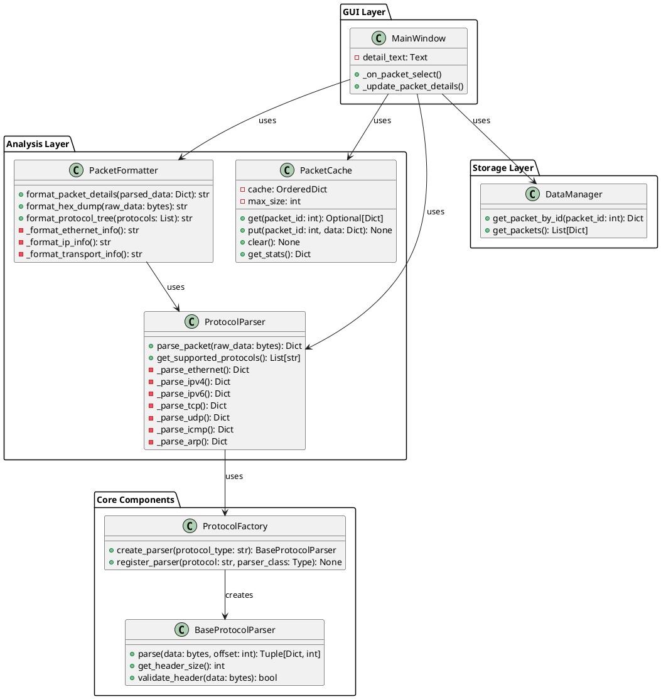
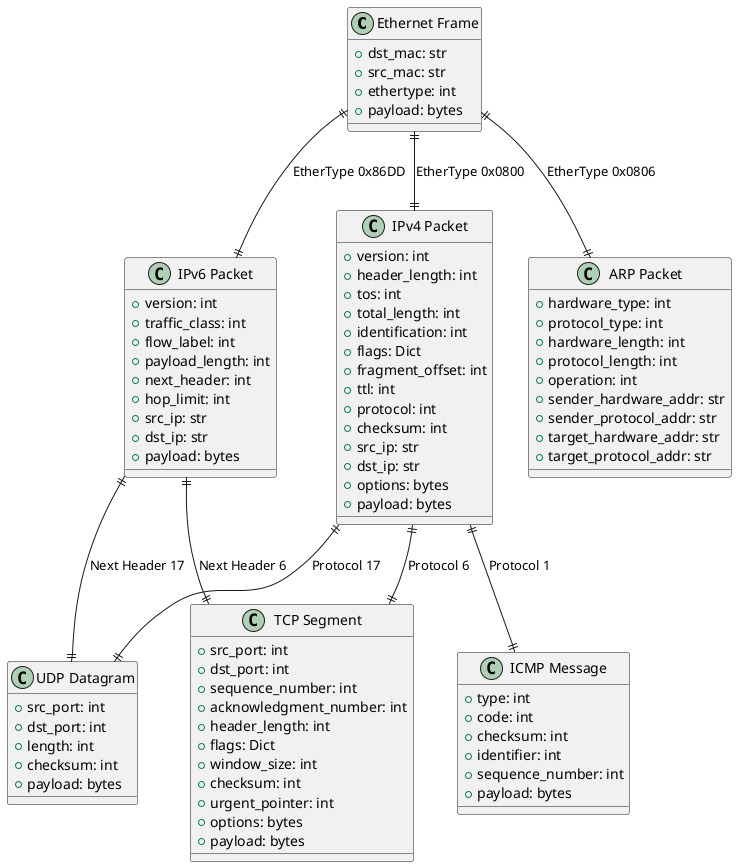
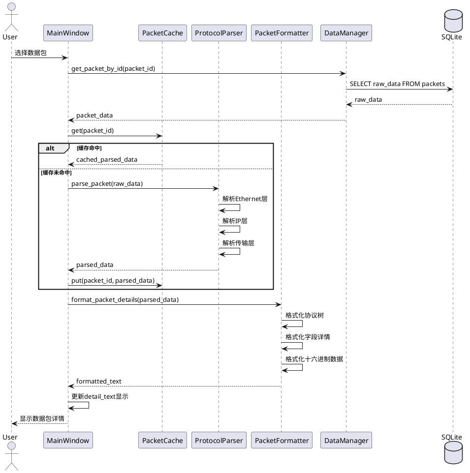
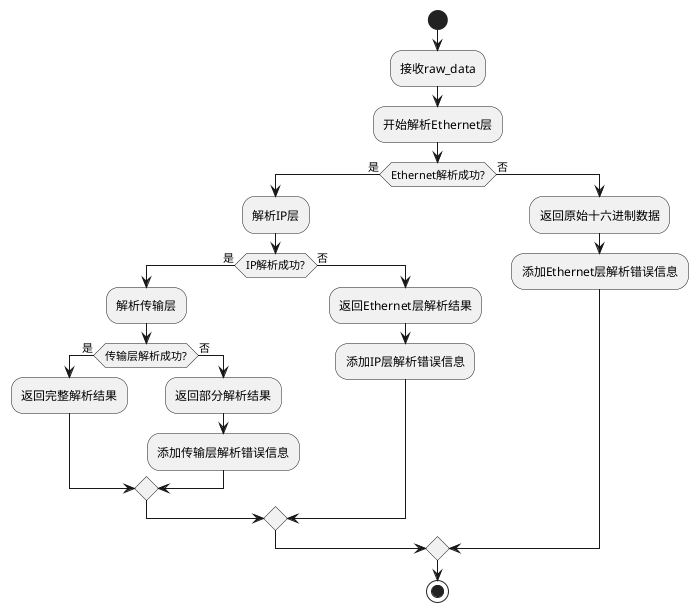

# 数据包详情显示功能 - 系统架构设计

## 1. 整体架构图



## 2. 分层设计

### 2.1 GUI层 (Presentation Layer)
- **职责**: 用户界面交互，数据包选择事件处理
- **核心组件**: MainWindow
- **主要功能**: 
  - 处理数据包选择事件
  - 调用分析层组件
  - 更新详情显示区域

### 2.2 分析层 (Analysis Layer)
- **职责**: 协议解析、数据格式化、缓存管理
- **核心组件**: ProtocolParser, PacketFormatter, PacketCache
- **主要功能**:
  - 二进制数据包解析
  - 协议层次分析
  - 格式化显示文本生成
  - 解析结果缓存

### 2.3 存储层 (Storage Layer)
- **职责**: 数据持久化和检索
- **核心组件**: DataManager (现有)
- **主要功能**: 数据包数据获取

## 3. 核心组件设计

### 3.1 ProtocolParser (协议解析器)

```python
class ProtocolParser:
    """核心协议解析器，负责解析网络数据包的各层协议"""
    
    def __init__(self):
        self.factory = ProtocolFactory()
        self._register_default_parsers()
    
    def parse_packet(self, raw_data: bytes) -> Dict[str, Any]:
        """
        解析数据包，返回协议层次信息
        
        Args:
            raw_data: 原始数据包字节数据
            
        Returns:
            Dict包含:
            - protocols: 协议栈列表 ['Ethernet', 'IPv4', 'TCP']
            - layers: 各层解析结果
            - raw_data: 原始数据
            - parse_time: 解析时间戳
        """
        
    def get_supported_protocols(self) -> List[str]:
        """返回支持的协议列表"""
```

### 3.2 PacketFormatter (格式化器)

```python
class PacketFormatter:
    """数据包详情格式化器，生成用户友好的显示文本"""
    
    def format_packet_details(self, parsed_data: Dict[str, Any]) -> str:
        """
        格式化数据包详情为显示文本
        
        Args:
            parsed_data: ProtocolParser解析结果
            
        Returns:
            格式化的显示文本，包含:
            - 协议层次树
            - 各层字段详情
            - 十六进制数据
        """
        
    def format_hex_dump(self, raw_data: bytes, bytes_per_line: int = 16) -> str:
        """格式化十六进制数据显示"""
        
    def format_protocol_tree(self, protocols: List[str]) -> str:
        """格式化协议栈树形显示"""
```

### 3.3 PacketCache (缓存管理器)

```python
class PacketCache:
    """LRU缓存管理器，缓存已解析的数据包信息"""
    
    def __init__(self, max_size: int = 100):
        self.cache = OrderedDict()
        self.max_size = max_size
        self.hit_count = 0
        self.miss_count = 0
    
    def get(self, packet_id: int) -> Optional[Dict[str, Any]]:
        """获取缓存的解析结果"""
        
    def put(self, packet_id: int, data: Dict[str, Any]) -> None:
        """存储解析结果到缓存"""
        
    def get_stats(self) -> Dict[str, Any]:
        """获取缓存统计信息"""
```

## 4. 协议解析层次结构



## 5. 数据流向图



## 6. 接口契约定义

### 6.1 ProtocolParser接口

```python
class IProtocolParser(ABC):
    @abstractmethod
    def parse_packet(self, raw_data: bytes) -> Dict[str, Any]:
        """解析数据包，返回协议层次信息"""
        pass
    
    @abstractmethod
    def get_supported_protocols(self) -> List[str]:
        """获取支持的协议列表"""
        pass
```

### 6.2 PacketFormatter接口

```python
class IPacketFormatter(ABC):
    @abstractmethod
    def format_packet_details(self, parsed_data: Dict[str, Any]) -> str:
        """格式化数据包详情"""
        pass
    
    @abstractmethod
    def format_hex_dump(self, raw_data: bytes) -> str:
        """格式化十六进制显示"""
        pass
```

### 6.3 数据结构定义

```python
# 解析结果数据结构
ParsedPacketData = TypedDict('ParsedPacketData', {
    'packet_id': int,
    'protocols': List[str],  # ['Ethernet', 'IPv4', 'TCP']
    'layers': Dict[str, Dict[str, Any]],  # 各层解析结果
    'raw_data': bytes,
    'parse_time': float,
    'total_size': int,
    'error': Optional[str]
})

# 协议层数据结构
ProtocolLayerData = TypedDict('ProtocolLayerData', {
    'protocol': str,
    'header_size': int,
    'payload_size': int,
    'fields': Dict[str, Any],
    'raw_header': bytes,
    'raw_payload': bytes
})
```

## 7. 异常处理策略

### 7.1 解析异常处理



### 7.2 错误类型定义

```python
class PacketParseError(Exception):
    """数据包解析异常基类"""
    pass

class InvalidPacketFormatError(PacketParseError):
    """无效的数据包格式"""
    pass

class UnsupportedProtocolError(PacketParseError):
    """不支持的协议类型"""
    pass

class InsufficientDataError(PacketParseError):
    """数据不足，无法完成解析"""
    pass
```

## 8. 性能优化设计

### 8.1 缓存策略
- **LRU缓存**: 最近最少使用算法
- **缓存大小**: 默认100个数据包
- **缓存键**: packet_id
- **缓存值**: 完整的解析结果

### 8.2 解析优化
- **懒加载**: 按需解析协议层
- **早期退出**: 遇到不支持协议时停止解析
- **内存复用**: 重用解析器实例
- **批量处理**: 支持批量解析（未来扩展）

## 9. 扩展性设计

### 9.1 新协议支持
```python
# 添加新协议解析器
class HTTPParser(BaseProtocolParser):
    def parse(self, data: bytes, offset: int) -> Tuple[Dict, int]:
        # HTTP协议解析逻辑
        pass

# 注册新协议
parser_factory.register_parser('HTTP', HTTPParser)
```

### 9.2 自定义格式化器
```python
# 自定义显示格式
class CompactFormatter(PacketFormatter):
    def format_packet_details(self, parsed_data: Dict) -> str:
        # 紧凑格式显示
        pass
```

## 10. 集成方案

### 10.1 现有代码修改点
1. **MainWindow._on_packet_select()**: 集成新的解析和显示逻辑
2. **添加新模块**: analysis包及其子模块
3. **依赖注入**: 通过构造函数注入新组件

### 10.2 向后兼容性
- 保持现有API不变
- 新功能通过配置开关控制
- 渐进式功能启用

### 10.3 测试策略
- 单元测试：每个组件独立测试
- 集成测试：组件间交互测试
- 性能测试：缓存效果和解析速度测试
- 兼容性测试：各种数据包格式测试

## 11. 风险评估与缓解

### 11.1 技术风险
| 风险 | 影响 | 概率 | 缓解措施 |
|------|------|------|----------|
| 协议解析错误 | 高 | 中 | 完善的异常处理和测试 |
| 性能问题 | 中 | 低 | 缓存机制和性能监控 |
| 内存泄漏 | 中 | 低 | 缓存大小限制和清理机制 |

### 11.2 集成风险
| 风险 | 影响 | 概率 | 缓解措施 |
|------|------|------|----------|
| 现有功能破坏 | 高 | 低 | 最小化修改，充分测试 |
| 依赖冲突 | 中 | 低 | 使用标准库，避免外部依赖 |

## 12. 开发计划

### 12.1 开发阶段
1. **阶段1**: 核心协议解析器开发
2. **阶段2**: 格式化器和缓存实现
3. **阶段3**: GUI集成和测试
4. **阶段4**: 性能优化和文档完善

### 12.2 里程碑
- **M1**: 基础协议解析功能完成
- **M2**: 完整的显示格式化功能
- **M3**: 缓存机制和性能优化
- **M4**: 集成测试和文档完成

---

**文档版本**: 1.0  
**创建时间**: 2024-12-19  
**最后更新**: 2024-12-19  
**状态**: 架构设计完成，待进入原子化阶段