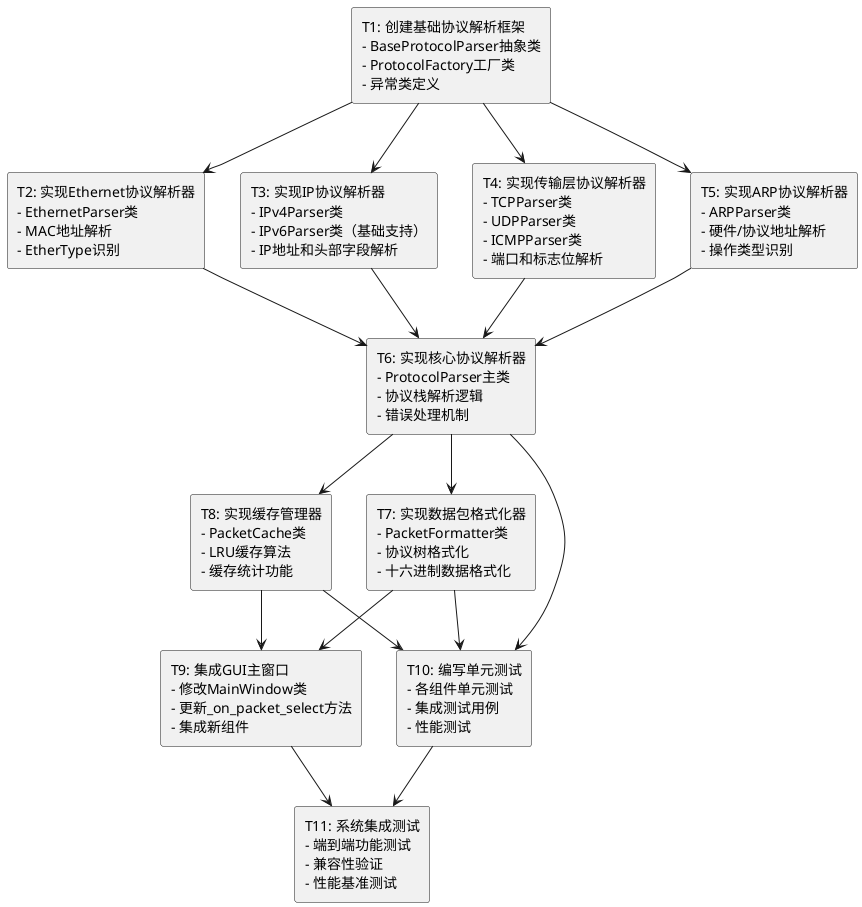

# 数据包详情显示功能 - 原子任务拆分

## 任务概述
基于DESIGN文档，将数据包详情显示功能拆分为可独立执行的原子任务，确保每个任务都有明确的输入输出契约和验收标准。

## 任务依赖关系图

## 详细任务定义

### T1: 创建基础协议解析框架

**输入契约:**
- 前置依赖: 无
- 输入数据: DESIGN文档中的接口定义
- 环境依赖: Python 3.x, struct模块

**输出契约:**
- 输出数据: 
  - `src/network_analyzer/analysis/base_parser.py`
  - `src/network_analyzer/analysis/protocol_factory.py`
  - `src/network_analyzer/analysis/exceptions.py`
- 交付物: 基础框架类和异常定义
- 验收标准: 
  - 抽象基类定义完整
  - 工厂模式实现正确
  - 异常类层次清晰

**实现约束:**
- 技术栈: Python标准库
- 接口规范: 遵循DESIGN文档中的接口契约
- 质量要求: 代码覆盖率>90%，类型注解完整

**依赖关系:**
- 后置任务: T2, T3, T4, T5
- 并行任务: 无

---

### T2: 实现Ethernet协议解析器

**输入契约:**
- 前置依赖: T1完成
- 输入数据: Ethernet帧二进制数据
- 环境依赖: BaseProtocolParser基类

**输出契约:**
- 输出数据: `src/network_analyzer/analysis/parsers/ethernet_parser.py`
- 交付物: EthernetParser类实现
- 验收标准:
  - 正确解析MAC地址（源和目标）
  - 正确识别EtherType字段
  - 支持常见EtherType（IPv4, IPv6, ARP）
  - 处理帧长度验证

**实现约束:**
- 技术栈: Python struct模块
- 接口规范: 继承BaseProtocolParser
- 质量要求: 支持标准Ethernet II帧格式

**依赖关系:**
- 前置任务: T1
- 后置任务: T6
- 并行任务: T3, T4, T5

---

### T3: 实现IP协议解析器

**输入契约:**
- 前置依赖: T1完成
- 输入数据: IP数据包二进制数据
- 环境依赖: BaseProtocolParser基类

**输出契约:**
- 输出数据: 
  - `src/network_analyzer/analysis/parsers/ipv4_parser.py`
  - `src/network_analyzer/analysis/parsers/ipv6_parser.py`
- 交付物: IPv4Parser和IPv6Parser类
- 验收标准:
  - IPv4: 解析所有标准头部字段
  - IPv6: 解析基本头部字段
  - IP地址格式化为可读字符串
  - 协议字段正确识别

**实现约束:**
- 技术栈: Python struct和ipaddress模块
- 接口规范: 继承BaseProtocolParser
- 质量要求: IPv4完整支持，IPv6基础支持

**依赖关系:**
- 前置任务: T1
- 后置任务: T6
- 并行任务: T2, T4, T5

---

### T4: 实现传输层协议解析器

**输入契约:**
- 前置依赖: T1完成
- 输入数据: TCP/UDP/ICMP数据段二进制数据
- 环境依赖: BaseProtocolParser基类

**输出契约:**
- 输出数据:
  - `src/network_analyzer/analysis/parsers/tcp_parser.py`
  - `src/network_analyzer/analysis/parsers/udp_parser.py`
  - `src/network_analyzer/analysis/parsers/icmp_parser.py`
- 交付物: TCP、UDP、ICMP解析器类
- 验收标准:
  - TCP: 端口、序列号、标志位、窗口大小
  - UDP: 端口、长度、校验和
  - ICMP: 类型、代码、标识符

**实现约束:**
- 技术栈: Python struct模块
- 接口规范: 继承BaseProtocolParser
- 质量要求: 支持标准协议格式

**依赖关系:**
- 前置任务: T1
- 后置任务: T6
- 并行任务: T2, T3, T5

---

### T5: 实现ARP协议解析器

**输入契约:**
- 前置依赖: T1完成
- 输入数据: ARP数据包二进制数据
- 环境依赖: BaseProtocolParser基类

**输出契约:**
- 输出数据: `src/network_analyzer/analysis/parsers/arp_parser.py`
- 交付物: ARPParser类实现
- 验收标准:
  - 硬件类型和协议类型识别
  - MAC地址和IP地址解析
  - 操作类型（请求/响应）识别

**实现约束:**
- 技术栈: Python struct模块
- 接口规范: 继承BaseProtocolParser
- 质量要求: 支持标准ARP格式

**依赖关系:**
- 前置任务: T1
- 后置任务: T6
- 并行任务: T2, T3, T4

---

### T6: 实现核心协议解析器

**输入契约:**
- 前置依赖: T1, T2, T3, T4, T5完成
- 输入数据: 完整数据包二进制数据
- 环境依赖: 所有协议解析器类

**输出契约:**
- 输出数据: `src/network_analyzer/analysis/protocol_parser.py`
- 交付物: ProtocolParser主类
- 验收标准:
  - 自动识别协议栈层次
  - 按顺序解析各层协议
  - 错误处理和部分解析支持
  - 返回标准化的解析结果

**实现约束:**
- 技术栈: Python标准库
- 接口规范: 实现IProtocolParser接口
- 质量要求: 支持协议栈自动识别

**依赖关系:**
- 前置任务: T1, T2, T3, T4, T5
- 后置任务: T7, T8, T10
- 并行任务: 无

---

### T7: 实现数据包格式化器

**输入契约:**
- 前置依赖: T6完成
- 输入数据: ProtocolParser解析结果
- 环境依赖: 解析结果数据结构

**输出契约:**
- 输出数据: `src/network_analyzer/analysis/packet_formatter.py`
- 交付物: PacketFormatter类
- 验收标准:
  - 生成协议层次树显示
  - 格式化各层字段详情
  - 生成十六进制数据显示
  - 支持可配置的显示格式

**实现约束:**
- 技术栈: Python字符串格式化
- 接口规范: 实现IPacketFormatter接口
- 质量要求: 输出格式美观易读

**依赖关系:**
- 前置任务: T6
- 后置任务: T9, T10
- 并行任务: T8

---

### T8: 实现缓存管理器

**输入契约:**
- 前置依赖: T6完成
- 输入数据: 数据包ID和解析结果
- 环境依赖: OrderedDict数据结构

**输出契约:**
- 输出数据: `src/network_analyzer/analysis/packet_cache.py`
- 交付物: PacketCache类
- 验收标准:
  - LRU缓存算法实现
  - 可配置的缓存大小
  - 缓存命中率统计
  - 内存使用控制

**实现约束:**
- 技术栈: Python collections模块
- 接口规范: 提供get/put/clear接口
- 质量要求: 缓存效率>80%

**依赖关系:**
- 前置任务: T6
- 后置任务: T9, T10
- 并行任务: T7

---

### T9: 集成GUI主窗口

**输入契约:**
- 前置依赖: T7, T8完成
- 输入数据: 现有MainWindow类
- 环境依赖: ProtocolParser, PacketFormatter, PacketCache

**输出契约:**
- 输出数据: 修改后的`src/network_analyzer/gui/main_window.py`
- 交付物: 集成新功能的主窗口
- 验收标准:
  - _on_packet_select方法更新
  - 新组件正确初始化
  - 详情显示功能正常
  - 保持现有功能不受影响

**实现约束:**
- 技术栈: Tkinter GUI框架
- 接口规范: 保持现有API兼容
- 质量要求: 响应时间<500ms

**依赖关系:**
- 前置任务: T7, T8
- 后置任务: T11
- 并行任务: T10

---

### T10: 编写单元测试

**输入契约:**
- 前置依赖: T6, T7, T8完成
- 输入数据: 所有实现的类和方法
- 环境依赖: unittest测试框架

**输出契约:**
- 输出数据: `tests/analysis/` 目录下的测试文件
- 交付物: 完整的单元测试套件
- 验收标准:
  - 代码覆盖率>90%
  - 所有公共方法有测试
  - 边界条件和异常情况覆盖
  - 性能基准测试

**实现约束:**
- 技术栈: Python unittest模块
- 接口规范: 标准测试用例格式
- 质量要求: 测试通过率100%

**依赖关系:**
- 前置任务: T6, T7, T8
- 后置任务: T11
- 并行任务: T9

---

### T11: 系统集成测试

**输入契约:**
- 前置依赖: T9, T10完成
- 输入数据: 完整的系统实现
- 环境依赖: 测试数据包样本

**输出契约:**
- 输出数据: 集成测试报告
- 交付物: 验证完成的功能系统
- 验收标准:
  - 端到端功能测试通过
  - 性能指标达标
  - 兼容性验证通过
  - 用户体验测试通过

**实现约束:**
- 技术栈: 完整的应用程序栈
- 接口规范: 符合需求规格
- 质量要求: 所有验收标准满足

**依赖关系:**
- 前置任务: T9, T10
- 后置任务: 无
- 并行任务: 无

## 任务执行顺序

### 第一批（并行执行）
- T1: 创建基础协议解析框架

### 第二批（并行执行）
- T2: 实现Ethernet协议解析器
- T3: 实现IP协议解析器  
- T4: 实现传输层协议解析器
- T5: 实现ARP协议解析器

### 第三批（串行执行）
- T6: 实现核心协议解析器

### 第四批（并行执行）
- T7: 实现数据包格式化器
- T8: 实现缓存管理器

### 第五批（并行执行）
- T9: 集成GUI主窗口
- T10: 编写单元测试

### 第六批（串行执行）
- T11: 系统集成测试

## 风险评估

### 高风险任务
- **T6**: 核心协议解析器 - 复杂度高，影响面大
- **T9**: GUI集成 - 可能影响现有功能

### 中风险任务
- **T3**: IP协议解析器 - IPv6支持复杂性
- **T11**: 系统集成测试 - 依赖所有前置任务

### 低风险任务
- **T1, T2, T4, T5, T7, T8, T10**: 相对独立，复杂度可控

## 质量门控

每个任务完成后必须通过以下检查：
1. **功能完整性**: 所有验收标准满足
2. **代码质量**: 符合项目编码规范
3. **测试覆盖**: 单元测试通过
4. **文档更新**: 相关文档同步更新
5. **集成验证**: 与现有系统兼容

---

**文档版本**: 1.0  
**创建时间**: 2024-12-19  
**最后更新**: 2024-12-19  
**状态**: 原子化拆分完成，待进入审批阶段