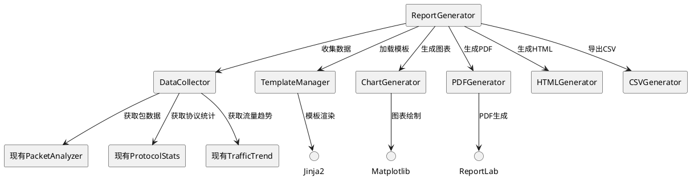
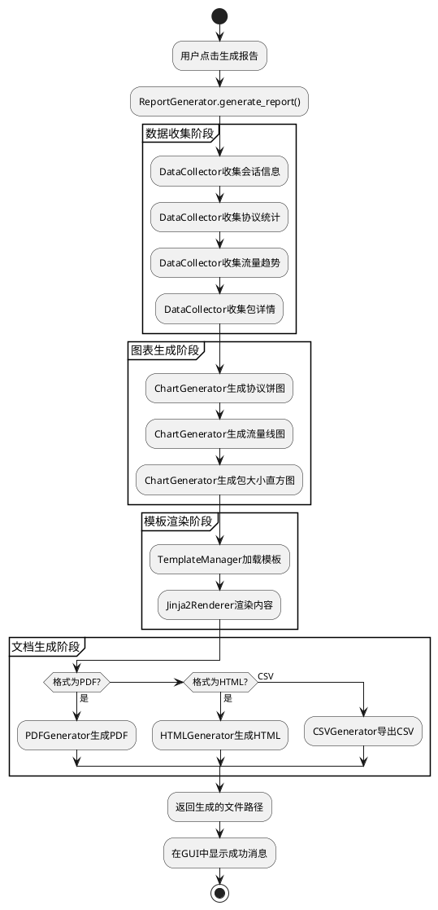

# 生成报告功能 - 架构设计文档

## 1. 整体架构图

```plantuml
@startuml
!define RECTANGLE class

package "报告生成系统" {
    RECTANGLE ReportGenerator {
        +generate_report(format, options)
        +get_available_formats()
        +validate_options()
    }
    
    package "数据收集层" {
        RECTANGLE DataCollector {
            +collect_session_info()
            +collect_protocol_stats()
            +collect_traffic_trends()
            +collect_packet_details()
        }
        
        RECTANGLE StatisticsProvider {
            +get_protocol_distribution()
            +get_traffic_timeline()
            +get_top_protocols()
            +get_session_summary()
        }
    }
    
    package "模板引擎层" {
        RECTANGLE TemplateManager {
            +load_template(format)
            +render_template(data, template)
            +get_available_templates()
        }
        
        RECTANGLE Jinja2Renderer {
            +render_html(data)
            +render_css_styles()
            +apply_custom_template()
        }
    }
    
    package "图表生成层" {
        RECTANGLE ChartGenerator {
            +create_protocol_pie_chart()
            +create_traffic_line_chart()
            +create_packet_size_histogram()
            +export_chart_as_image()
        }
        
        RECTANGLE MatplotlibRenderer {
            +generate_pie_chart(data)
            +generate_line_chart(data)
            +generate_histogram(data)
            +save_chart_image(path)
        }
    }
    
    package "文档生成层" {
        RECTANGLE PDFGenerator {
            +create_pdf_document()
            +add_content_to_pdf()
            +add_charts_to_pdf()
            +save_pdf_file()
        }
        
        RECTANGLE HTMLGenerator {
            +create_html_document()
            +embed_charts()
            +apply_styling()
            +save_html_file()
        }
        
        RECTANGLE CSVGenerator {
            +export_protocol_stats()
            +export_traffic_data()
            +export_packet_summary()
            +save_csv_file()
        }
    }
}

package "现有系统" {
    RECTANGLE PacketAnalyzer {
        +captured_packets
        +session_info
    }
    
    RECTANGLE ProtocolStatsModule {
        +get_protocol_statistics()
        +get_protocol_distribution()
    }
    
    RECTANGLE TrafficTrendModule {
        +get_traffic_trends()
        +get_timeline_data()
    }
}

ReportGenerator --> DataCollector
ReportGenerator --> TemplateManager
ReportGenerator --> ChartGenerator
ReportGenerator --> PDFGenerator
ReportGenerator --> HTMLGenerator
ReportGenerator --> CSVGenerator

DataCollector --> PacketAnalyzer
DataCollector --> ProtocolStatsModule
DataCollector --> TrafficTrendModule
DataCollector --> StatisticsProvider

TemplateManager --> Jinja2Renderer
ChartGenerator --> MatplotlibRenderer

@enduml
```



## 2. 分层设计和核心组件

### 2.1 数据收集层 (Data Collection Layer)
**职责**: 从现有系统收集报告所需的所有数据
- **DataCollector**: 主要数据收集器，协调各种数据源
- **StatisticsProvider**: 提供统计数据的计算和聚合

### 2.2 模板引擎层 (Template Engine Layer)
**职责**: 管理报告模板和内容渲染
- **TemplateManager**: 模板管理器，负责加载和管理模板
- **Jinja2Renderer**: 基于Jinja2的HTML模板渲染器

### 2.3 图表生成层 (Chart Generation Layer)
**职责**: 生成各种统计图表
- **ChartGenerator**: 图表生成器，提供统一的图表生成接口
- **MatplotlibRenderer**: 基于Matplotlib的图表渲染器

### 2.4 文档生成层 (Document Generation Layer)
**职责**: 生成最终的报告文档
- **PDFGenerator**: PDF文档生成器 (使用ReportLab)
- **HTMLGenerator**: HTML文档生成器
- **CSVGenerator**: CSV数据导出器

### 2.5 报告生成器 (Report Generator)
**职责**: 协调整个报告生成流程的核心组件
- 统一的报告生成接口
- 格式验证和选项处理
- 流程控制和错误处理

## 3. 模块依赖关系图



## 4. 接口契约定义

### 4.1 ReportGenerator 主接口
```python
class ReportGenerator:
    def generate_report(self, format: str, options: dict) -> str:
        """生成报告
        Args:
            format: 报告格式 ('pdf', 'html', 'csv')
            options: 生成选项 (模板、输出路径等)
        Returns:
            生成的报告文件路径
        """
        
    def get_available_formats(self) -> List[str]:
        """获取支持的报告格式"""
        
    def validate_options(self, format: str, options: dict) -> bool:
        """验证生成选项"""
```

### 4.2 DataCollector 接口
```python
class DataCollector:
    def collect_session_info(self) -> dict:
        """收集会话信息"""
        
    def collect_protocol_stats(self) -> dict:
        """收集协议统计数据"""
        
    def collect_traffic_trends(self) -> dict:
        """收集流量趋势数据"""
        
    def collect_packet_details(self) -> List[dict]:
        """收集数据包详细信息"""
```

### 4.3 ChartGenerator 接口
```python
class ChartGenerator:
    def create_protocol_pie_chart(self, data: dict) -> str:
        """创建协议分布饼图，返回图片路径"""
        
    def create_traffic_line_chart(self, data: dict) -> str:
        """创建流量趋势线图，返回图片路径"""
        
    def create_packet_size_histogram(self, data: List[int]) -> str:
        """创建包大小直方图，返回图片路径"""
```

## 5. 数据流向图



## 6. 异常处理策略

### 6.1 数据收集异常
- **空数据处理**: 当没有捕获到数据包时，生成空报告模板
- **数据不完整**: 部分数据缺失时，在报告中标注"数据不可用"
- **统计计算错误**: 提供默认值和错误提示

### 6.2 图表生成异常
- **数据格式错误**: 验证数据格式，提供默认图表
- **图表渲染失败**: 使用文本表格替代图表
- **图片保存失败**: 提供临时目录备选方案

### 6.3 文档生成异常
- **模板加载失败**: 使用内置默认模板
- **文件写入权限**: 提示用户选择其他保存位置
- **格式转换错误**: 提供详细错误信息和解决建议

## 7. 技术实现约束

### 7.1 依赖库要求
- **ReportLab**: PDF生成 (版本 >= 3.6.0)
- **Jinja2**: HTML模板引擎 (版本 >= 3.0.0)
- **Matplotlib**: 图表生成 (版本 >= 3.5.0)
- **Pandas**: 数据处理 (可选，用于CSV导出)

### 7.2 性能约束
- **内存使用**: 大量数据包时使用分批处理
- **生成时间**: 超过10000个包时显示进度条
- **文件大小**: PDF文件大小控制在50MB以内

### 7.3 兼容性约束
- **Python版本**: 兼容Python 3.8+
- **操作系统**: 支持Windows、Linux、macOS
- **文件格式**: 确保生成的文件可在常见软件中打开

## 8. 安全考虑

### 8.1 文件操作安全
- 验证输出路径的合法性
- 防止路径遍历攻击
- 确保文件写入权限

### 8.2 数据隐私
- 敏感数据脱敏处理
- 可选的数据过滤功能
- 报告中不包含原始数据包内容

## 9. 扩展性设计

### 9.1 模板系统扩展
- 支持用户自定义模板
- 模板继承和组合机制
- 多语言模板支持

### 9.2 格式扩展
- 插件化的格式生成器
- 新格式的简单集成
- 格式转换器接口

### 9.3 图表扩展
- 可配置的图表类型
- 自定义图表样式
- 交互式图表支持(HTML格式)

## 10. 下一步实施计划

1. **创建基础模块结构**
2. **实现数据收集层**
3. **开发图表生成功能**
4. **构建模板系统**
5. **实现各格式生成器**
6. **集成到主界面**
7. **测试和优化**

---

**设计完成时间**: 2024年1月
**设计版本**: v1.0
**下一阶段**: Atomize - 原子任务拆分