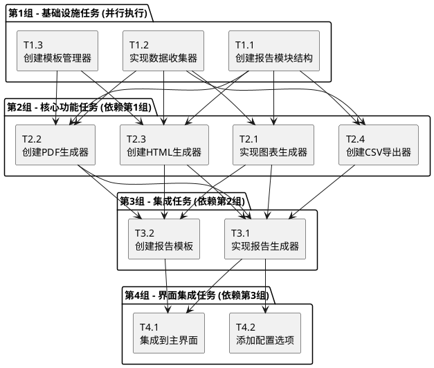

# 生成报告功能 - 原子任务拆分文档

## 1. 任务拆分概述

基于DESIGN文档的架构设计，将报告生成功能拆分为12个原子任务，按照依赖关系分为4个并行组。

## 2. 任务依赖关系图

## 3. 原子任务详细定义

### 第1组 - 基础设施任务 (并行执行)

#### T1.1 创建报告模块结构
**输入契约**:
- 前置依赖: 无
- 输入数据: DESIGN文档中的模块结构定义
- 环境依赖: Python开发环境

**输出契约**:
- 输出数据: 完整的报告模块目录结构
- 交付物: 
  - `reports/` 目录结构
  - `reports/__init__.py`
  - `reports/generators/` 子模块
  - `reports/templates/` 模板目录
  - `reports/charts/` 图表模块
- 验收标准: 
  - 所有目录和初始文件创建完成
  - 模块可以正常导入
  - 符合项目代码结构规范

**实现约束**:
- 技术栈: Python模块结构
- 接口规范: 遵循现有项目的模块命名规范
- 质量要求: 清晰的模块分层，便于后续开发

**依赖关系**:
- 后置任务: T1.2, T1.3, T2.1, T2.2, T2.3, T2.4
- 并行任务: 无

---

#### T1.2 实现数据收集器
**输入契约**:
- 前置依赖: T1.1 (模块结构)
- 输入数据: 现有的PacketAnalyzer、ProtocolStats、TrafficTrend模块
- 环境依赖: 现有项目的数据模块

**输出契约**:
- 输出数据: 统一的数据收集接口
- 交付物:
  - `reports/data_collector.py`
  - `reports/statistics_provider.py`
  - 数据收集器的单元测试
- 验收标准:
  - 能够收集会话信息、协议统计、流量趋势
  - 数据格式标准化
  - 异常处理完善
  - 单元测试覆盖率 > 80%

**实现约束**:
- 技术栈: Python, 现有数据模块API
- 接口规范: 返回标准化的字典格式数据
- 质量要求: 健壮的错误处理，数据验证

**依赖关系**:
- 前置任务: T1.1
- 后置任务: T2.1, T2.2, T2.3, T2.4
- 并行任务: T1.3

---

#### T1.3 创建模板管理器
**输入契约**:
- 前置依赖: T1.1 (模块结构)
- 输入数据: Jinja2模板引擎规范
- 环境依赖: Jinja2库

**输出契约**:
- 输出数据: 模板加载和渲染功能
- 交付物:
  - `reports/template_manager.py`
  - `reports/jinja2_renderer.py`
  - 基础模板文件
  - 模板管理器的单元测试
- 验收标准:
  - 支持模板加载、渲染、缓存
  - 支持自定义模板
  - 模板继承机制工作正常
  - 单元测试覆盖率 > 80%

**实现约束**:
- 技术栈: Python, Jinja2
- 接口规范: 标准的模板引擎接口
- 质量要求: 模板安全性，防止注入攻击

**依赖关系**:
- 前置任务: T1.1
- 后置任务: T2.2, T2.3
- 并行任务: T1.2

---

### 第2组 - 核心功能任务 (依赖第1组)

#### T2.1 实现图表生成器
**输入契约**:
- 前置依赖: T1.1 (模块结构), T1.2 (数据收集器)
- 输入数据: 标准化的统计数据
- 环境依赖: Matplotlib库

**输出契约**:
- 输出数据: 各种统计图表图片文件
- 交付物:
  - `reports/charts/chart_generator.py`
  - `reports/charts/matplotlib_renderer.py`
  - 图表生成器的单元测试
- 验收标准:
  - 支持饼图、线图、直方图生成
  - 图表样式美观，支持自定义
  - 图片质量高，适合报告使用
  - 单元测试覆盖率 > 80%

**实现约束**:
- 技术栈: Python, Matplotlib
- 接口规范: 返回图片文件路径
- 质量要求: 图表清晰度，颜色搭配合理

**依赖关系**:
- 前置任务: T1.1, T1.2
- 后置任务: T3.1, T3.2
- 并行任务: T2.2, T2.3, T2.4

---

#### T2.2 创建PDF生成器
**输入契约**:
- 前置依赖: T1.1 (模块结构), T1.2 (数据收集器), T1.3 (模板管理器)
- 输入数据: 报告数据和图表文件
- 环境依赖: ReportLab库

**输出契约**:
- 输出数据: PDF格式的报告文件
- 交付物:
  - `reports/generators/pdf_generator.py`
  - PDF生成器的单元测试
- 验收标准:
  - 生成高质量的PDF文档
  - 支持图表嵌入
  - 支持中文字体
  - 文档结构清晰，排版美观
  - 单元测试覆盖率 > 80%

**实现约束**:
- 技术栈: Python, ReportLab
- 接口规范: 生成符合PDF标准的文件
- 质量要求: 文档可读性，兼容性

**依赖关系**:
- 前置任务: T1.1, T1.2, T1.3
- 后置任务: T3.1
- 并行任务: T2.1, T2.3, T2.4

---

#### T2.3 创建HTML生成器
**输入契约**:
- 前置依赖: T1.1 (模块结构), T1.2 (数据收集器), T1.3 (模板管理器)
- 输入数据: 报告数据和图表文件
- 环境依赖: Jinja2库

**输出契约**:
- 输出数据: HTML格式的报告文件
- 交付物:
  - `reports/generators/html_generator.py`
  - HTML模板文件
  - CSS样式文件
  - HTML生成器的单元测试
- 验收标准:
  - 生成响应式HTML报告
  - 支持图表嵌入
  - 现代化的UI设计
  - 浏览器兼容性良好
  - 单元测试覆盖率 > 80%

**实现约束**:
- 技术栈: Python, Jinja2, HTML5, CSS3
- 接口规范: 生成标准HTML文档
- 质量要求: 用户体验，视觉效果

**依赖关系**:
- 前置任务: T1.1, T1.2, T1.3
- 后置任务: T3.1, T3.2
- 并行任务: T2.1, T2.2, T2.4

---

#### T2.4 创建CSV导出器
**输入契约**:
- 前置依赖: T1.1 (模块结构), T1.2 (数据收集器)
- 输入数据: 结构化的统计数据
- 环境依赖: Python标准库csv模块

**输出契约**:
- 输出数据: CSV格式的数据文件
- 交付物:
  - `reports/generators/csv_generator.py`
  - CSV导出器的单元测试
- 验收标准:
  - 支持多种数据表格导出
  - CSV格式标准，Excel兼容
  - 支持中文编码
  - 数据完整性保证
  - 单元测试覆盖率 > 80%

**实现约束**:
- 技术栈: Python, csv模块
- 接口规范: 标准CSV格式
- 质量要求: 数据准确性，编码正确

**依赖关系**:
- 前置任务: T1.1, T1.2
- 后置任务: T3.1
- 并行任务: T2.1, T2.2, T2.3

---

### 第3组 - 集成任务 (依赖第2组)

#### T3.1 实现报告生成器
**输入契约**:
- 前置依赖: T2.1, T2.2, T2.3, T2.4 (所有生成器)
- 输入数据: 用户配置选项
- 环境依赖: 所有子模块

**输出契约**:
- 输出数据: 统一的报告生成接口
- 交付物:
  - `reports/report_generator.py`
  - 报告生成器的单元测试
  - 集成测试用例
- 验收标准:
  - 统一的报告生成接口
  - 支持多种格式选择
  - 完善的错误处理
  - 进度反馈机制
  - 单元测试覆盖率 > 80%

**实现约束**:
- 技术栈: Python, 所有依赖模块
- 接口规范: 简洁的用户接口
- 质量要求: 稳定性，用户体验

**依赖关系**:
- 前置任务: T2.1, T2.2, T2.3, T2.4
- 后置任务: T4.1, T4.2
- 并行任务: T3.2

---

#### T3.2 创建报告模板
**输入契约**:
- 前置依赖: T2.1 (图表生成器), T2.2, T2.3 (文档生成器)
- 输入数据: 报告内容规范
- 环境依赖: 模板引擎

**输出契约**:
- 输出数据: 完整的报告模板集
- 交付物:
  - HTML报告模板
  - PDF报告模板配置
  - CSS样式文件
  - 模板测试用例
- 验收标准:
  - 模板设计美观专业
  - 支持多种数据展示
  - 模板结构清晰
  - 易于维护和扩展

**实现约束**:
- 技术栈: Jinja2, HTML, CSS
- 接口规范: 模板变量标准化
- 质量要求: 视觉效果，信息层次

**依赖关系**:
- 前置任务: T2.1, T2.2, T2.3
- 后置任务: T4.1
- 并行任务: T3.1

---

### 第4组 - 界面集成任务 (依赖第3组)

#### T4.1 集成到主界面
**输入契约**:
- 前置依赖: T3.1 (报告生成器), T3.2 (报告模板)
- 输入数据: 现有主界面代码
- 环境依赖: tkinter GUI框架

**输出契约**:
- 输出数据: 集成报告功能的主界面
- 交付物:
  - 修改后的`main_window.py`
  - 报告生成对话框
  - 界面集成测试
- 验收标准:
  - 报告生成按钮功能正常
  - 进度显示和用户反馈
  - 错误处理和提示
  - 界面美观易用

**实现约束**:
- 技术栈: Python, tkinter
- 接口规范: 与现有界面风格一致
- 质量要求: 用户体验，响应性

**依赖关系**:
- 前置任务: T3.1, T3.2
- 后置任务: 无
- 并行任务: T4.2

---

#### T4.2 添加配置选项
**输入契约**:
- 前置依赖: T3.1 (报告生成器)
- 输入数据: 用户配置需求
- 环境依赖: 现有设置系统

**输出契约**:
- 输出数据: 报告生成配置界面
- 交付物:
  - 配置选项界面
  - 配置文件管理
  - 配置验证逻辑
- 验收标准:
  - 支持模板选择
  - 支持输出格式配置
  - 配置持久化保存
  - 配置验证完善

**实现约束**:
- 技术栈: Python, tkinter, JSON配置
- 接口规范: 与现有设置系统集成
- 质量要求: 配置的易用性

**依赖关系**:
- 前置任务: T3.1
- 后置任务: 无
- 并行任务: T4.1

---

## 4. 任务执行时间估算

| 任务组 | 任务编号 | 任务名称 | 预估时间 | 复杂度 |
|--------|----------|----------|----------|--------|
| 第1组 | T1.1 | 创建报告模块结构 | 0.5小时 | 简单 |
| 第1组 | T1.2 | 实现数据收集器 | 1.5小时 | 中等 |
| 第1组 | T1.3 | 创建模板管理器 | 1小时 | 中等 |
| 第2组 | T2.1 | 实现图表生成器 | 2小时 | 复杂 |
| 第2组 | T2.2 | 创建PDF生成器 | 2小时 | 复杂 |
| 第2组 | T2.3 | 创建HTML生成器 | 1.5小时 | 中等 |
| 第2组 | T2.4 | 创建CSV导出器 | 1小时 | 简单 |
| 第3组 | T3.1 | 实现报告生成器 | 1.5小时 | 中等 |
| 第3组 | T3.2 | 创建报告模板 | 1小时 | 中等 |
| 第4组 | T4.1 | 集成到主界面 | 1小时 | 中等 |
| 第4组 | T4.2 | 添加配置选项 | 0.5小时 | 简单 |

**总计预估时间**: 13.5小时
**关键路径**: T1.1 → T1.2 → T2.1 → T3.1 → T4.1 (约6.5小时)

## 5. 风险评估和缓解策略

### 5.1 技术风险
- **ReportLab中文字体问题**: 提前测试字体配置，准备备选方案
- **图表生成性能**: 大数据量时使用采样和分页
- **模板渲染安全**: 严格验证模板输入，防止注入

### 5.2 集成风险
- **现有代码兼容性**: 充分测试与现有模块的集成
- **依赖库版本冲突**: 使用虚拟环境，固定版本号
- **界面响应性**: 使用多线程处理长时间操作

### 5.3 质量风险
- **测试覆盖不足**: 每个任务都要求80%以上测试覆盖率
- **用户体验问题**: 及时收集反馈，迭代改进
- **文档不完整**: 同步更新技术文档和用户手册

## 6. 验收标准总结

### 6.1 功能验收
- [ ] 支持PDF、HTML、CSV三种格式导出
- [ ] 包含协议统计、流量趋势、会话信息
- [ ] 图表清晰美观，数据准确
- [ ] 模板系统工作正常

### 6.2 质量验收
- [ ] 所有模块单元测试覆盖率 > 80%
- [ ] 集成测试通过
- [ ] 代码符合项目规范
- [ ] 性能满足要求（10000包内5秒完成）

### 6.3 用户体验验收
- [ ] 界面操作简单直观
- [ ] 错误提示清晰有用
- [ ] 进度反馈及时
- [ ] 生成的报告专业美观

---

**文档创建时间**: 2024年1月
**文档版本**: v1.0
**下一阶段**: Approve - 审批确认