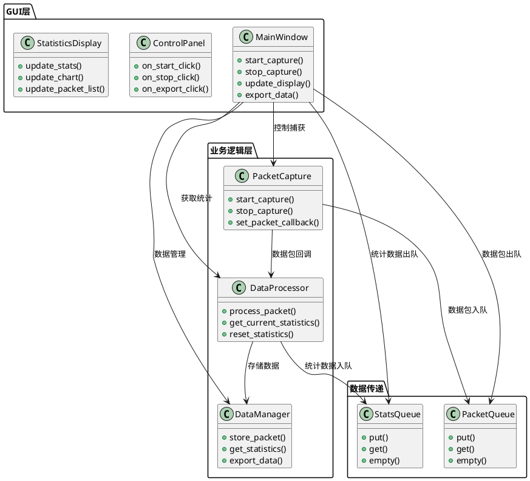
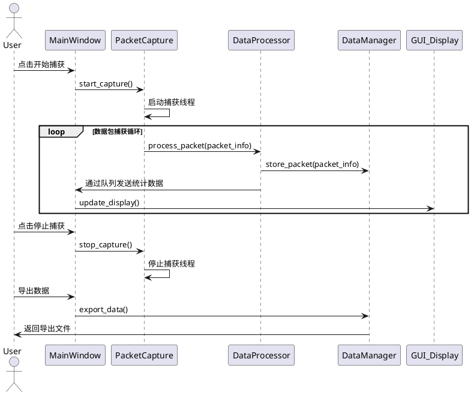
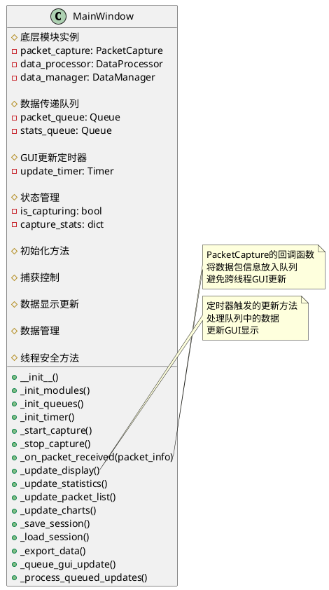
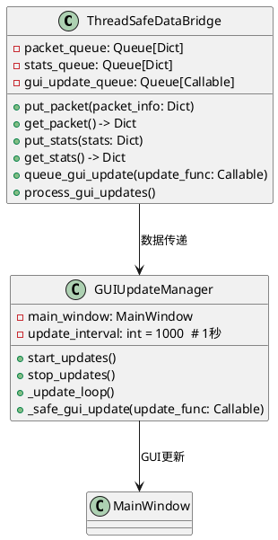
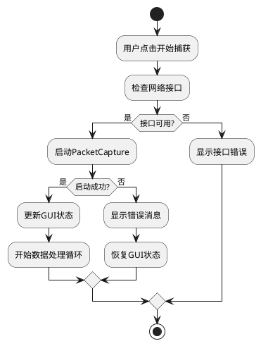

# GUI集成架构设计文档

## 1. 整体架构设计

### 1.1 系统架构图



### 1.2 数据流向图



## 2. 核心组件设计

### 2.1 MainWindow集成设计



### 2.2 线程安全数据传递设计



## 3. 接口契约定义

### 3.1 PacketCapture集成接口

```python
# MainWindow中的PacketCapture使用方式
class MainWindow:
    def _init_packet_capture(self):
        self.packet_capture = PacketCapture(self.settings)
        self.packet_capture.set_packet_callback(self._on_packet_received)
    
    def _start_capture(self):
        interface = self.interface_var.get()
        filter_expr = self.filter_entry.get()
        success = self.packet_capture.start_capture(
            interface=interface,
            filter_expression=filter_expr
        )
        if success:
            self._update_capture_status(True)
        else:
            messagebox.showerror("错误", "启动数据包捕获失败")
    
    def _on_packet_received(self, packet_info: Dict[str, Any]):
        # 线程安全的数据传递
        self.packet_queue.put(packet_info)
```

### 3.2 DataProcessor集成接口

```python
# MainWindow中的DataProcessor使用方式
class MainWindow:
    def _init_data_processor(self):
        self.data_processor = DataProcessor(self.settings, self.data_manager)
    
    def _on_packet_received(self, packet_info: Dict[str, Any]):
        # 处理数据包
        self.data_processor.process_packet(packet_info)
        
        # 获取更新的统计信息
        stats = self.data_processor.get_current_statistics()
        self.stats_queue.put(stats)
```

### 3.3 GUI更新接口

```python
# GUI更新的标准接口
class MainWindow:
    def _update_display(self):
        # 处理数据包队列
        while not self.packet_queue.empty():
            packet_info = self.packet_queue.get()
            self._add_packet_to_list(packet_info)
        
        # 处理统计队列
        while not self.stats_queue.empty():
            stats = self.stats_queue.get()
            self._update_statistics_display(stats)
            self._update_charts(stats)
```

## 4. 异常处理策略

### 4.1 捕获异常处理



### 4.2 数据处理异常处理

```python
def _on_packet_received(self, packet_info: Dict[str, Any]):
    try:
        # 数据包处理
        self.data_processor.process_packet(packet_info)
        self.packet_queue.put(packet_info)
    except Exception as e:
        self.logger.error(f"数据包处理失败: {e}")
        # 不中断捕获，继续处理下一个数据包
```

## 5. 性能优化设计

### 5.1 数据队列管理

- **队列大小限制**: 防止内存无限增长
- **批量处理**: GUI更新时批量处理队列数据
- **优先级处理**: 统计数据优先于单个数据包显示

### 5.2 GUI更新优化

- **定时更新**: 1秒间隔更新，避免频繁刷新
- **增量更新**: 只更新变化的数据
- **显示限制**: 数据包列表最多显示1000条

## 6. 集成测试策略

### 6.1 功能测试

1. **捕获控制测试**: 开始/停止功能
2. **数据显示测试**: 统计数据准确性
3. **导出功能测试**: 数据完整性

### 6.2 性能测试

1. **内存使用测试**: 长时间运行内存稳定性
2. **响应时间测试**: GUI操作响应时间
3. **并发测试**: 高流量下的稳定性

## 7. 实施计划

### 阶段1: 基础集成
- 修改MainWindow，集成底层模块
- 实现基本的开始/停止功能
- 建立数据传递机制

### 阶段2: 数据显示
- 实现统计数据实时更新
- 实现数据包列表显示
- 实现基础图表更新

### 阶段3: 完善功能
- 实现数据导出功能
- 实现会话保存/加载
- 完善异常处理

### 阶段4: 测试验证
- 功能测试
- 性能测试
- 用户验收测试