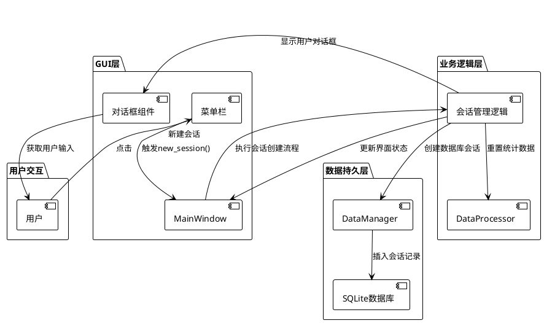
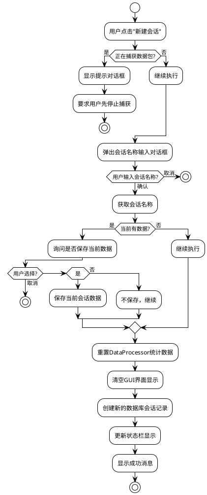
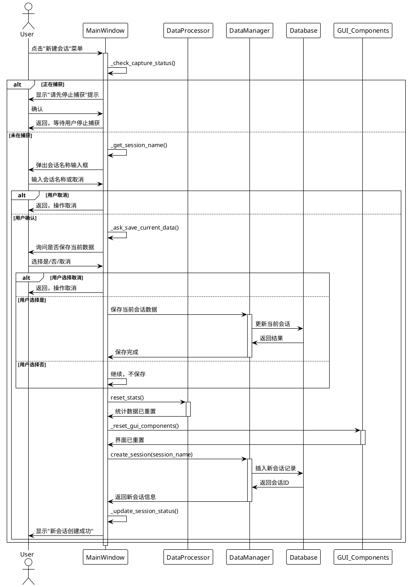
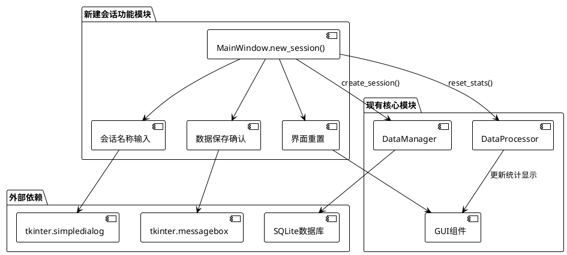
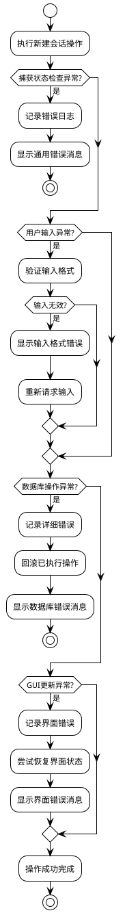

# DESIGN_T1.1新建会话功能

## 1. 设计概述
- **任务名称**: T1.1 新建会话功能
- **设计阶段**: Architect阶段
- **创建时间**: 2024-01-15
- **设计原则**: 最小化修改、复用现有组件、用户友好交互

## 2. 整体架构图



## 3. 分层设计

### 3.1 表现层 (GUI层)
- **MainWindow**: 主窗口类，包含new_session()方法
- **菜单系统**: 现有的菜单栏，触发新建会话功能
- **对话框组件**: tkinter.simpledialog和messagebox

### 3.2 业务逻辑层
- **会话管理逻辑**: 新建会话的核心业务流程
- **状态检查逻辑**: 检查当前捕获状态
- **数据保存逻辑**: 处理当前数据的保存

### 3.3 数据访问层
- **DataProcessor**: 负责重置统计数据
- **DataManager**: 负责数据库会话管理
- **SQLite数据库**: 持久化存储会话信息

## 4. 核心组件设计

### 4.1 MainWindow.new_session() 方法设计



### 4.2 接口契约定义

```python
class MainWindow:
    def new_session(self) -> bool:
        """
        创建新的会话
        
        Returns:
            bool: 成功创建返回True，用户取消或失败返回False
            
        Raises:
            DatabaseError: 数据库操作失败
            UIError: 界面操作失败
        """
        pass
    
    def _check_capture_status(self) -> bool:
        """检查当前捕获状态"""
        pass
    
    def _get_session_name(self) -> str:
        """获取用户输入的会话名称"""
        pass
    
    def _ask_save_current_data(self) -> str:
        """询问是否保存当前数据，返回'yes'/'no'/'cancel'"""
        pass
    
    def _reset_gui_components(self) -> None:
        """重置所有GUI组件"""
        pass
    
    def _update_session_status(self, session_name: str) -> None:
        """更新会话状态显示"""
        pass
```

## 5. 数据流向图



## 6. 模块依赖关系图



## 7. 异常处理策略

### 7.1 异常分类与处理



### 7.2 具体异常处理方案

| 异常类型 | 处理策略 | 用户反馈 |
|---------|---------|---------|
| 捕获状态检查失败 | 记录日志，安全返回 | "无法检查当前状态，请重试" |
| 用户输入为空 | 提示重新输入 | "会话名称不能为空" |
| 会话名称重复 | 提示修改名称 | "会话名称已存在，请使用其他名称" |
| 数据库连接失败 | 记录错误，操作回滚 | "数据库操作失败，请检查系统状态" |
| GUI组件更新失败 | 尝试恢复，记录错误 | "界面更新异常，功能可能受影响" |

## 8. 性能考虑

### 8.1 性能指标
- **响应时间**: 用户点击到界面响应 < 200ms
- **数据库操作**: 会话创建 < 100ms
- **界面重置**: GUI组件清空 < 50ms

### 8.2 优化策略
- 异步处理数据库操作（如果数据量大）
- 批量更新GUI组件
- 缓存常用的对话框组件

## 9. 安全考虑

### 9.1 输入验证
- 会话名称长度限制（1-100字符）
- 特殊字符过滤（避免SQL注入）
- 路径遍历攻击防护

### 9.2 数据保护
- 确保数据库事务完整性
- 敏感操作的用户确认
- 操作日志记录

## 10. 测试策略

### 10.1 单元测试
- 会话名称验证逻辑
- 状态检查逻辑
- 数据库操作逻辑

### 10.2 集成测试
- 完整的新建会话流程
- 异常情况处理
- 用户交互流程

### 10.3 用户验收测试
- 正常使用场景
- 边界条件测试
- 用户体验评估

---
**设计状态**: ✅ 完成
**审核状态**: 待审核
**下一阶段**: Atomize阶段