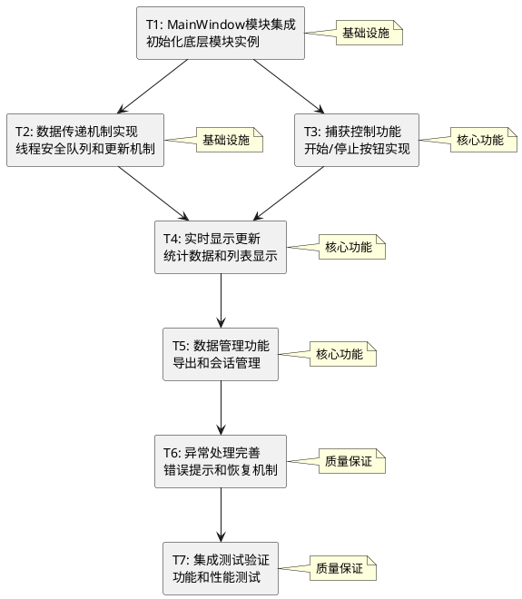

# GUI集成任务拆分文档

## 项目概述

将已实现的底层模块（PacketCapture、DataProcessor、DataManager）与GUI界面集成，实现完整的网络数据包分析器功能。

## 任务拆分策略

基于依赖关系，将项目拆分为7个原子任务，按3个开发阶段执行：

- **阶段1**: 基础集成（T1-T2）
- **阶段2**: 功能实现（T3-T5）  
- **阶段3**: 完善测试（T6-T7）

## 任务依赖关系图

## 详细任务定义

### 阶段1：基础集成

#### T1: MainWindow模块集成
- **任务ID**: T1
- **优先级**: 高
- **预估工时**: 2小时
- **依赖**: 无

**输入契约**:
- 现有MainWindow类（src/network_analyzer/gui/main_window.py）
- 底层模块类（PacketCapture、DataProcessor、DataManager）
- Settings配置类

**输出契约**:
- 修改后的MainWindow类，包含底层模块实例
- 模块初始化方法
- 基础的模块间连接

**实现约束**:
- 保持现有GUI布局不变
- 使用现有的Settings配置
- 遵循现有的代码风格

**验收标准**:
- [ ] MainWindow能成功初始化所有底层模块
- [ ] 模块间引用关系正确建立
- [ ] 程序启动无错误
- [ ] 单元测试通过

**交付物**:
- 修改后的main_window.py
- 模块集成的单元测试

---

#### T2: 数据传递机制实现
- **任务ID**: T2
- **优先级**: 高
- **预估工时**: 3小时
- **依赖**: T1

**输入契约**:
- T1完成的MainWindow类
- 线程安全队列需求（packet_queue、stats_queue）
- GUI更新定时器需求

**输出契约**:
- 线程安全的数据传递队列
- GUI更新定时器机制
- 数据包回调函数

**实现约束**:
- 使用Python标准库的Queue
- GUI更新间隔1秒
- 队列大小限制防止内存溢出

**验收标准**:
- [ ] 数据队列线程安全运行
- [ ] GUI定时器正常工作
- [ ] 跨线程数据传递无丢失
- [ ] 内存使用稳定

**交付物**:
- 数据传递机制代码
- 线程安全测试用例

---

### 阶段2：核心功能实现

#### T3: 捕获控制功能
- **任务ID**: T3
- **优先级**: 高
- **预估工时**: 2小时
- **依赖**: T1, T2

**输入契约**:
- T1的模块集成结果
- T2的数据传递机制
- 现有的开始/停止按钮UI

**输出契约**:
- 功能完整的开始/停止捕获按钮
- 网络接口选择功能
- 过滤器设置功能
- 捕获状态显示

**实现约束**:
- 使用PacketCapture类的现有接口
- 保持UI响应性
- 提供用户友好的错误提示

**验收标准**:
- [ ] 点击开始按钮能启动数据包捕获
- [ ] 点击停止按钮能停止捕获
- [ ] 网络接口选择正常工作
- [ ] 过滤器设置生效
- [ ] 状态显示准确

**交付物**:
- 捕获控制功能代码
- 功能测试用例

---

#### T4: 实时显示更新
- **任务ID**: T4
- **优先级**: 高
- **预估工时**: 4小时
- **依赖**: T2, T3

**输入契约**:
- T2的数据传递机制
- T3的捕获控制功能
- 现有的统计显示UI组件

**输出契约**:
- 实时统计数据显示
- 数据包列表实时更新
- 基础图表显示
- 性能指标显示

**实现约束**:
- 更新频率1秒间隔
- 数据包列表最多显示1000条
- 统计数据格式化显示
- 图表使用matplotlib

**验收标准**:
- [ ] 统计数据实时更新显示
- [ ] 数据包列表正确显示
- [ ] 图表数据准确
- [ ] GUI响应流畅（<100ms）
- [ ] 长时间运行稳定

**交付物**:
- 实时显示更新代码
- 显示功能测试用例

---

#### T5: 数据管理功能
- **任务ID**: T5
- **优先级**: 中
- **预估工时**: 3小时
- **依赖**: T4

**输入契约**:
- T4的显示更新功能
- DataManager类接口
- 现有的菜单栏UI

**输出契约**:
- 会话保存/加载功能
- 数据导出功能（CSV/JSON）
- 历史记录查看功能
- 文件对话框集成

**实现约束**:
- 使用DataManager的现有接口
- 支持CSV和JSON格式导出
- 文件操作异常处理
- 用户友好的文件对话框

**验收标准**:
- [ ] 会话能正确保存和加载
- [ ] 数据导出格式正确
- [ ] 文件操作错误处理完善
- [ ] 用户界面友好

**交付物**:
- 数据管理功能代码
- 文件操作测试用例

---

### 阶段3：完善测试

#### T6: 异常处理完善
- **任务ID**: T6
- **优先级**: 中
- **预估工时**: 2小时
- **依赖**: T5

**输入契约**:
- T1-T5的所有功能实现
- 异常处理需求分析
- 用户体验要求

**输出契约**:
- 完善的异常捕获机制
- 用户友好的错误提示
- 系统恢复机制
- 日志记录功能

**实现约束**:
- 所有异常都要有适当处理
- 错误信息对用户友好
- 系统能从错误中恢复
- 详细的日志记录

**验收标准**:
- [ ] 网络异常处理正确
- [ ] 文件操作异常处理完善
- [ ] 用户错误操作有提示
- [ ] 系统能从异常中恢复
- [ ] 日志记录完整

**交付物**:
- 异常处理代码
- 异常处理测试用例

---

#### T7: 集成测试验证
- **任务ID**: T7
- **优先级**: 高
- **预估工时**: 3小时
- **依赖**: T6

**输入契约**:
- T1-T6的完整功能实现
- 测试用例需求
- 性能基准要求

**输出契约**:
- 完整的集成测试套件
- 性能测试报告
- 功能验收报告
- 用户使用文档

**实现约束**:
- 覆盖所有主要功能
- 包含性能基准测试
- 模拟真实使用场景
- 自动化测试执行

**验收标准**:
- [ ] 所有功能测试通过
- [ ] 性能指标达标
- [ ] 长时间运行稳定
- [ ] 用户场景测试通过
- [ ] 文档完整准确

**交付物**:
- 集成测试代码
- 测试报告
- 用户文档

## 风险评估

### 高风险任务
- **T2**: 线程安全实现复杂
- **T4**: 实时更新性能要求高

### 中风险任务
- **T3**: 网络接口兼容性
- **T7**: 集成测试覆盖面

### 低风险任务
- **T1**: 模块集成相对简单
- **T5**: 文件操作标准化
- **T6**: 异常处理模式化

## 质量保证

### 代码质量
- 遵循现有代码规范
- 保持与现有架构一致
- 充分的单元测试覆盖

### 功能质量
- 每个任务都有明确验收标准
- 集成测试验证整体功能
- 性能基准测试

### 用户体验
- 界面响应流畅
- 错误提示友好
- 功能操作直观

## 执行计划

### 第1天：基础集成
- 上午：T1 MainWindow模块集成
- 下午：T2 数据传递机制实现

### 第2天：核心功能
- 上午：T3 捕获控制功能
- 下午：T4 实时显示更新（第1部分）

### 第3天：功能完善
- 上午：T4 实时显示更新（第2部分）
- 下午：T5 数据管理功能

### 第4天：质量保证
- 上午：T6 异常处理完善
- 下午：T7 集成测试验证

## 成功标准

项目成功的标志：
1. 所有按钮功能正常，不再显示"后续版本实现"
2. 数据包捕获和显示功能完整
3. 统计数据实时更新准确
4. 数据导出功能正常
5. 系统稳定运行，无崩溃
6. 用户体验良好，操作直观