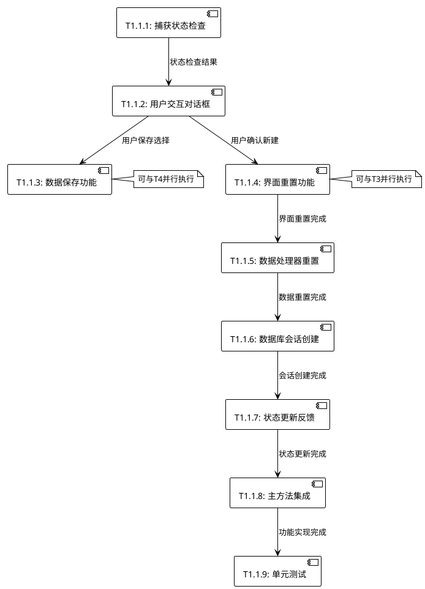

# TASK_T1.1新建会话功能

## 1. 任务拆分概述
- **任务名称**: T1.1 新建会话功能
- **拆分阶段**: Atomize阶段
- **创建时间**: 2024-01-15
- **拆分原则**: 功能独立、可测试、复杂度可控

## 2. 原子任务列表

### 任务T1.1.1: 捕获状态检查功能
**优先级**: 高
**预估工时**: 30分钟
**复杂度**: 低

#### 输入契约
- **前置依赖**: MainWindow类已初始化
- **输入数据**: 当前MainWindow实例的状态
- **环境依赖**: GUI界面正常运行

#### 输出契约
- **输出数据**: 布尔值，表示是否正在捕获
- **交付物**: `_check_capture_status()` 方法实现
- **验收标准**: 
  - 能正确检测当前捕获状态
  - 返回准确的布尔值
  - 无异常抛出

#### 实现约束
- **技术栈**: Python, tkinter
- **接口规范**: `def _check_capture_status(self) -> bool`
- **质量要求**: 单元测试覆盖率100%

#### 依赖关系
- **后置任务**: T1.1.2 (需要状态检查结果)
- **并行任务**: 无

---

### 任务T1.1.2: 用户交互对话框实现
**优先级**: 高
**预估工时**: 45分钟
**复杂度**: 中等

#### 输入契约
- **前置依赖**: T1.1.1完成，捕获状态已知
- **输入数据**: 捕获状态布尔值
- **环境依赖**: tkinter对话框组件可用

#### 输出契约
- **输出数据**: 用户输入的会话名称字符串或None（取消）
- **交付物**: `_get_session_name()` 和 `_ask_save_current_data()` 方法
- **验收标准**:
  - 如果正在捕获，显示停止提示并返回
  - 会话名称输入框正常工作，支持取消
  - 数据保存确认对话框支持是/否/取消三选项
  - 输入验证：名称不为空，长度1-100字符

#### 实现约束
- **技术栈**: tkinter.simpledialog, tkinter.messagebox
- **接口规范**: 
  - `def _get_session_name(self) -> str | None`
  - `def _ask_save_current_data(self) -> str`  # 返回'yes'/'no'/'cancel'
- **质量要求**: 用户体验友好，错误处理完善

#### 依赖关系
- **前置任务**: T1.1.1
- **后置任务**: T1.1.3, T1.1.4
- **并行任务**: 无

---

### 任务T1.1.3: 数据保存功能实现
**优先级**: 中等
**预估工时**: 30分钟
**复杂度**: 低

#### 输入契约
- **前置依赖**: T1.1.2完成，用户选择保存数据
- **输入数据**: 当前会话数据和用户保存选择
- **环境依赖**: DataManager实例可用，数据库连接正常

#### 输出契约
- **输出数据**: 保存操作成功/失败状态
- **交付物**: 数据保存逻辑实现
- **验收标准**:
  - 能正确调用DataManager保存当前会话
  - 处理保存失败的异常情况
  - 向用户反馈保存结果

#### 实现约束
- **技术栈**: 现有DataManager接口
- **接口规范**: 复用现有`DataManager.update_session()`方法
- **质量要求**: 异常处理完善，事务完整性

#### 依赖关系
- **前置任务**: T1.1.2
- **后置任务**: T1.1.4
- **并行任务**: 无

---

### 任务T1.1.4: 界面重置功能实现
**优先级**: 高
**预估工时**: 40分钟
**复杂度**: 中等

#### 输入契约
- **前置依赖**: T1.1.2完成，用户确认新建会话
- **输入数据**: GUI组件引用
- **环境依赖**: 所有GUI组件已初始化

#### 输出契约
- **输出数据**: 界面重置完成状态
- **交付物**: `_reset_gui_components()` 方法实现
- **验收标准**:
  - 清空数据包列表显示（packet_tree）
  - 清空统计信息显示（stats_text）
  - 清空详情面板内容（detail_text）
  - 重置状态栏信息（status_text）
  - 重置数据包计数标签（packet_count_label）

#### 实现约束
- **技术栈**: tkinter GUI组件操作
- **接口规范**: `def _reset_gui_components(self) -> None`
- **质量要求**: 确保所有相关组件都被正确重置

#### 依赖关系
- **前置任务**: T1.1.2
- **后置任务**: T1.1.5
- **并行任务**: T1.1.3（可并行执行）

---

### 任务T1.1.5: 数据处理器重置功能
**优先级**: 高
**预估工时**: 20分钟
**复杂度**: 低

#### 输入契约
- **前置依赖**: T1.1.4完成，界面已重置
- **输入数据**: DataProcessor实例引用
- **环境依赖**: DataProcessor已初始化

#### 输出契约
- **输出数据**: 统计数据重置完成状态
- **交付物**: DataProcessor重置调用实现
- **验收标准**:
  - 成功调用DataProcessor.reset_stats()
  - 统计数据被正确清零
  - 无异常抛出

#### 实现约束
- **技术栈**: 现有DataProcessor接口
- **接口规范**: 复用现有`DataProcessor.reset_stats()`方法
- **质量要求**: 调用时机正确，异常处理

#### 依赖关系
- **前置任务**: T1.1.4
- **后置任务**: T1.1.6
- **并行任务**: 无

---

### 任务T1.1.6: 数据库会话创建功能
**优先级**: 高
**预估工时**: 35分钟
**复杂度**: 中等

#### 输入契约
- **前置依赖**: T1.1.5完成，数据已重置
- **输入数据**: 用户输入的会话名称
- **环境依赖**: DataManager实例可用，数据库连接正常

#### 输出契约
- **输出数据**: 新创建的会话ID和会话信息
- **交付物**: 数据库会话创建逻辑
- **验收标准**:
  - 成功在数据库中创建新会话记录
  - 返回有效的会话ID
  - 处理会话名称重复等异常情况
  - 事务完整性保证

#### 实现约束
- **技术栈**: 现有DataManager接口
- **接口规范**: 复用现有`DataManager.create_session()`方法
- **质量要求**: 数据库操作安全，异常处理完善

#### 依赖关系
- **前置任务**: T1.1.5
- **后置任务**: T1.1.7
- **并行任务**: 无

---

### 任务T1.1.7: 状态更新和用户反馈
**优先级**: 中等
**预估工时**: 25分钟
**复杂度**: 低

#### 输入契约
- **前置依赖**: T1.1.6完成，新会话已创建
- **输入数据**: 新会话信息（ID、名称等）
- **环境依赖**: GUI状态栏组件可用

#### 输出契约
- **输出数据**: 界面状态更新完成
- **交付物**: `_update_session_status()` 方法实现
- **验收标准**:
  - 状态栏显示新会话信息
  - 窗口标题更新（如果需要）
  - 向用户显示成功消息
  - 界面状态与实际状态一致

#### 实现约束
- **技术栈**: tkinter GUI组件，messagebox
- **接口规范**: `def _update_session_status(self, session_name: str) -> None`
- **质量要求**: 用户反馈及时、准确

#### 依赖关系
- **前置任务**: T1.1.6
- **后置任务**: T1.1.8
- **并行任务**: 无

---

### 任务T1.1.8: 主方法集成和异常处理
**优先级**: 高
**预估工时**: 40分钟
**复杂度**: 中等

#### 输入契约
- **前置依赖**: T1.1.1-T1.1.7所有子任务完成
- **输入数据**: 所有子方法的实现
- **环境依赖**: MainWindow类完整可用

#### 输出契约
- **输出数据**: 完整的new_session()方法实现
- **交付物**: 主方法实现和完整的异常处理机制
- **验收标准**:
  - 正确调用所有子方法
  - 完善的异常处理和回滚机制
  - 用户操作流程顺畅
  - 所有边界条件处理正确

#### 实现约束
- **技术栈**: Python异常处理，日志记录
- **接口规范**: `def new_session(self) -> bool`
- **质量要求**: 代码健壮性高，用户体验好

#### 依赖关系
- **前置任务**: T1.1.1-T1.1.7
- **后置任务**: T1.1.9
- **并行任务**: 无

---

### 任务T1.1.9: 单元测试编写
**优先级**: 中等
**预估工时**: 60分钟
**复杂度**: 中等

#### 输入契约
- **前置依赖**: T1.1.8完成，主功能实现完毕
- **输入数据**: 完整的功能实现代码
- **环境依赖**: Python unittest框架，测试环境

#### 输出契约
- **输出数据**: 完整的单元测试套件
- **交付物**: test_new_session.py测试文件
- **验收标准**:
  - 覆盖所有主要功能分支
  - 包含正常流程和异常流程测试
  - 测试用例通过率100%
  - 代码覆盖率 > 90%

#### 实现约束
- **技术栈**: unittest, mock
- **接口规范**: 标准Python测试规范
- **质量要求**: 测试用例全面，断言准确

#### 依赖关系
- **前置任务**: T1.1.8
- **后置任务**: 无
- **并行任务**: 无

## 3. 任务依赖关系图

## 4. 实施计划

### 4.1 执行顺序
1. **第一批**: T1.1.1 (捕获状态检查)
2. **第二批**: T1.1.2 (用户交互对话框)
3. **第三批**: T1.1.3 和 T1.1.4 (并行执行)
4. **第四批**: T1.1.5 (数据处理器重置)
5. **第五批**: T1.1.6 (数据库会话创建)
6. **第六批**: T1.1.7 (状态更新反馈)
7. **第七批**: T1.1.8 (主方法集成)
8. **第八批**: T1.1.9 (单元测试)

### 4.2 总体预估
- **总工时**: 285分钟 (约4.75小时)
- **关键路径**: T1.1.1 → T1.1.2 → T1.1.4 → T1.1.5 → T1.1.6 → T1.1.7 → T1.1.8 → T1.1.9
- **并行优化**: T1.1.3 和 T1.1.4 可并行执行，节省约30分钟

### 4.3 风险评估
- **低风险任务**: T1.1.1, T1.1.3, T1.1.5, T1.1.7 (复用现有接口)
- **中等风险任务**: T1.1.2, T1.1.4, T1.1.6, T1.1.8 (需要新实现)
- **高风险任务**: T1.1.9 (测试覆盖率要求高)

## 5. 质量保证

### 5.1 每个任务的质量门控
- **代码审查**: 每个任务完成后进行代码审查
- **单元测试**: 关键任务需要单独的单元测试
- **集成测试**: 每完成一个任务立即进行集成测试
- **用户验收**: 涉及用户交互的任务需要用户体验验证

### 5.2 整体质量标准
- **功能完整性**: 所有验收标准必须满足
- **代码质量**: 遵循项目现有代码规范
- **性能要求**: 响应时间符合设计要求
- **异常处理**: 所有异常情况都有适当处理

---
**文档状态**: ✅ 完成
**审核状态**: 待审核
**下一阶段**: Approve阶段