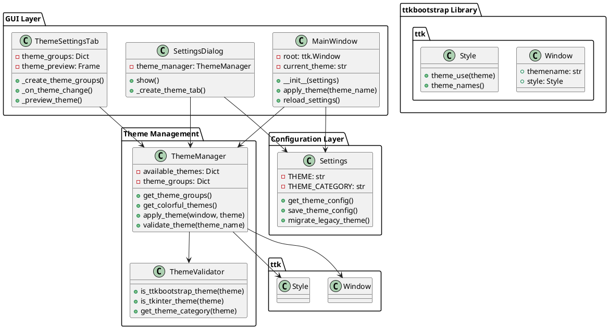
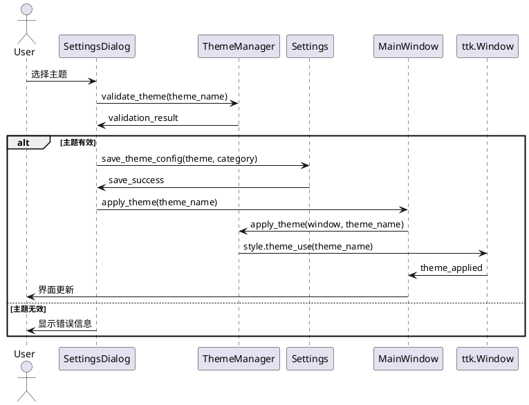

# ttkbootstrap主题切换功能 - 设计文档

## 整体架构设计

### 系统架构图



### 核心组件设计

#### 1. ThemeManager (主题管理器)
**职责**: 统一管理所有主题相关操作
```python
class ThemeManager:
    """主题管理器 - 统一管理主题切换和分组"""
    
    # 主题分组定义
    LIGHT_THEMES = ['litera', 'flatly', 'cosmo', 'journal', 'lumen', 
                   'minty', 'pulse', 'sandstone', 'united', 'yeti']
    
    DARK_THEMES = ['darkly', 'cyborg', 'slate', 'superhero', 'vapor']
    
    COLORFUL_THEMES = ['morph', 'vapor', 'superhero', 'cyborg']
    
    CLASSIC_THEMES = ['default', 'clam', 'alt', 'classic']
    
    DEFAULT_THEME = 'litera'
```

#### 2. 主窗口改造
**变更点**: 
- `tk.Tk()` → `ttk.Window(themename=...)`
- 添加主题切换方法
- 集成主题管理器

#### 3. 设置对话框扩展
**新增**: ThemeSettingsTab
- 4个主题分组的UI布局
- 实时主题预览
- 主题切换逻辑

## 分层设计

### 1. 表现层 (Presentation Layer)
```
GUI Components
├── MainWindow (主窗口)
│   ├── 使用 ttk.Window 替代 tk.Tk
│   └── 集成主题切换功能
├── SettingsDialog (设置对话框)
│   └── 新增主题设置选项卡
└── ThemeSettingsTab (主题设置选项卡)
    ├── 浅色主题组
    ├── 暗色主题组  
    ├── Colorful主题组
    └── Windows经典风格组
```

### 2. 业务逻辑层 (Business Logic Layer)
```
Theme Management
├── ThemeManager (主题管理器)
│   ├── 主题分组管理
│   ├── 主题切换逻辑
│   └── 主题验证
├── ThemeValidator (主题验证器)
│   ├── 主题有效性检查
│   └── 主题分类识别
└── ThemePreview (主题预览)
    ├── 实时预览功能
    └── 预览组件管理
```

### 3. 数据层 (Data Layer)
```
Configuration Management
├── Settings (配置管理)
│   ├── 主题配置存储
│   ├── 配置迁移逻辑
│   └── 配置验证
└── .env (配置文件)
    ├── THEME=litera
    ├── THEME_CATEGORY=light
    └── 向后兼容处理
```

## 核心组件接口设计

### 1. ThemeManager 接口
```python
class ThemeManager:
    def get_theme_groups(self) -> Dict[str, List[str]]:
        """获取所有主题分组"""
        
    def apply_theme(self, window: ttk.Window, theme_name: str) -> bool:
        """应用主题到窗口"""
        
    def get_colorful_themes(self) -> List[str]:
        """获取Colorful主题列表"""
        
    def validate_theme(self, theme_name: str) -> bool:
        """验证主题是否有效"""
        
    def get_theme_category(self, theme_name: str) -> str:
        """获取主题分类"""
```

### 2. Settings 扩展接口
```python
class Settings:
    def get_theme_config(self) -> Dict[str, str]:
        """获取主题配置"""
        
    def save_theme_config(self, theme: str, category: str) -> bool:
        """保存主题配置"""
        
    def migrate_legacy_theme(self) -> str:
        """迁移旧主题配置"""
```

### 3. MainWindow 扩展接口
```python
class MainWindow:
    def apply_theme(self, theme_name: str) -> None:
        """应用新主题"""
        
    def reload_theme_settings(self) -> None:
        """重新加载主题设置"""
```

## 数据流向图



## 异常处理策略

### 1. 主题加载失败
```python
def apply_theme(self, theme_name: str) -> bool:
    try:
        self.root.style.theme_use(theme_name)
        return True
    except tk.TclError as e:
        self.logger.warning(f"主题 {theme_name} 加载失败: {e}")
        # 回退到默认主题
        self.root.style.theme_use(self.DEFAULT_THEME)
        return False
```

### 2. 配置文件损坏
```python
def load_theme_config(self) -> str:
    try:
        theme = self.get_env_str('THEME', self.DEFAULT_THEME)
        if not self.theme_manager.validate_theme(theme):
            return self.migrate_legacy_theme()
        return theme
    except Exception as e:
        self.logger.error(f"主题配置加载失败: {e}")
        return self.DEFAULT_THEME
```

### 3. 依赖库缺失
```python
def check_ttkbootstrap_availability(self) -> bool:
    try:
        import ttkbootstrap
        return True
    except ImportError:
        self.logger.error("ttkbootstrap库未安装")
        return False
```

## 性能优化设计

### 1. 延迟加载
- 主题列表按需加载
- 预览组件延迟创建
- 主题验证缓存结果

### 2. 内存管理
- 及时释放未使用的主题资源
- 限制预览组件数量
- 使用弱引用避免循环引用

### 3. 响应性优化
- 主题切换异步执行
- UI更新批量处理
- 避免频繁的样式重计算

## 兼容性设计

### 1. 向后兼容
```python
THEME_MIGRATION_MAP = {
    'default': 'litera',
    'clam': 'flatly', 
    'alt': 'cosmo',
    'classic': 'journal'
}
```

### 2. 平台兼容
- Windows: 完全支持
- macOS: 测试验证
- Linux: 基础支持

### 3. Python版本兼容
- Python 3.8+: 完全支持
- 类型注解: 可选支持

## 测试策略

### 1. 单元测试
- ThemeManager 功能测试
- Settings 配置测试
- 主题验证测试

### 2. 集成测试
- 主题切换端到端测试
- 配置保存/加载测试
- GUI组件兼容性测试

### 3. 用户体验测试
- 主题切换响应时间
- 界面一致性检查
- 错误处理验证

## 部署考虑

### 1. 依赖管理
```toml
dependencies = [
    "ttkbootstrap>=1.10.0",
    # ... 其他依赖
]
```

### 2. 配置迁移
- 自动检测旧配置
- 平滑迁移策略
- 迁移日志记录

### 3. 回滚机制
- 保留配置备份
- 快速回滚功能
- 错误恢复策略

## 质量保证

### 1. 代码质量
- 遵循项目编码规范
- 完整的类型注解
- 充分的文档注释

### 2. 性能指标
- 主题切换时间 < 1秒
- 内存增长 < 10MB
- 启动时间增长 < 0.5秒

### 3. 用户体验
- 操作流畅性
- 界面一致性
- 错误提示友好性