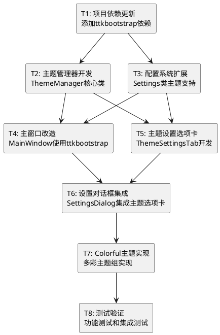

# ttkbootstrap主题切换功能 - 任务拆分文档

## 任务依赖关系图

---

## T1: 项目依赖更新
**复杂度**: 简单 | **预估时间**: 30分钟 | **优先级**: 高

### 输入契约
- **前置依赖**: 无
- **输入数据**: 当前pyproject.toml文件
- **环境依赖**: Python 3.8+, pip

### 输出契约
- **输出数据**: 更新后的pyproject.toml
- **交付物**: 
  - 更新的依赖配置
  - 安装验证脚本
- **验收标准**: 
  - ttkbootstrap>=1.10.0成功添加到依赖
  - pip install成功执行
  - 可以正常导入ttkbootstrap

### 实现约束
- **技术栈**: Python包管理
- **接口规范**: 遵循pyproject.toml标准
- **质量要求**: 依赖版本兼容性检查

### 依赖关系
- **后置任务**: T2, T3
- **并行任务**: 无

---

## T2: 主题管理器开发
**复杂度**: 中等 | **预估时间**: 2小时 | **优先级**: 高

### 输入契约
- **前置依赖**: T1完成
- **输入数据**: ttkbootstrap主题列表
- **环境依赖**: ttkbootstrap库已安装

### 输出契约
- **输出数据**: `src/network_analyzer/gui/theme_manager.py`
- **交付物**: 
  - ThemeManager类实现
  - ThemeValidator类实现
  - 主题分组配置
- **验收标准**: 
  - 支持4个主题分组
  - 主题验证功能正常
  - 主题切换功能正常
  - 单元测试通过

### 实现约束
- **技术栈**: Python, ttkbootstrap
- **接口规范**: 按设计文档定义的接口
- **质量要求**: 完整的错误处理和日志记录

### 依赖关系
- **后置任务**: T4, T5
- **并行任务**: T3

---

## T3: 配置系统扩展
**复杂度**: 中等 | **预估时间**: 1.5小时 | **优先级**: 高

### 输入契约
- **前置依赖**: T1完成
- **输入数据**: 现有Settings类
- **环境依赖**: python-dotenv库

### 输出契约
- **输出数据**: 更新的`src/network_analyzer/config/settings.py`
- **交付物**: 
  - 主题配置方法扩展
  - 配置迁移逻辑
  - 默认配置更新
- **验收标准**: 
  - 支持THEME和THEME_CATEGORY配置
  - 旧配置自动迁移
  - 配置验证功能正常
  - 向后兼容性保证

### 实现约束
- **技术栈**: Python, python-dotenv
- **接口规范**: 保持现有Settings接口兼容
- **质量要求**: 配置迁移安全可靠

### 依赖关系
- **后置任务**: T4, T5
- **并行任务**: T2

---

## T4: 主窗口改造
**复杂度**: 中等 | **预估时间**: 2小时 | **优先级**: 高

### 输入契约
- **前置依赖**: T2, T3完成
- **输入数据**: 现有MainWindow类
- **环境依赖**: ThemeManager, 更新的Settings

### 输出契约
- **输出数据**: 更新的`src/network_analyzer/gui/main_window.py`
- **交付物**: 
  - 使用ttk.Window替代tk.Tk
  - 集成ThemeManager
  - 主题切换方法
- **验收标准**: 
  - 主窗口使用ttkbootstrap主题
  - 主题切换功能正常
  - 所有现有功能保持正常
  - 界面风格一致

### 实现约束
- **技术栈**: ttkbootstrap, ThemeManager
- **接口规范**: 保持现有MainWindow接口
- **质量要求**: 不破坏现有功能

### 依赖关系
- **后置任务**: T6
- **并行任务**: T5

---

## T5: 主题设置选项卡
**复杂度**: 中等 | **预估时间**: 2.5小时 | **优先级**: 高

### 输入契约
- **前置依赖**: T2, T3完成
- **输入数据**: ThemeManager, Settings扩展
- **环境依赖**: tkinter, ttkbootstrap

### 输出契约
- **输出数据**: `src/network_analyzer/gui/dialogs/theme_settings_tab.py`
- **交付物**: 
  - ThemeSettingsTab类实现
  - 4个主题分组UI
  - 主题预览功能
  - 主题切换逻辑
- **验收标准**: 
  - 支持4个主题分组显示
  - 主题选择功能正常
  - 实时预览效果
  - 配置保存功能

### 实现约束
- **技术栈**: tkinter, ttkbootstrap, ThemeManager
- **接口规范**: 遵循现有设置选项卡模式
- **质量要求**: 用户体验流畅

### 依赖关系
- **后置任务**: T6
- **并行任务**: T4

---

## T6: 设置对话框集成
**复杂度**: 简单 | **预估时间**: 1小时 | **优先级**: 中等

### 输入契约
- **前置依赖**: T4, T5完成
- **输入数据**: 现有SettingsDialog, ThemeSettingsTab
- **环境依赖**: 完整的主题系统

### 输出契约
- **输出数据**: 更新的`src/network_analyzer/gui/dialogs/settings_dialog.py`
- **交付物**: 
  - 集成主题设置选项卡
  - 更新设置对话框布局
  - 主题切换立即生效
- **验收标准**: 
  - 主题选项卡正常显示
  - 主题切换立即生效
  - 设置保存功能正常
  - 与其他设置选项卡协调

### 实现约束
- **技术栈**: tkinter, 现有设置框架
- **接口规范**: 保持现有设置对话框接口
- **质量要求**: 界面布局协调

### 依赖关系
- **后置任务**: T7
- **并行任务**: 无

---

## T7: Colorful主题实现
**复杂度**: 中等 | **预估时间**: 1.5小时 | **优先级**: 中等

### 输入契约
- **前置依赖**: T6完成
- **输入数据**: 完整的主题系统
- **环境依赖**: ttkbootstrap主题库

### 输出契约
- **输出数据**: 
  - 更新的ThemeManager (Colorful主题组)
  - Colorful主题配置
- **交付物**: 
  - Colorful主题列表定义
  - 主题审美优化
  - 颜色搭配验证
- **验收标准**: 
  - Colorful主题组正常显示
  - 主题颜色搭配协调
  - 五彩斑斓效果达到预期
  - 审美在线，不割裂

### 实现约束
- **技术栈**: ttkbootstrap主题系统
- **接口规范**: 遵循ThemeManager接口
- **质量要求**: 颜色搭配审美优秀

### 依赖关系
- **后置任务**: T8
- **并行任务**: 无

---

## T8: 测试验证
**复杂度**: 中等 | **预估时间**: 2小时 | **优先级**: 中等

### 输入契约
- **前置依赖**: T7完成
- **输入数据**: 完整的主题切换系统
- **环境依赖**: 完整的开发环境

### 输出契约
- **输出数据**: 
  - 测试脚本集合
  - 测试报告
  - Bug修复
- **交付物**: 
  - 单元测试脚本
  - 集成测试脚本
  - 用户体验测试
  - 性能测试报告
- **验收标准**: 
  - 所有单元测试通过
  - 集成测试通过
  - 性能指标达标
  - 用户体验流畅

### 实现约束
- **技术栈**: pytest, 现有测试框架
- **接口规范**: 遵循项目测试规范
- **质量要求**: 测试覆盖率>90%

### 依赖关系
- **后置任务**: 无
- **并行任务**: 无

---

## 任务执行计划

### 第一阶段 (基础设施)
1. **T1: 项目依赖更新** (30分钟)
2. **T2 & T3: 并行开发** (2小时)
   - T2: 主题管理器开发
   - T3: 配置系统扩展

### 第二阶段 (核心功能)
3. **T4 & T5: 并行开发** (2.5小时)
   - T4: 主窗口改造
   - T5: 主题设置选项卡

### 第三阶段 (集成优化)
4. **T6: 设置对话框集成** (1小时)
5. **T7: Colorful主题实现** (1.5小时)

### 第四阶段 (测试验证)
6. **T8: 测试验证** (2小时)

**总预估时间**: 9.5小时 (约2个工作日)

## 风险控制

### 高风险任务
- **T4: 主窗口改造** - 可能影响现有功能
- **T5: 主题设置选项卡** - UI复杂度较高

### 风险缓解策略
1. **备份策略**: 每个任务开始前创建代码备份
2. **渐进式测试**: 每完成一个任务立即测试
3. **回滚机制**: 保持git提交粒度，便于回滚
4. **依赖隔离**: 确保任务间依赖清晰，避免循环依赖

## 质量检查点

### 每个任务完成后检查
1. ✅ 功能正常工作
2. ✅ 代码符合规范
3. ✅ 无明显性能问题
4. ✅ 现有功能未受影响
5. ✅ 文档更新完整

### 里程碑检查
- **第一阶段后**: 基础设施就绪
- **第二阶段后**: 核心功能可用
- **第三阶段后**: 完整功能集成
- **第四阶段后**: 质量验证通过