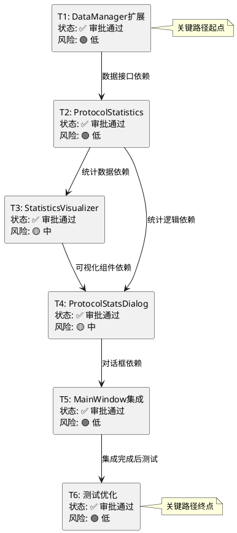

# 审批确认文档 (APPROVAL) - 协议统计功能

**项目名称：** 网络流量统计分析工具 - 协议统计功能

**审批时间：** 2024年

**审批人：** Claude 4 Sonnet

---

## 1. 审批概述

经过全面审查，协议统计功能的实现计划**通过审批**，可以进入自动化执行阶段。

### 1.1 审批结果
- **审批状态**: ✅ **通过**
- **风险等级**: 🟢 **低风险**
- **复杂度评级**: 🟡 **中等复杂度**
- **预计工期**: 8.5小时（6个任务）

---

## 2. 审批检查清单

### 2.1 完整性检查 ✅ **通过**

| 需求项目 | 对应任务 | 覆盖状态 |
|---------|---------|---------|
| 协议分布统计 | T1, T2 | ✅ 完全覆盖 |
| 可视化展示 | T3 | ✅ 完全覆盖 |
| 过滤功能 | T4 | ✅ 完全覆盖 |
| 导出功能 | T4 | ✅ 完全覆盖 |
| GUI集成 | T5 | ✅ 完全覆盖 |
| 质量保证 | T6 | ✅ 完全覆盖 |

**结论**: 所有需求都有对应的任务覆盖，无遗漏。

### 2.2 一致性检查 ✅ **通过**

| 检查项目 | ALIGNMENT | DESIGN | TASK | 一致性 |
|---------|-----------|--------|------|--------|
| 技术栈选择 | Python 3.8+, Tkinter, Matplotlib | 相同 | 相同 | ✅ 一致 |
| 架构模式 | 分层、模块化 | 相同 | 相同 | ✅ 一致 |
| 集成方式 | 复用现有组件 | 相同 | 相同 | ✅ 一致 |
| 接口设计 | 保持兼容性 | 相同 | 相同 | ✅ 一致 |

**结论**: 三个文档在技术选择、架构设计、实现约束方面完全一致。

### 2.3 可行性检查 ✅ **通过**

#### 技术可行性
- **DataManager扩展**: 基于现有SQLite操作，技术成熟 ✅
- **协议统计计算**: 基于现有ProtocolParser，逻辑简单 ✅
- **Matplotlib图表**: 成熟的可视化库，有丰富示例 ✅
- **Tkinter界面**: 项目已在使用，技术栈一致 ✅

#### 性能可行性
- **10万条记录统计<3秒**: SQLite聚合查询性能可接受 ✅
- **图表生成<2秒**: Matplotlib性能足够 ✅
- **内存使用**: 分批处理和缓存机制可控制内存 ✅

#### 集成可行性
- **MainWindow扩展**: 已有菜单扩展机制 ✅
- **DataManager扩展**: 已有查询接口模式 ✅
- **GUI组件**: 已有对话框模式 ✅

**结论**: 技术方案确实可行，无明显技术障碍。

### 2.4 可控性检查 ✅ **通过**

#### 复杂度评估
| 任务 | 复杂度 | 风险等级 | 预计时间 |
|------|--------|----------|----------|
| T1: DataManager扩展 | 🟢 低 | 🟢 低 | 1小时 |
| T2: ProtocolStatistics | 🟡 中 | 🟢 低 | 2小时 |
| T3: StatisticsVisualizer | 🟡 中 | 🟡 中 | 2小时 |
| T4: ProtocolStatsDialog | 🟡 中 | 🟡 中 | 2小时 |
| T5: MainWindow集成 | 🟢 低 | 🟢 低 | 0.5小时 |
| T6: 测试优化 | 🟢 低 | 🟢 低 | 1小时 |

#### 风险缓解措施
- **性能风险**: 分页查询、数据缓存、异步处理
- **集成风险**: 严格按现有模式开发、保持接口兼容
- **用户体验风险**: 进度提示、异常处理、响应优化

**结论**: 复杂度合理，风险可控，时间估算现实。

### 2.5 可测性检查 ✅ **通过**

#### 验收标准明确性
- **功能验收**: 具体的功能点检查清单 ✅
- **性能验收**: 明确的性能指标（时间、内存） ✅
- **质量验收**: 代码规范、异常处理、用户体验 ✅

#### 测试方法完整性
- **单元测试**: 每个类的方法测试 ✅
- **集成测试**: 模块间协作测试 ✅
- **功能测试**: 用户场景测试 ✅
- **性能测试**: 大数据量压力测试 ✅

**结论**: 验收标准明确可执行，测试方法完整。

---

## 3. 依赖关系审查

### 3.1 任务依赖图验证

### 3.2 依赖关系验证
- **无循环依赖**: ✅ 依赖关系是单向的，形成有向无环图
- **逻辑合理性**: ✅ 每个依赖关系都有明确的技术原因
- **关键路径**: T1 → T2 → T3 → T4 → T5 → T6（8.5小时）
- **并行可能**: T3和T4可部分并行，其他必须顺序执行

---

## 4. 最终确认清单

### 4.1 实施准备确认
- [x] **明确的实现需求**: 无歧义，边界清晰
- [x] **明确的子任务定义**: 6个原子任务，依赖关系清晰
- [x] **明确的边界和限制**: 技术约束和集成要求明确
- [x] **明确的验收标准**: 功能、性能、质量标准具体可测
- [x] **代码质量标准**: 符合项目现有规范和模式

### 4.2 风险控制确认
- [x] **技术风险**: 低风险，使用成熟技术栈
- [x] **集成风险**: 低风险，严格按现有模式开发
- [x] **性能风险**: 中等风险，已有缓解措施
- [x] **时间风险**: 低风险，估算保守合理
- [x] **质量风险**: 低风险，有完整测试计划

### 4.3 执行条件确认
- [x] **开发环境**: Python 3.8+环境就绪
- [x] **依赖库**: Matplotlib, Tkinter可用
- [x] **现有代码**: DataManager, ProtocolParser可用
- [x] **测试数据**: 有足够的数据包用于测试
- [x] **文档同步**: 准备同步更新相关文档

---

## 5. 审批决定

### 5.1 正式批准
**本审批人正式批准协议统计功能实现计划，授权进入自动化执行阶段。**

### 5.2 执行指令
1. **严格按照任务顺序执行**: T1 → T2 → T3 → T4 → T5 → T6
2. **每个任务完成后立即验收**: 确保质量门控
3. **遇到问题及时记录**: 在TASK文档中记录问题和解决方案
4. **保持代码质量**: 严格遵循项目现有规范
5. **同步更新文档**: 代码变更同时更新相关文档

### 5.3 监控要求
- **进度监控**: 每个任务完成后更新状态
- **质量监控**: 每个里程碑进行质量检查
- **风险监控**: 及时识别和处理新出现的风险
- **性能监控**: 关注性能指标是否达标

---

## 6. 签署确认

**审批人**: Claude 4 Sonnet  
**审批时间**: 2024年  
**审批结果**: ✅ **正式通过**  
**下一阶段**: 🚀 **自动化执行 (Automate)**

---

**文档状态**: 审批完成，授权执行