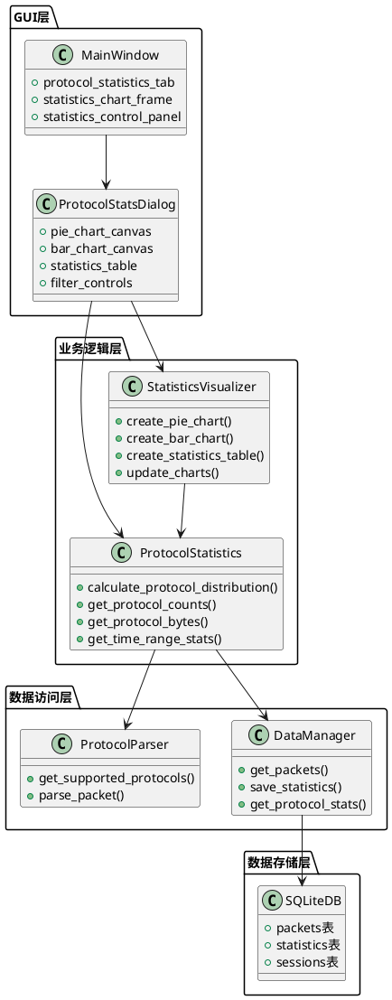
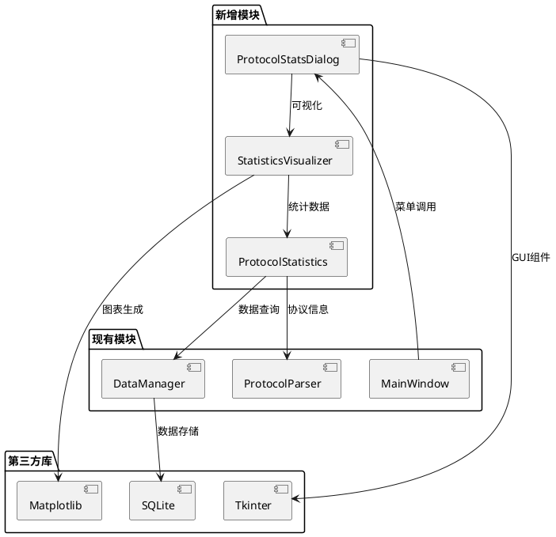
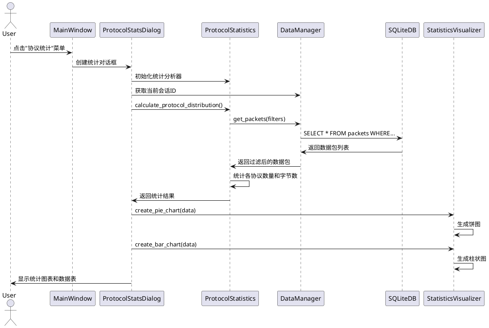

# 系统设计文档 (DESIGN) - 协议统计功能

**项目名称：** 网络流量统计分析工具 - 协议统计功能

**创建时间：** 2024年

**负责人：** Claude 4 Sonnet

---

## 1. 整体架构设计

### 1.1 系统架构图



### 1.2 模块依赖关系



## 2. 核心模块设计

### 2.1 ProtocolStatistics 类设计

```python
class ProtocolStatistics:
    """协议统计分析类"""
    
    def __init__(self, data_manager: DataManager):
        self.data_manager = data_manager
        self.protocol_parser = ProtocolParser()
        
    def calculate_protocol_distribution(self, 
                                      session_id: Optional[int] = None,
                                      start_time: Optional[float] = None,
                                      end_time: Optional[float] = None) -> Dict[str, Dict[str, Any]]:
        """
        计算协议分布统计
        
        Returns:
            {
                'TCP': {'count': 1000, 'bytes': 50000, 'percentage': 60.5},
                'UDP': {'count': 500, 'bytes': 20000, 'percentage': 30.3},
                'ICMP': {'count': 150, 'bytes': 5000, 'percentage': 9.2}
            }
        """
        
    def get_protocol_counts(self, **filters) -> Dict[str, int]:
        """获取各协议数据包数量"""
        
    def get_protocol_bytes(self, **filters) -> Dict[str, int]:
        """获取各协议字节数统计"""
        
    def get_time_range_stats(self, time_window: int = 3600) -> List[Dict[str, Any]]:
        """获取时间范围内的协议统计"""
```

### 2.2 StatisticsVisualizer 类设计

```python
class StatisticsVisualizer:
    """统计数据可视化类"""
    
    def __init__(self, parent_frame: tk.Frame):
        self.parent_frame = parent_frame
        self.figure = None
        self.canvas = None
        
    def create_pie_chart(self, data: Dict[str, Dict[str, Any]], 
                        metric: str = 'count') -> None:
        """创建协议分布饼图"""
        
    def create_bar_chart(self, data: Dict[str, Dict[str, Any]], 
                        metric: str = 'count') -> None:
        """创建协议统计柱状图"""
        
    def create_statistics_table(self, data: Dict[str, Dict[str, Any]]) -> tk.Frame:
        """创建统计数据表格"""
        
    def update_charts(self, new_data: Dict[str, Dict[str, Any]]) -> None:
        """更新图表数据"""
```

### 2.3 ProtocolStatsDialog 类设计

```python
class ProtocolStatsDialog:
    """协议统计对话框"""
    
    def __init__(self, parent: tk.Tk, data_manager: DataManager):
        self.parent = parent
        self.data_manager = data_manager
        self.statistics = ProtocolStatistics(data_manager)
        self.visualizer = None
        
    def show(self) -> None:
        """显示统计对话框"""
        
    def _create_ui(self) -> None:
        """创建用户界面"""
        
    def _create_filter_controls(self) -> tk.Frame:
        """创建过滤控制面板"""
        
    def _create_chart_area(self) -> tk.Frame:
        """创建图表显示区域"""
        
    def _update_statistics(self) -> None:
        """更新统计数据"""
        
    def _export_statistics(self) -> None:
        """导出统计数据"""
```

## 3. 数据流设计

### 3.1 数据流图



### 3.2 数据结构设计

#### 统计数据结构
```python
ProtocolStats = {
    'protocol_name': str,           # 协议名称
    'packet_count': int,            # 数据包数量
    'total_bytes': int,             # 总字节数
    'percentage_count': float,      # 数量百分比
    'percentage_bytes': float,      # 字节百分比
    'avg_packet_size': float,       # 平均包大小
    'first_seen': float,            # 首次出现时间
    'last_seen': float              # 最后出现时间
}

StatisticsResult = {
    'total_packets': int,           # 总数据包数
    'total_bytes': int,             # 总字节数
    'time_range': {                 # 时间范围
        'start': float,
        'end': float
    },
    'protocols': Dict[str, ProtocolStats]  # 各协议统计
}
```

## 4. 界面设计

### 4.1 主窗口集成

在现有主窗口的菜单栏添加：
```
分析(A)
├── 协议统计(P)    Ctrl+P
├── 流量趋势(T)    Ctrl+T
└── 生成报告(R)    Ctrl+R
```

### 4.2 协议统计对话框布局

```
┌─────────────────────────────────────────────────────────────┐
│ 协议统计分析                                          [×]    │
├─────────────────────────────────────────────────────────────┤
│ 过滤条件: [会话选择▼] [时间范围▼] [刷新] [导出]              │
├─────────────────────────────────────────────────────────────┤
│ ┌─────────────────┐ ┌─────────────────┐ ┌─────────────────┐ │
│ │   协议分布饼图   │ │   协议统计柱图   │ │   统计数据表格   │ │
│ │                │ │                │ │                │ │
│ │                │ │                │ │                │ │
│ │                │ │                │ │                │ │
│ └─────────────────┘ └─────────────────┘ └─────────────────┘ │
├─────────────────────────────────────────────────────────────┤
│ 状态: 共分析 1,234 个数据包，5 种协议                        │
└─────────────────────────────────────────────────────────────┘
```

### 4.3 图表设计规范

#### 饼图设计
- 使用不同颜色区分协议
- 显示协议名称和百分比
- 支持点击查看详细信息
- 自动调整标签位置避免重叠

#### 柱状图设计
- X轴：协议名称
- Y轴：数据包数量或字节数
- 支持切换显示指标
- 显示具体数值标签

#### 数据表格设计
- 列：协议、数据包数、字节数、百分比、平均包大小
- 支持按列排序
- 支持数据导出

## 5. 接口规范

### 5.1 数据库查询接口

扩展 DataManager 类，添加协议统计专用方法：

```python
def get_protocol_statistics(self, 
                          session_id: Optional[int] = None,
                          start_time: Optional[float] = None,
                          end_time: Optional[float] = None) -> Dict[str, Any]:
    """
    获取协议统计数据
    
    Returns:
        {
            'total_packets': int,
            'total_bytes': int,
            'protocols': {
                'TCP': {'count': 1000, 'bytes': 50000},
                'UDP': {'count': 500, 'bytes': 20000}
            }
        }
    """
```

### 5.2 GUI集成接口

在 MainWindow 类中添加：

```python
def _protocol_statistics(self) -> None:
    """显示协议统计对话框"""
    try:
        dialog = ProtocolStatsDialog(self.root, self.data_manager)
        dialog.show()
    except Exception as e:
        self.logger.error(f"打开协议统计失败: {e}")
        messagebox.showerror("错误", f"无法打开协议统计: {e}")
```

## 6. 性能优化设计

### 6.1 数据查询优化
- 使用数据库索引加速协议字段查询
- 实现分页查询避免内存溢出
- 缓存统计结果减少重复计算

### 6.2 图表渲染优化
- 异步生成图表避免界面卡顿
- 限制图表数据点数量
- 使用图表缓存机制

### 6.3 内存管理
- 及时释放大型数据对象
- 使用生成器处理大数据集
- 实现数据分批处理

## 7. 异常处理策略

### 7.1 数据异常
- 空数据集处理
- 无效协议数据过滤
- 数据库连接异常恢复

### 7.2 界面异常
- 图表生成失败处理
- 对话框创建异常
- 用户操作异常捕获

## 8. 测试策略

### 8.1 单元测试
- ProtocolStatistics 类方法测试
- StatisticsVisualizer 图表生成测试
- 数据查询接口测试

### 8.2 集成测试
- GUI对话框显示测试
- 数据流完整性测试
- 性能压力测试

---

**设计状态**: 架构设计完成，准备进入任务拆分阶段