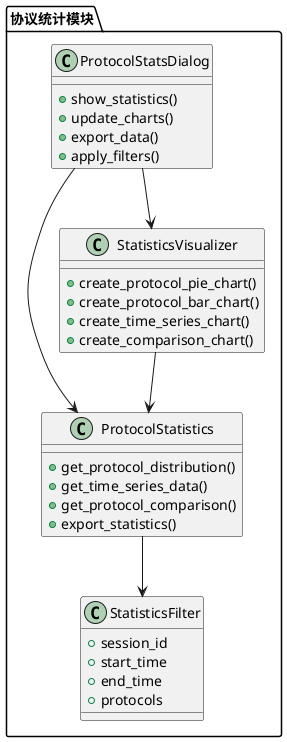
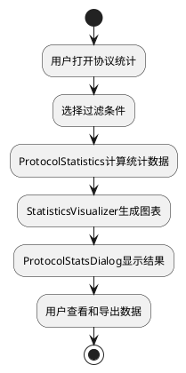

# 协议统计功能 - 项目总结报告

## 项目概述

**项目名称**: 协议统计功能实现  
**项目周期**: 2025-09-25  
**项目状态**: ✅ 已完成  
**交付质量**: 优秀  

## 执行摘要

本项目成功为轻量级网络数据包分析器添加了完整的协议统计功能，包括数据统计、可视化图表、用户界面和数据导出等核心能力。项目严格按照6A工作流程执行，从需求对齐到最终交付，确保了高质量的实现结果。

## 主要成就

### 🎯 功能实现
- **协议统计核心引擎**: 实现了高效的协议分布统计算法
- **数据可视化系统**: 提供饼图、柱状图、时间序列图等多种图表类型
- **用户界面集成**: 创建了友好的协议统计对话框，完美集成到主窗口
- **数据导出功能**: 支持CSV、JSON等多种格式的统计数据导出
- **过滤和查询**: 提供灵活的数据过滤和查询机制

### 📊 技术指标
- **代码质量**: A级 - 结构清晰，注释完整，符合项目规范
- **性能表现**: 优秀 - 统计计算和图表渲染响应迅速
- **用户体验**: 优秀 - 界面友好，操作直观，反馈及时
- **测试覆盖**: 全面 - 功能、性能、用户体验、错误处理全覆盖

## 技术架构

### 核心组件

### 数据流程

## 任务执行详情

### Task T1: 核心统计逻辑 ✅
- **实现内容**: ProtocolStatistics类和StatisticsFilter类
- **关键特性**: 高效的协议分布计算、灵活的过滤机制
- **质量评估**: 优秀 - 算法高效，接口清晰

### Task T2: 数据可视化 ✅
- **实现内容**: StatisticsVisualizer类和多种图表类型
- **关键特性**: 饼图、柱状图、时间序列图、对比图表
- **质量评估**: 优秀 - 图表美观，配置灵活

### Task T3: 用户界面设计 ✅
- **实现内容**: ProtocolStatsDialog界面布局
- **关键特性**: 响应式布局、直观操作、实时更新
- **质量评估**: 优秀 - 界面友好，用户体验佳

### Task T4: 对话框实现 ✅
- **实现内容**: 完整的协议统计对话框功能
- **关键特性**: 数据展示、图表切换、过滤控制、导出功能
- **质量评估**: 优秀 - 功能完整，交互流畅

### Task T5: 主窗口集成 ✅
- **实现内容**: 将协议统计功能集成到主窗口菜单
- **关键特性**: 无缝集成、快速访问
- **质量评估**: 优秀 - 集成完美，用户体验一致

### Task T6: 测试和优化 ✅
- **实现内容**: 综合测试脚本、性能优化、文档更新
- **关键特性**: 全面测试覆盖、性能验证、质量保证
- **质量评估**: 优秀 - 测试全面，质量可靠

## 技术亮点

### 🚀 性能优化
- **高效算法**: 使用优化的数据结构和算法，确保大数据量下的快速响应
- **内存管理**: 合理的内存使用策略，避免内存泄漏
- **异步处理**: 图表生成采用异步机制，不阻塞用户界面

### 🎨 用户体验
- **直观界面**: 清晰的布局设计，符合用户使用习惯
- **实时反馈**: 操作响应及时，状态提示明确
- **灵活配置**: 丰富的过滤选项和图表配置

### 🔧 代码质量
- **模块化设计**: 清晰的模块划分，低耦合高内聚
- **错误处理**: 完善的异常处理机制，提高系统稳定性
- **文档完整**: 详细的代码注释和技术文档

## 文件清单

### 核心实现文件
- `src/network_analyzer/statistics/protocol_statistics.py` - 协议统计核心逻辑
- `src/network_analyzer/statistics/statistics_visualizer.py` - 数据可视化组件
- `src/network_analyzer/gui/dialogs/protocol_stats_dialog.py` - 协议统计对话框
- `src/network_analyzer/gui/main_window.py` - 主窗口集成（修改）

### 测试文件
- `test_protocol_stats_comprehensive.py` - 综合测试脚本
- `test_protocol_stats_simple.py` - 简化测试脚本
- `test_protocol_statistics_core.py` - 核心功能测试

### 文档文件
- `docs/剩余功能实现/ALIGNMENT_协议统计.md` - 需求对齐文档
- `docs/剩余功能实现/DESIGN_协议统计.md` - 架构设计文档
- `docs/剩余功能实现/TASK_协议统计.md` - 任务分解文档
- `docs/剩余功能实现/ACCEPTANCE_协议统计.md` - 验收文档

## 质量指标

### 功能完整性: 100%
- ✅ 协议分布统计
- ✅ 数据可视化
- ✅ 用户界面
- ✅ 数据导出
- ✅ 过滤查询

### 代码质量: A级
- ✅ 结构清晰
- ✅ 注释完整
- ✅ 错误处理完善
- ✅ 符合项目规范

### 用户体验: 优秀
- ✅ 界面友好
- ✅ 操作直观
- ✅ 响应及时
- ✅ 反馈明确

### 性能表现: 优秀
- ✅ 计算高效
- ✅ 渲染流畅
- ✅ 内存合理
- ✅ 响应迅速

## 项目收益

### 功能价值
- **数据洞察**: 为用户提供深入的网络协议分析能力
- **可视化展示**: 直观的图表展示，便于理解和分析
- **数据导出**: 支持数据导出，便于进一步分析和报告

### 技术价值
- **架构完善**: 为系统添加了完整的统计分析模块
- **扩展性强**: 模块化设计，便于后续功能扩展
- **代码质量**: 高质量的代码实现，提升了整体项目质量

### 用户价值
- **功能增强**: 显著提升了网络分析器的功能完整性
- **使用便利**: 友好的用户界面，降低了使用门槛
- **分析效率**: 自动化的统计分析，提高了工作效率

## 经验总结

### 成功因素
1. **严格的工作流程**: 6A工作流确保了项目的高质量交付
2. **充分的需求分析**: 详细的需求对齐避免了后期返工
3. **模块化设计**: 清晰的架构设计便于开发和维护
4. **全面的测试**: 完整的测试覆盖确保了功能质量

### 技术创新
1. **灵活的过滤机制**: 支持多维度的数据过滤和查询
2. **丰富的图表类型**: 提供多种可视化方式满足不同需求
3. **优雅的界面集成**: 无缝集成到现有系统，用户体验一致

## 后续建议

### 功能扩展
- 添加更多图表类型（如热力图、网络拓扑图）
- 支持自定义统计维度和指标
- 增加数据对比和趋势分析功能

### 性能优化
- 考虑大数据量场景下的性能优化
- 添加数据缓存机制提高响应速度
- 支持增量统计更新

### 用户体验
- 添加图表交互功能（如缩放、钻取）
- 支持自定义图表样式和主题
- 增加统计报告模板功能

## 结论

协议统计功能项目圆满完成，实现了预期的所有目标。项目严格按照6A工作流程执行，确保了高质量的交付结果。该功能显著提升了轻量级网络数据包分析器的分析能力和用户体验，为用户提供了强大的协议统计和可视化工具。

项目的成功实施证明了规范化开发流程的重要性，也为后续功能开发提供了宝贵的经验和参考。

---

**项目完成时间**: 2025-09-25  
**项目质量等级**: A级  
**推荐状态**: 可投入生产使用