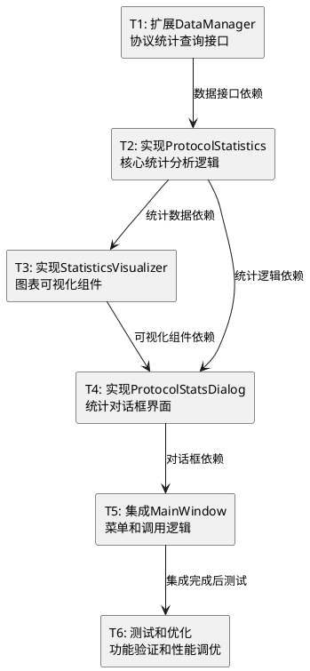

# 任务拆分文档 (TASK) - 协议统计功能

**项目名称：** 网络流量统计分析工具 - 协议统计功能

**创建时间：** 2024年

**负责人：** Claude 4 Sonnet

---

## 1. 任务概览

基于DESIGN文档，将协议统计功能拆分为6个可独立实现的原子任务，按依赖关系顺序执行。

### 1.1 任务依赖关系图



---

## 2. 原子任务详细定义

### 任务T1: 扩展DataManager协议统计查询接口

#### 输入契约
- **前置依赖**: 现有DataManager类和数据库结构
- **输入数据**: 现有packets表结构和protocol字段
- **环境依赖**: SQLite数据库连接正常

#### 输出契约
- **输出数据**: 扩展的DataManager类，包含协议统计查询方法
- **交付物**: 
  - 修改后的 `src/network_analyzer/storage/data_manager.py`
  - 新增协议统计查询方法
- **验收标准**: 
  - 能够按会话、时间范围查询协议统计
  - 返回正确的协议分布数据
  - 查询性能满足要求（<1秒处理10万条记录）

#### 实现约束
- **技术栈**: Python 3.8+, SQLite3
- **接口规范**: 
  ```python
  def get_protocol_statistics(self, session_id=None, start_time=None, end_time=None) -> Dict[str, Any]
  def get_protocol_counts(self, **filters) -> Dict[str, int]
  def get_protocol_bytes(self, **filters) -> Dict[str, int]
  ```
- **质量要求**: 
  - 添加适当的错误处理
  - 使用参数化查询防止SQL注入
  - 添加日志记录

#### 依赖关系
- **后置任务**: T2 (ProtocolStatistics实现)
- **并行任务**: 无

---

### 任务T2: 实现ProtocolStatistics核心统计分析逻辑

#### 输入契约
- **前置依赖**: T1完成，DataManager扩展接口可用
- **输入数据**: 协议统计查询接口返回的数据
- **环境依赖**: ProtocolParser类可用

#### 输出契约
- **输出数据**: ProtocolStatistics类实现
- **交付物**: 
  - 新建 `src/network_analyzer/analysis/protocol_statistics.py`
  - 完整的统计分析逻辑
- **验收标准**: 
  - 正确计算协议分布百分比
  - 支持多种过滤条件
  - 处理边界情况（空数据、单一协议等）

#### 实现约束
- **技术栈**: Python 3.8+, 标准库
- **接口规范**: 按DESIGN文档中的ProtocolStatistics类设计
- **质量要求**: 
  - 完整的单元测试覆盖
  - 性能优化（大数据集处理）
  - 详细的文档字符串

#### 依赖关系
- **前置任务**: T1 (DataManager扩展)
- **后置任务**: T3 (StatisticsVisualizer), T4 (ProtocolStatsDialog)
- **并行任务**: 无

---

### 任务T3: 实现StatisticsVisualizer图表可视化组件

#### 输入契约
- **前置依赖**: T2完成，ProtocolStatistics类可用
- **输入数据**: 协议统计数据字典
- **环境依赖**: Matplotlib库可用，Tkinter环境正常

#### 输出契约
- **输出数据**: StatisticsVisualizer类实现
- **交付物**: 
  - 新建 `src/network_analyzer/gui/components/statistics_visualizer.py`
  - 饼图、柱状图、数据表格组件
- **验收标准**: 
  - 生成美观的协议分布饼图
  - 生成清晰的协议统计柱状图
  - 创建可排序的数据表格
  - 支持图表数据更新

#### 实现约束
- **技术栈**: Python 3.8+, Matplotlib, Tkinter
- **接口规范**: 按DESIGN文档中的StatisticsVisualizer类设计
- **质量要求**: 
  - 图表美观度和可读性
  - 响应式布局适配
  - 异常处理（数据为空等）

#### 依赖关系
- **前置任务**: T2 (ProtocolStatistics实现)
- **后置任务**: T4 (ProtocolStatsDialog)
- **并行任务**: 可与T4部分并行开发

---

### 任务T4: 实现ProtocolStatsDialog统计对话框界面

#### 输入契约
- **前置依赖**: T2, T3完成，统计逻辑和可视化组件可用
- **输入数据**: DataManager实例，当前会话信息
- **环境依赖**: Tkinter GUI环境，主窗口可用

#### 输出契约
- **输出数据**: ProtocolStatsDialog类实现
- **交付物**: 
  - 新建 `src/network_analyzer/gui/dialogs/protocol_stats_dialog.py`
  - 完整的统计对话框界面
- **验收标准**: 
  - 对话框正常显示和关闭
  - 过滤控件功能正常
  - 图表和表格正确显示
  - 导出功能可用

#### 实现约束
- **技术栈**: Python 3.8+, Tkinter
- **接口规范**: 按DESIGN文档中的ProtocolStatsDialog类设计
- **质量要求**: 
  - 界面美观和用户友好
  - 响应速度快（<2秒加载）
  - 错误处理和用户提示

#### 依赖关系
- **前置任务**: T2 (ProtocolStatistics), T3 (StatisticsVisualizer)
- **后置任务**: T5 (MainWindow集成)
- **并行任务**: 无

---

### 任务T5: 集成MainWindow菜单和调用逻辑

#### 输入契约
- **前置依赖**: T4完成，ProtocolStatsDialog可用
- **输入数据**: 现有MainWindow类结构
- **环境依赖**: 主窗口GUI正常运行

#### 输出契约
- **输出数据**: 扩展的MainWindow类
- **交付物**: 
  - 修改后的 `src/network_analyzer/gui/main_window.py`
  - 新增菜单项和调用逻辑
- **验收标准**: 
  - "分析"菜单正确显示
  - "协议统计"菜单项可点击
  - 快捷键Ctrl+P正常工作
  - 对话框正确打开和关闭

#### 实现约束
- **技术栈**: Python 3.8+, Tkinter
- **接口规范**: 保持现有MainWindow接口兼容性
- **质量要求**: 
  - 不影响现有功能
  - 菜单布局合理
  - 异常处理完善

#### 依赖关系
- **前置任务**: T4 (ProtocolStatsDialog实现)
- **后置任务**: T6 (测试和优化)
- **并行任务**: 无

---

### 任务T6: 测试和优化功能验证

#### 输入契约
- **前置依赖**: T1-T5全部完成，功能集成完毕
- **输入数据**: 完整的协议统计功能
- **环境依赖**: 测试数据和测试环境

#### 输出契约
- **输出数据**: 经过测试和优化的协议统计功能
- **交付物**: 
  - 功能测试报告
  - 性能优化记录
  - 用户使用文档
- **验收标准**: 
  - 所有功能正常工作
  - 性能满足要求
  - 无明显bug和异常
  - 用户体验良好

#### 实现约束
- **技术栈**: 现有技术栈
- **接口规范**: 最终接口稳定
- **质量要求**: 
  - 完整的功能测试
  - 性能基准测试
  - 用户体验测试

#### 依赖关系
- **前置任务**: T1-T5 (所有实现任务)
- **后置任务**: 无
- **并行任务**: 无

---

## 3. 实施计划

### 3.1 任务执行顺序
1. **T1**: DataManager扩展 (预计1小时)
2. **T2**: ProtocolStatistics实现 (预计2小时)
3. **T3**: StatisticsVisualizer实现 (预计2小时)
4. **T4**: ProtocolStatsDialog实现 (预计2小时)
5. **T5**: MainWindow集成 (预计0.5小时)
6. **T6**: 测试和优化 (预计1小时)

### 3.2 关键里程碑
- **里程碑1**: T1-T2完成，核心统计逻辑可用
- **里程碑2**: T3-T4完成，完整对话框可用
- **里程碑3**: T5完成，功能完全集成
- **里程碑4**: T6完成，功能发布就绪

### 3.3 风险控制
- **技术风险**: 图表渲染性能问题 → 实现数据分页和缓存
- **集成风险**: 与现有代码冲突 → 严格按照现有模式开发
- **用户体验风险**: 界面响应慢 → 异步处理和进度提示

---

## 4. 验收标准总览

### 4.1 功能验收
- [ ] 协议统计数据计算正确
- [ ] 饼图和柱状图显示正常
- [ ] 数据表格可排序和导出
- [ ] 过滤功能正常工作
- [ ] 菜单集成无问题

### 4.2 性能验收
- [ ] 10万条记录统计<3秒
- [ ] 图表生成<2秒
- [ ] 界面响应<1秒
- [ ] 内存使用合理

### 4.3 质量验收
- [ ] 代码规范符合项目标准
- [ ] 异常处理完善
- [ ] 日志记录完整
- [ ] 用户体验良好

---

**任务状态**: 原子任务拆分完成，准备进入审批阶段