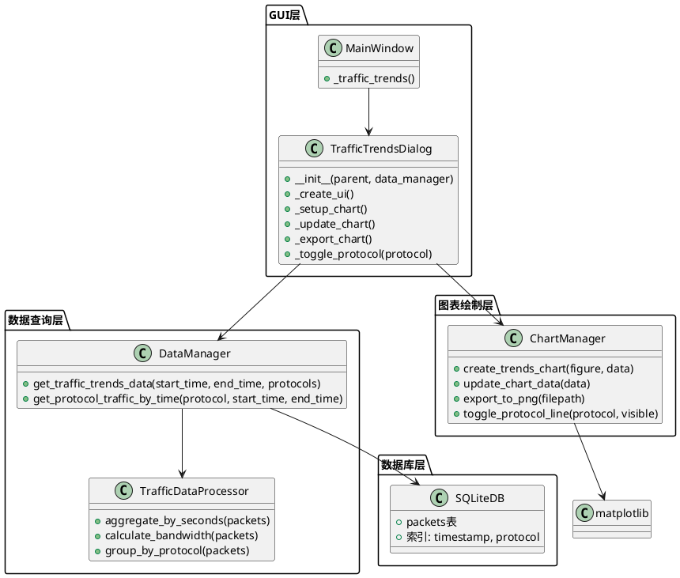
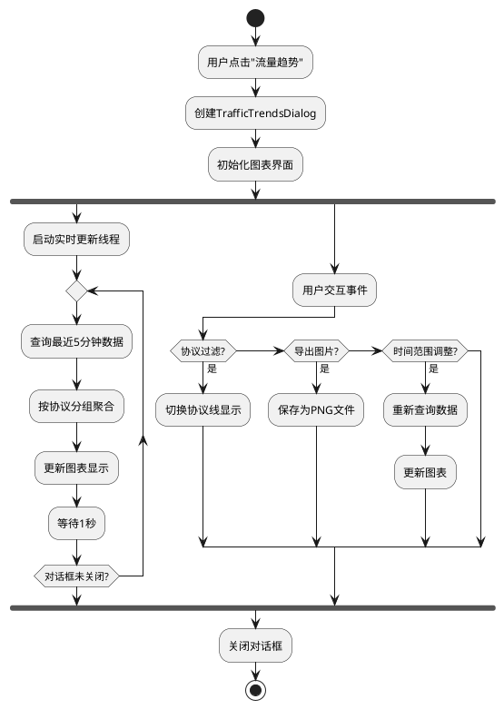
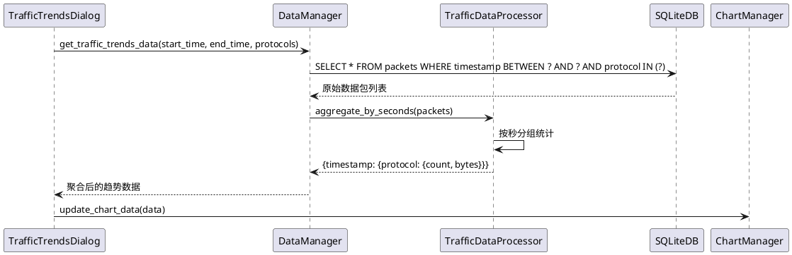
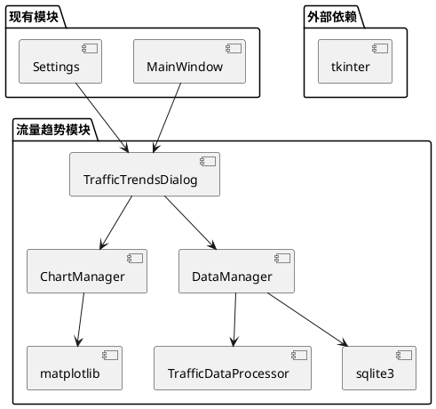
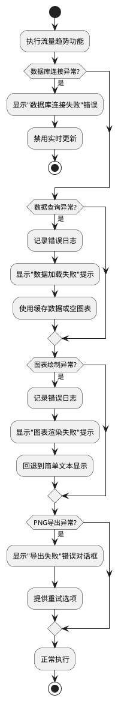

# 流量趋势功能 - 架构设计文档

## 文档信息
- **任务名称**: 流量趋势功能
- **阶段**: Architect (架构阶段)
- **创建时间**: 2025-01-27
- **基于文档**: ALIGNMENT_流量趋势.md

## 1. 整体架构设计

### 1.1 系统架构图



### 1.2 核心组件设计

#### 1.2.1 TrafficTrendsDialog (主对话框)
- **职责**: 用户界面管理、事件处理、实时更新控制
- **继承**: tkinter.Toplevel
- **关键特性**: 
  - 独立窗口，可调整大小
  - 实时更新机制（1秒频率）
  - 协议过滤控制
  - PNG导出功能

#### 1.2.2 DataManager扩展
- **新增方法**: 
  - `get_traffic_trends_data()`: 获取指定时间范围和协议的流量数据
  - `get_protocol_traffic_by_time()`: 按协议分组获取时间序列数据
- **查询优化**: 利用timestamp和protocol索引

#### 1.2.3 ChartManager (图表管理器)
- **职责**: matplotlib图表的创建、更新、导出
- **支持功能**:
  - 多协议趋势线绘制
  - 动态显示/隐藏协议线
  - PNG格式导出
  - 图表样式统一

## 2. 数据流设计

### 2.1 数据流向图



### 2.2 数据查询流程



## 3. 接口契约定义

### 3.1 数据查询接口

```python
# DataManager新增方法
def get_traffic_trends_data(self, start_time: datetime, end_time: datetime, 
                          protocols: List[str] = None) -> Dict[str, Any]:
    """
    获取流量趋势数据
    
    Args:
        start_time: 开始时间
        end_time: 结束时间  
        protocols: 协议列表，None表示所有协议
        
    Returns:
        {
            'timestamps': [datetime, ...],
            'data': {
                'TCP': {'counts': [int, ...], 'bytes': [int, ...]},
                'UDP': {'counts': [int, ...], 'bytes': [int, ...]},
                'ICMP': {'counts': [int, ...], 'bytes': [int, ...]},
                'DNS': {'counts': [int, ...], 'bytes': [int, ...]}
            }
        }
    """
```

### 3.2 图表管理接口

```python
class ChartManager:
    def create_trends_chart(self, figure: Figure, data: Dict) -> None:
        """创建趋势图表"""
        
    def update_chart_data(self, data: Dict) -> None:
        """更新图表数据"""
        
    def export_to_png(self, filepath: str, dpi: int = 300) -> bool:
        """导出为PNG图片"""
        
    def toggle_protocol_line(self, protocol: str, visible: bool) -> None:
        """切换协议线显示状态"""
```

### 3.3 UI事件接口

```python
class TrafficTrendsDialog:
    def _on_protocol_toggle(self, protocol: str) -> None:
        """协议过滤切换事件"""
        
    def _on_export_click(self) -> None:
        """导出按钮点击事件"""
        
    def _on_time_range_change(self, minutes: int) -> None:
        """时间范围调整事件"""
```

## 4. 模块依赖关系

### 4.1 依赖关系图



### 4.2 文件组织结构

```
src/network_analyzer/
├── gui/
│   ├── main_window.py          # 集成流量趋势入口
│   ├── traffic_trends_dialog.py   # 新增：主对话框
│   └── chart_manager.py        # 新增：图表管理器
├── storage/
│   └── data_manager.py         # 扩展：新增查询方法
├── processing/
│   └── traffic_data_processor.py  # 新增：数据处理器
└── utils/
    └── time_utils.py           # 新增：时间处理工具
```

## 5. 异常处理策略

### 5.1 异常分类处理



### 5.2 错误恢复机制

1. **数据查询失败**: 使用上次成功的数据，显示警告
2. **图表渲染失败**: 降级到文本统计显示
3. **实时更新失败**: 暂停自动更新，允许手动刷新
4. **导出失败**: 提供重试和格式选择

## 6. 性能优化设计

### 6.1 查询优化
- **索引利用**: timestamp + protocol复合索引
- **数据分页**: 大数据集分批查询
- **缓存策略**: 缓存最近5分钟的聚合数据

### 6.2 UI响应优化
- **异步更新**: 数据查询在后台线程执行
- **增量更新**: 只更新变化的数据点
- **渲染优化**: 限制图表重绘频率

## 7. 安全考虑

### 7.1 数据安全
- **SQL注入防护**: 使用参数化查询
- **文件路径验证**: 导出路径安全检查
- **内存管理**: 及时释放大数据集

### 7.2 用户体验安全
- **响应超时**: 查询超时保护（5秒）
- **资源限制**: 限制同时打开的趋势窗口数量
- **错误边界**: 异常不影响主程序稳定性

## 8. 质量门控

### 8.1 架构验证清单
- [ ] 架构图清晰准确，模块职责明确
- [ ] 接口定义完整，参数类型明确
- [ ] 与现有系统无冲突，复用现有组件
- [ ] 异常处理策略完善
- [ ] 性能优化方案可行

### 8.2 设计可行性确认
- [ ] matplotlib集成方案验证
- [ ] 数据库查询性能评估
- [ ] 内存使用量预估
- [ ] UI响应时间预期

## 9. 下一步行动

1. **进入Atomize阶段**: 基于此设计拆分具体开发任务
2. **创建TASK文档**: 定义每个子任务的输入输出契约
3. **准备开发环境**: 确认matplotlib版本兼容性
4. **开始编码实现**: 按任务依赖顺序逐步实施