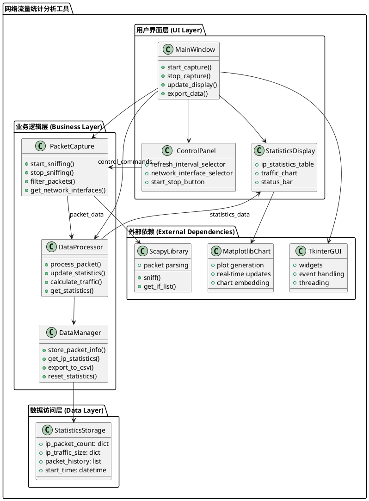
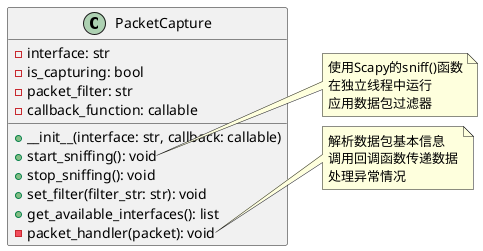
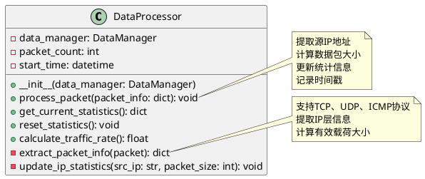
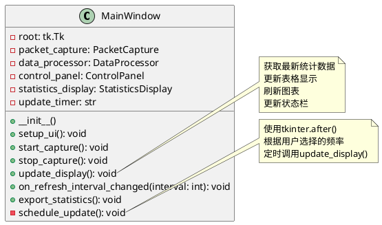
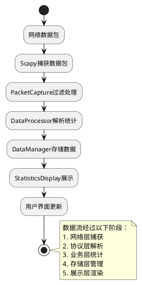
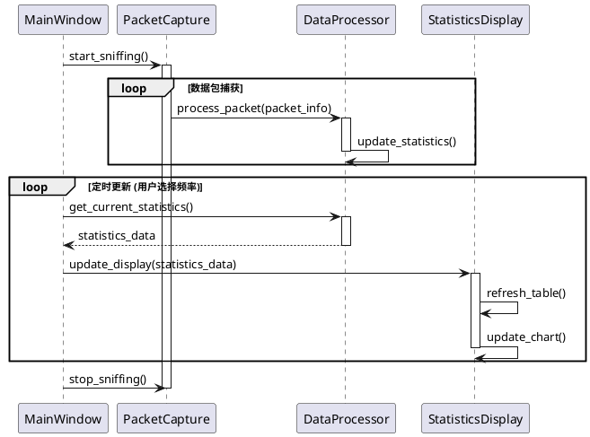
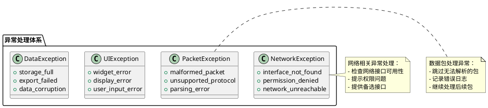

# 网络流量统计分析工具 - 系统架构设计

## 1. 整体架构设计

### 1.1 系统架构图



### 1.2 分层设计说明

#### 用户界面层 (UI Layer)
- **MainWindow**: 主窗口控制器，协调各个UI组件
- **ControlPanel**: 控制面板，包含开始/停止按钮、刷新频率选择等
- **StatisticsDisplay**: 统计数据展示区域，包含表格和图表

#### 业务逻辑层 (Business Layer)
- **PacketCapture**: 数据包捕获模块，封装Scapy抓包功能
- **DataProcessor**: 数据处理模块，解析和统计数据包信息
- **DataManager**: 数据管理模块，负责数据存储和导出

#### 数据访问层 (Data Layer)
- **StatisticsStorage**: 统计数据存储，使用内存数据结构

## 2. 核心模块设计

### 2.1 数据包捕获模块 (PacketCapture)



### 2.2 数据处理模块 (DataProcessor)



### 2.3 用户界面模块 (MainWindow)



## 3. 数据流设计

### 3.1 数据流向图



### 3.2 实时更新机制



## 4. 接口契约定义

### 4.1 数据包信息接口

```python
# 数据包信息数据结构
PacketInfo = {
    'timestamp': datetime,      # 捕获时间戳
    'src_ip': str,             # 源IP地址
    'dst_ip': str,             # 目标IP地址
    'protocol': str,           # 协议类型 (TCP/UDP/ICMP)
    'packet_size': int,        # 数据包大小(字节)
    'src_port': int,           # 源端口(可选)
    'dst_port': int            # 目标端口(可选)
}
```

### 4.2 统计数据接口

```python
# 统计数据结构
StatisticsData = {
    'ip_statistics': {
        'ip_address': {
            'packet_count': int,    # 数据包数量
            'total_bytes': int,     # 总流量字节数
            'protocols': dict,      # 协议分布
            'first_seen': datetime, # 首次出现时间
            'last_seen': datetime   # 最后出现时间
        }
    },
    'global_stats': {
        'total_packets': int,       # 总数据包数
        'total_bytes': int,         # 总流量
        'unique_ips': int,          # 唯一IP数量
        'capture_duration': float,  # 捕获时长(秒)
        'packets_per_second': float # 每秒数据包数
    }
}
```

### 4.3 配置参数接口

```python
# 配置参数结构
ConfigParams = {
    'network_interface': str,       # 网络接口名称
    'packet_filter': str,          # 数据包过滤器
    'refresh_interval': int,       # 刷新间隔(秒)
    'max_ip_entries': int,         # 最大IP条目数
    'enable_export': bool,         # 是否启用导出功能
    'chart_type': str             # 图表类型
}
```

## 5. 异常处理策略

### 5.1 异常分类和处理



### 5.2 错误恢复机制

1. **网络接口错误**: 自动切换到可用接口
2. **权限不足**: 提示用户以管理员身份运行
3. **内存不足**: 实现数据清理和限制机制
4. **UI响应超时**: 在独立线程中处理耗时操作

## 6. 性能优化设计

### 6.1 性能关键点

1. **数据包处理**: 使用异步处理避免阻塞UI
2. **内存管理**: 限制统计数据条目数量
3. **UI更新**: 批量更新减少重绘频率
4. **数据结构**: 使用高效的字典和列表操作

### 6.2 资源限制

- **最大IP条目**: 1000个
- **历史数据保留**: 最近1小时
- **UI更新频率**: 最快1秒
- **内存使用限制**: 100MB

## 7. 扩展性设计

### 7.1 协议扩展接口

```python
class ProtocolParser:
    def can_parse(self, packet) -> bool:
        """判断是否能解析该协议"""
        pass
    
    def parse_packet(self, packet) -> PacketInfo:
        """解析数据包信息"""
        pass
    
    def get_protocol_name(self) -> str:
        """获取协议名称"""
        pass
```

### 7.2 可视化扩展接口

```python
class ChartRenderer:
    def render(self, data: StatisticsData) -> None:
        """渲染图表"""
        pass
    
    def update(self, data: StatisticsData) -> None:
        """更新图表数据"""
        pass
    
    def get_chart_type(self) -> str:
        """获取图表类型"""
        pass
```

---

**文档状态**: 架构设计完成  
**创建时间**: 2024年1月  
**版本**: v1.0  
**下一步**: 进入Atomize阶段，拆分开发任务