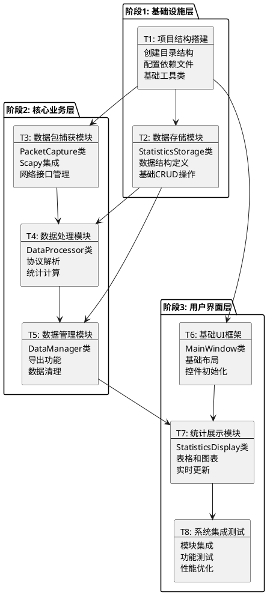

# 网络流量统计分析工具 - 任务拆分文档

## 1. 任务拆分概述

基于系统架构设计，将项目拆分为8个原子任务，按依赖关系分为3个开发阶段。

### 1.1 任务依赖关系图



## 2. 详细任务定义

### 任务T1: 项目结构搭建

#### 输入契约
- **前置依赖**: 无
- **输入数据**: 架构设计文档
- **环境依赖**: Python 3.8+, Windows环境

#### 输出契约
- **输出数据**: 完整的项目目录结构
- **交付物**: 
  - `src/` 源代码目录
  - `requirements.txt` 依赖文件
  - `README.md` 项目说明
  - `config.py` 配置文件
- **验收标准**: 
  - 目录结构符合设计规范
  - 依赖文件包含所有必需库
  - 项目可以正常初始化

#### 实现约束
- **技术栈**: Python, Scapy, Tkinter, Matplotlib
- **接口规范**: 遵循Python PEP8规范
- **质量要求**: 代码结构清晰，注释完整

#### 依赖关系
- **后置任务**: T2, T3, T6
- **并行任务**: 无

---

### 任务T2: 数据存储模块

#### 输入契约
- **前置依赖**: T1完成
- **输入数据**: 数据结构定义
- **环境依赖**: 项目基础结构

#### 输出契约
- **输出数据**: StatisticsStorage类
- **交付物**:
  - `src/storage/statistics_storage.py`
  - 数据结构定义
  - 基础存储操作方法
- **验收标准**:
  - 支持IP统计数据存储
  - 提供数据查询接口
  - 内存使用控制在限制范围内

#### 实现约束
- **技术栈**: Python字典和列表
- **接口规范**: 
  ```python
  class StatisticsStorage:
      def add_packet_info(self, packet_info: dict)
      def get_ip_statistics(self) -> dict
      def reset_statistics(self)
      def get_global_stats(self) -> dict
  ```
- **质量要求**: 线程安全，高效查询

#### 依赖关系
- **前置任务**: T1
- **后置任务**: T4, T5
- **并行任务**: T3, T6

---

### 任务T3: 数据包捕获模块

#### 输入契约
- **前置依赖**: T1完成
- **输入数据**: 网络接口配置
- **环境依赖**: 管理员权限，网络接口可用

#### 输出契约
- **输出数据**: PacketCapture类
- **交付物**:
  - `src/capture/packet_capture.py`
  - 网络接口管理功能
  - 数据包过滤器
- **验收标准**:
  - 能够捕获IP数据包
  - 支持TCP/UDP/ICMP协议
  - 提供开始/停止控制

#### 实现约束
- **技术栈**: Scapy库
- **接口规范**:
  ```python
  class PacketCapture:
      def start_sniffing(self, interface: str, callback: callable)
      def stop_sniffing(self)
      def get_available_interfaces(self) -> list
      def set_packet_filter(self, filter_str: str)
  ```
- **质量要求**: 异步处理，异常处理完善

#### 依赖关系
- **前置任务**: T1
- **后置任务**: T4
- **并行任务**: T2, T6

---

### 任务T4: 数据处理模块

#### 输入契约
- **前置依赖**: T2, T3完成
- **输入数据**: 原始数据包信息
- **环境依赖**: 数据存储模块可用

#### 输出契约
- **输出数据**: DataProcessor类
- **交付物**:
  - `src/processor/data_processor.py`
  - 协议解析器
  - 统计计算逻辑
- **验收标准**:
  - 正确解析TCP/UDP/ICMP包
  - 准确计算流量统计
  - 实时更新统计数据

#### 实现约束
- **技术栈**: Scapy协议解析
- **接口规范**:
  ```python
  class DataProcessor:
      def process_packet(self, packet_info: dict)
      def get_current_statistics(self) -> dict
      def reset_statistics(self)
      def calculate_traffic_rate(self) -> float
  ```
- **质量要求**: 高效处理，准确统计

#### 依赖关系
- **前置任务**: T2, T3
- **后置任务**: T5
- **并行任务**: 无

---

### 任务T5: 数据管理模块

#### 输入契约
- **前置依赖**: T2, T4完成
- **输入数据**: 处理后的统计数据
- **环境依赖**: 文件系统写权限

#### 输出契约
- **输出数据**: DataManager类
- **交付物**:
  - `src/manager/data_manager.py`
  - CSV导出功能
  - 数据清理机制
- **验收标准**:
  - 支持统计数据导出
  - 提供数据重置功能
  - 实现内存管理

#### 实现约束
- **技术栈**: Python CSV库
- **接口规范**:
  ```python
  class DataManager:
      def export_to_csv(self, filename: str)
      def clear_old_data(self, time_limit: int)
      def get_memory_usage(self) -> int
      def optimize_storage(self)
  ```
- **质量要求**: 数据完整性，性能优化

#### 依赖关系
- **前置任务**: T2, T4
- **后置任务**: T7
- **并行任务**: T6

---

### 任务T6: 基础UI框架

#### 输入契约
- **前置依赖**: T1完成
- **输入数据**: UI设计规范
- **环境依赖**: Tkinter库可用

#### 输出契约
- **输出数据**: MainWindow类框架
- **交付物**:
  - `src/ui/main_window.py`
  - 基础窗口布局
  - 控件初始化代码
- **验收标准**:
  - 窗口正常显示
  - 基础控件响应正常
  - 布局符合设计要求

#### 实现约束
- **技术栈**: Tkinter GUI
- **接口规范**:
  ```python
  class MainWindow:
      def __init__(self)
      def setup_ui(self)
      def start_capture(self)
      def stop_capture(self)
      def update_display(self)
  ```
- **质量要求**: 界面美观，响应流畅

#### 依赖关系
- **前置任务**: T1
- **后置任务**: T7
- **并行任务**: T2, T3, T5

---

### 任务T7: 统计展示模块

#### 输入契约
- **前置依赖**: T5, T6完成
- **输入数据**: 统计数据和UI框架
- **环境依赖**: Matplotlib库可用

#### 输出契约
- **输出数据**: StatisticsDisplay类
- **交付物**:
  - `src/ui/statistics_display.py`
  - 数据表格组件
  - 图表绘制组件
- **验收标准**:
  - 表格正确显示统计数据
  - 图表实时更新
  - 刷新频率可配置

#### 实现约束
- **技术栈**: Tkinter + Matplotlib
- **接口规范**:
  ```python
  class StatisticsDisplay:
      def update_table(self, data: dict)
      def update_chart(self, data: dict)
      def set_refresh_interval(self, interval: int)
      def export_chart(self, filename: str)
  ```
- **质量要求**: 数据准确，界面友好

#### 依赖关系
- **前置任务**: T5, T6
- **后置任务**: T8
- **并行任务**: 无

---

### 任务T8: 系统集成测试

#### 输入契约
- **前置依赖**: T7完成
- **输入数据**: 所有模块代码
- **环境依赖**: 完整开发环境

#### 输出契约
- **输出数据**: 完整可运行的系统
- **交付物**:
  - `main.py` 主程序入口
  - 集成测试报告
  - 性能优化报告
- **验收标准**:
  - 所有功能正常工作
  - 性能指标达标
  - 无严重bug

#### 实现约束
- **技术栈**: 完整技术栈
- **接口规范**: 系统级接口
- **质量要求**: 稳定可靠，用户体验良好

#### 依赖关系
- **前置任务**: T7
- **后置任务**: 无
- **并行任务**: 无

## 3. 开发时间估算

| 任务ID | 任务名称 | 预估工时 | 复杂度 | 风险等级 |
|--------|----------|----------|--------|----------|
| T1 | 项目结构搭建 | 2小时 | 低 | 低 |
| T2 | 数据存储模块 | 4小时 | 中 | 低 |
| T3 | 数据包捕获模块 | 6小时 | 高 | 中 |
| T4 | 数据处理模块 | 5小时 | 中 | 中 |
| T5 | 数据管理模块 | 3小时 | 低 | 低 |
| T6 | 基础UI框架 | 4小时 | 中 | 低 |
| T7 | 统计展示模块 | 6小时 | 高 | 中 |
| T8 | 系统集成测试 | 4小时 | 中 | 高 |

**总计**: 34小时 (约4-5个工作日)

## 4. 风险控制措施

### 高风险任务处理
1. **T3 (数据包捕获)**: 
   - 风险: 权限问题、网络接口兼容性
   - 缓解: 提前测试权限，提供接口选择功能

2. **T7 (统计展示)**:
   - 风险: 图表性能、实时更新卡顿
   - 缓解: 实现数据采样，优化更新频率

3. **T8 (系统集成)**:
   - 风险: 模块间接口不匹配
   - 缓解: 严格按照接口规范开发，增量集成

### 质量保证措施
- 每个任务完成后立即进行单元测试
- 关键模块提供详细的错误处理
- 定期进行代码审查和重构

## 5. 下一步行动

1. 进入Approve阶段，审批任务拆分方案
2. 确认开发优先级和资源分配
3. 开始Automate阶段的具体实施

---

**文档状态**: 任务拆分完成  
**创建时间**: 2024年1月  
**版本**: v1.0  
**下一步**: 进入Approve阶段