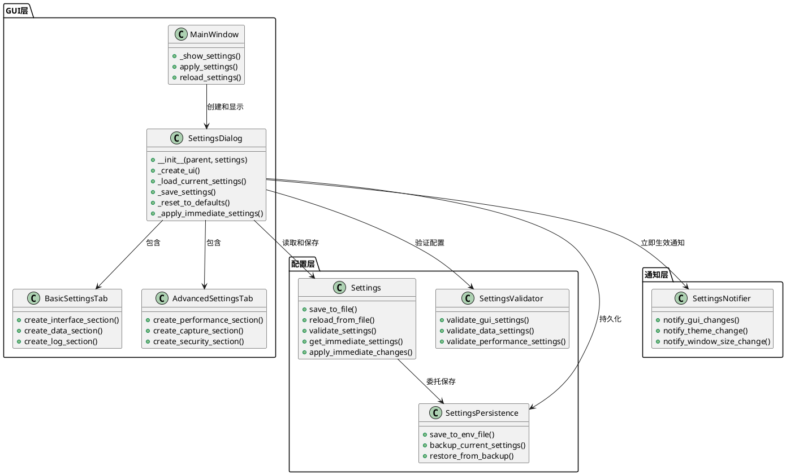
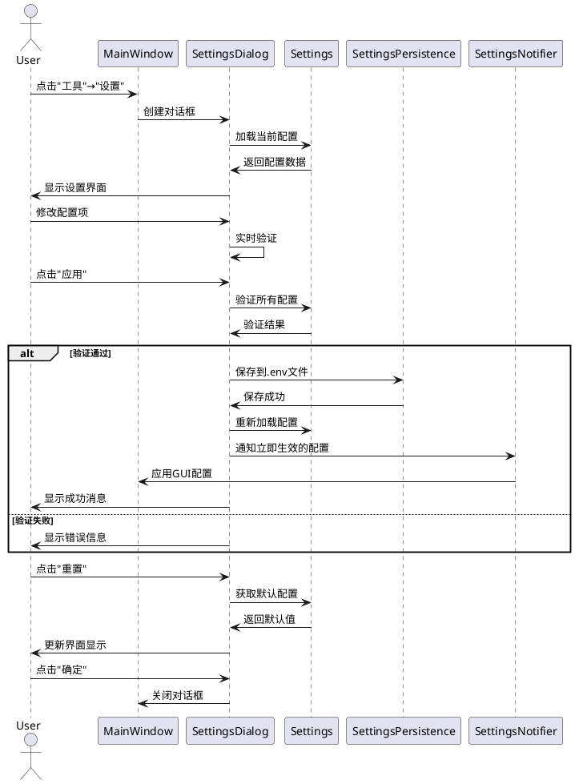
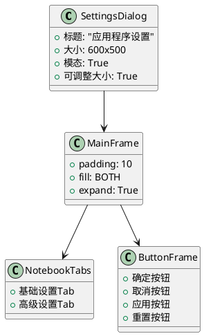
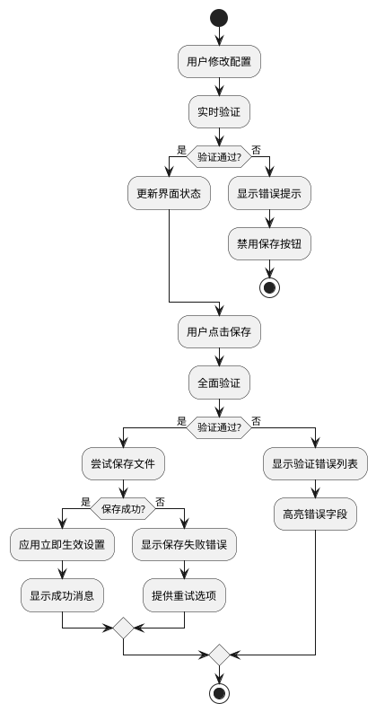

# 设置功能 - 架构设计文档 (DESIGN)

**项目名称：** 网络流量统计分析工具 - 设置功能实现

**创建时间：** 2024年

**负责人：** Claude 4 Sonnet

**设计阶段：** Architect

---

## 1. 整体架构设计

### 1.1 系统架构图



### 1.2 数据流设计



## 2. 核心组件设计

### 2.1 SettingsDialog类设计

```python
class SettingsDialog:
    """设置对话框类"""
    
    def __init__(self, parent: tk.Tk, settings: Settings, main_window: MainWindow):
        """
        初始化设置对话框
        
        Args:
            parent: 父窗口
            settings: 配置管理器
            main_window: 主窗口引用（用于立即生效）
        """
        self.parent = parent
        self.settings = settings
        self.main_window = main_window
        self.dialog = None
        self.result = None
        
        # 配置变量
        self.config_vars = {}
        self.original_values = {}
        
        # 组件引用
        self.notebook = None
        self.basic_tab = None
        self.advanced_tab = None
    
    def show(self) -> bool:
        """显示设置对话框"""
        pass
    
    def _create_ui(self) -> None:
        """创建用户界面"""
        pass
    
    def _create_basic_tab(self, notebook: ttk.Notebook) -> None:
        """创建基础设置选项卡"""
        pass
    
    def _create_advanced_tab(self, notebook: ttk.Notebook) -> None:
        """创建高级设置选项卡"""
        pass
    
    def _load_current_settings(self) -> None:
        """加载当前配置到界面"""
        pass
    
    def _validate_settings(self) -> Tuple[bool, str]:
        """验证所有设置"""
        pass
    
    def _save_settings(self) -> bool:
        """保存设置到文件"""
        pass
    
    def _apply_immediate_settings(self) -> None:
        """应用立即生效的设置"""
        pass
    
    def _reset_to_defaults(self) -> None:
        """重置到默认值"""
        pass
```

### 2.2 Settings类扩展设计

```python
class Settings:
    """扩展现有Settings类"""
    
    def save_to_file(self, file_path: Optional[str] = None) -> bool:
        """
        保存配置到.env文件
        
        Args:
            file_path: 可选的文件路径，默认使用self.env_file
            
        Returns:
            bool: 保存是否成功
        """
        pass
    
    def get_immediate_settings(self) -> Dict[str, Any]:
        """
        获取需要立即生效的配置项
        
        Returns:
            Dict: 立即生效的配置字典
        """
        return {
            'WINDOW_WIDTH': self.WINDOW_WIDTH,
            'WINDOW_HEIGHT': self.WINDOW_HEIGHT,
            'THEME': self.THEME,
        }
    
    def get_restart_required_settings(self) -> Dict[str, Any]:
        """
        获取需要重启才能生效的配置项
        
        Returns:
            Dict: 需要重启的配置字典
        """
        return {
            'DATABASE_PATH': self.DATABASE_PATH,
            'LOG_FILE': self.LOG_FILE,
            'LOG_LEVEL': self.LOG_LEVEL,
            'BUFFER_SIZE': self.BUFFER_SIZE,
            'WORKER_THREADS': self.WORKER_THREADS,
        }
    
    def create_backup(self) -> str:
        """创建配置备份"""
        pass
    
    def restore_from_backup(self, backup_path: str) -> bool:
        """从备份恢复配置"""
        pass
```

## 3. 用户界面设计

### 3.1 设置对话框布局



### 3.2 基础设置选项卡设计

#### 界面设置组
- **窗口大小**
  - 宽度: IntVar (800-1920)
  - 高度: IntVar (600-1080)
  - 预设选择: Combobox (1200x800, 1400x900, 1600x1000)

- **主题设置**
  - 主题选择: Combobox (default, clam, alt, classic)
  - 字体大小: Scale (8-16)

#### 数据管理组
- **数据保存**
  - 数据目录: Entry + Browse按钮
  - 数据库路径: Entry + Browse按钮
  - 自动清理: Checkbutton

- **数据保留**
  - 保留天数: Spinbox (1-365)
  - 最大数据包数: Spinbox (1000-100000)

#### 日志设置组
- **日志级别**: Combobox (DEBUG, INFO, WARNING, ERROR)
- **日志文件**: Entry + Browse按钮
- **日志大小限制**: Spinbox (1-100 MB)
- **备份文件数**: Spinbox (1-10)

### 3.3 高级设置选项卡设计

#### 性能设置组
- **缓冲区大小**: Spinbox (32KB-1MB)
- **工作线程数**: Spinbox (1-16)
- **更新频率**: Scale (0.5-5秒)

#### 捕获设置组
- **默认网络接口**: Combobox
- **默认过滤器**: Entry
- **混杂模式**: Checkbutton
- **捕获超时**: Spinbox (1-300秒)

#### 安全设置组
- **需要管理员权限**: Checkbutton
- **启用性能分析**: Checkbutton
- **调试模式**: Checkbutton

## 4. 配置持久化设计

### 4.1 .env文件格式

```env
# 应用程序基本信息
APP_NAME=网络流量统计
VERSION=0.1.0

# GUI配置
WINDOW_WIDTH=1200
WINDOW_HEIGHT=800
THEME=default

# 数据存储配置
DATA_DIRECTORY=data
DATABASE_PATH=data/network_analyzer.db
DATA_RETENTION_DAYS=30
AUTO_CLEANUP=true

# 日志配置
LOG_LEVEL=INFO
LOG_FILE=logs/network_analyzer.log
LOG_MAX_SIZE=10485760
LOG_BACKUP_COUNT=5

# 性能配置
BUFFER_SIZE=65536
WORKER_THREADS=4

# 安全配置
ENABLE_PROMISCUOUS_MODE=false
REQUIRE_ADMIN=true
DEBUG=false
```

### 4.2 配置保存策略

1. **备份机制**: 保存前创建.env.backup文件
2. **原子操作**: 先写入临时文件，再重命名
3. **错误恢复**: 保存失败时自动恢复备份
4. **格式保持**: 保持注释和分组结构

## 5. 立即生效机制设计

### 5.1 SettingsNotifier类

```python
class SettingsNotifier:
    """设置变更通知器"""
    
    def __init__(self, main_window: MainWindow):
        self.main_window = main_window
        self.callbacks = {}
    
    def register_callback(self, setting_name: str, callback: Callable):
        """注册配置变更回调"""
        pass
    
    def notify_change(self, setting_name: str, old_value: Any, new_value: Any):
        """通知配置变更"""
        pass
    
    def apply_gui_settings(self, settings: Dict[str, Any]):
        """应用GUI相关设置"""
        if 'WINDOW_WIDTH' in settings or 'WINDOW_HEIGHT' in settings:
            self._apply_window_size(settings)
        
        if 'THEME' in settings:
            self._apply_theme(settings['THEME'])
    
    def _apply_window_size(self, settings: Dict[str, Any]):
        """应用窗口大小设置"""
        pass
    
    def _apply_theme(self, theme: str):
        """应用主题设置"""
        pass
```

### 5.2 立即生效配置项

- **立即生效**:
  - 窗口大小 (WINDOW_WIDTH, WINDOW_HEIGHT)
  - 主题 (THEME)
  - 字体大小
  - 界面更新频率

- **重启生效**:
  - 数据库路径
  - 日志配置
  - 性能参数
  - 安全设置

## 6. 验证机制设计

### 6.1 配置验证规则

```python
class SettingsValidator:
    """配置验证器"""
    
    VALIDATION_RULES = {
        'WINDOW_WIDTH': {
            'type': int,
            'min': 800,
            'max': 1920,
            'message': '窗口宽度必须在800-1920之间'
        },
        'WINDOW_HEIGHT': {
            'type': int,
            'min': 600,
            'max': 1080,
            'message': '窗口高度必须在600-1080之间'
        },
        'DATA_RETENTION_DAYS': {
            'type': int,
            'min': 1,
            'max': 365,
            'message': '数据保留天数必须在1-365之间'
        },
        'LOG_LEVEL': {
            'type': str,
            'choices': ['DEBUG', 'INFO', 'WARNING', 'ERROR'],
            'message': '日志级别必须是DEBUG、INFO、WARNING或ERROR之一'
        }
    }
    
    def validate_setting(self, key: str, value: Any) -> Tuple[bool, str]:
        """验证单个配置项"""
        pass
    
    def validate_all(self, settings: Dict[str, Any]) -> Tuple[bool, List[str]]:
        """验证所有配置项"""
        pass
```

### 6.2 实时验证机制

- **输入验证**: 用户输入时实时验证格式
- **范围验证**: 数值类型检查范围限制
- **依赖验证**: 检查配置项之间的依赖关系
- **路径验证**: 验证文件和目录路径的有效性

## 7. 错误处理策略

### 7.1 错误分类

1. **输入错误**: 用户输入格式不正确
2. **验证错误**: 配置值不符合规则
3. **保存错误**: 文件写入失败
4. **权限错误**: 没有文件写入权限

### 7.2 错误处理流程



## 8. 集成接口设计

### 8.1 MainWindow集成

```python
class MainWindow:
    """主窗口类扩展"""
    
    def _show_settings(self) -> None:
        """显示设置对话框"""
        dialog = SettingsDialog(self.root, self.settings, self)
        if dialog.show():
            # 设置已保存，重新加载配置
            self.reload_settings()
    
    def reload_settings(self) -> None:
        """重新加载设置"""
        # 重新创建Settings实例
        self.settings = Settings(self.settings.env_file)
        
        # 应用立即生效的设置
        self._apply_immediate_settings()
    
    def _apply_immediate_settings(self) -> None:
        """应用立即生效的设置"""
        # 应用窗口大小
        self.root.geometry(f"{self.settings.WINDOW_WIDTH}x{self.settings.WINDOW_HEIGHT}")
        
        # 应用主题（如果支持）
        if hasattr(self, 'style'):
            self.style.theme_use(self.settings.THEME)
```

### 8.2 Settings类集成

```python
class Settings:
    """Settings类扩展方法"""
    
    def save_to_file(self, file_path: Optional[str] = None) -> bool:
        """保存配置到.env文件"""
        target_file = file_path or self.env_file
        
        try:
            # 创建备份
            backup_file = f"{target_file}.backup"
            if Path(target_file).exists():
                shutil.copy2(target_file, backup_file)
            
            # 生成配置内容
            config_content = self._generate_env_content()
            
            # 原子写入
            temp_file = f"{target_file}.tmp"
            with open(temp_file, 'w', encoding='utf-8') as f:
                f.write(config_content)
            
            # 重命名为目标文件
            os.rename(temp_file, target_file)
            
            return True
            
        except Exception as e:
            # 恢复备份
            if Path(backup_file).exists():
                shutil.copy2(backup_file, target_file)
            raise e
    
    def _generate_env_content(self) -> str:
        """生成.env文件内容"""
        pass
```

## 9. 测试策略

### 9.1 单元测试

- **SettingsDialog测试**: 界面创建、配置加载、保存功能
- **Settings扩展测试**: 文件保存、备份恢复、验证功能
- **SettingsValidator测试**: 各种验证规则
- **SettingsNotifier测试**: 立即生效机制

### 9.2 集成测试

- **完整流程测试**: 打开设置→修改→保存→生效
- **错误处理测试**: 各种错误情况的处理
- **备份恢复测试**: 保存失败时的恢复机制
- **立即生效测试**: GUI配置的实时应用

## 10. 性能考虑

### 10.1 优化策略

- **延迟加载**: 设置对话框按需创建
- **批量更新**: 多个配置项一次性保存
- **缓存机制**: 缓存验证结果
- **异步保存**: 大文件保存使用异步操作

### 10.2 内存管理

- **对话框销毁**: 关闭后及时释放资源
- **变量清理**: 及时清理临时变量
- **事件解绑**: 销毁时解绑所有事件

---

**设计状态**: ✅ 架构设计完成
**下一阶段**: Atomize - 任务原子化
**预估复杂度**: 中等（涉及GUI、文件操作、配置管理）