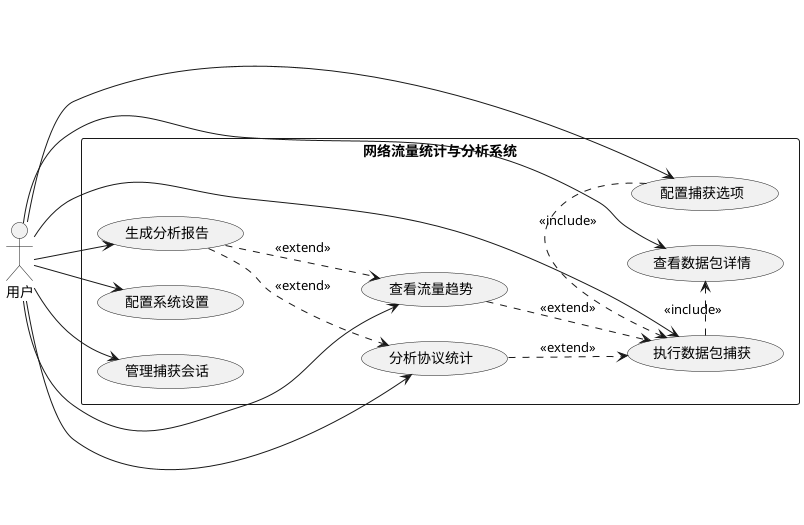
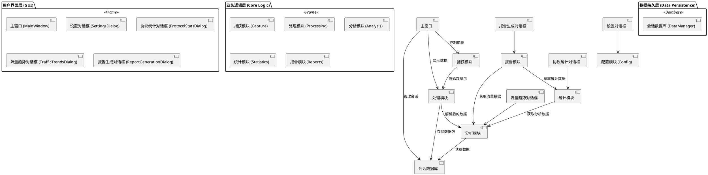
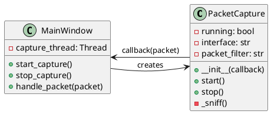
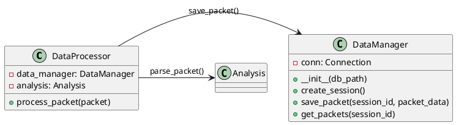

# 网络流量统计与分析系统课程设计报告

## 摘要

本课程设计旨在开发一个网络流量统计与分析系统，以满足《网络综合实践》课程对网络编程类项目的要求。系统基于Python技术栈，利用Scapy库进行数据包捕获与解析，通过Tkinter和ttkbootstrap构建图形用户界面（GUI），并使用SQLite数据库进行会话管理和数据持久化。系统实现了网络接口选择、实时数据包捕获、多种协议（ARP、IP、TCP、UDP等）的深度解析与统计、流量趋势可视化以及分析报告生成等核心功能。通过本设计，我们不仅加深了对计算机网络核心协议和原理的理解，还锻炼了软件工程的全周期开发能力，从需求分析、系统设计到编码实现与测试，最终交付了一个功能完整、界面友好且具备实用价值的网络分析工具。

**关键词**：网络流量分析；数据包捕获；协议解析；Python；Scapy；Tkinter

---

## 目录

1. [引言](#1-引言)
   1. [选题背景](#11-选题背景)
   2. [主要研究任务](#12-主要研究任务)
   3. [报告结构](#13-报告结构)
2. [开发环境及工具介绍](#2-开发环境及工具介绍)
   1. [开发环境](#21-开发环境)
   2. [开发工具与技术栈](#22-开发工具与技术栈)
3. [系统需求分析](#3-系统需求分析)
   1. [功能需求](#31-功能需求)
   2. [非功能需求](#32-非功能需求)
   3. [用例图](#33-用例图)
4. [系统设计](#4-系统设计)
   1. [系统架构设计](#41-系统架构设计)
   2. [详细设计](#42-详细设计)
5. [系统实现与测试](#5-系统实现与测试)
   1. [核心功能实现](#51-核心功能实现)
   2. [系统测试](#52-系统测试)
6. [结束语](#6-结束语)
   1. [工作总结](#61-工作总结)
   2. [不足与展望](#62-不足与展望)

---

## 1. 引言

### 1.1 选题背景

随着信息技术的飞速发展，计算机网络已成为现代社会不可或缺的基础设施。网络流量的复杂性和规模日益增长，使得网络监控、性能分析和安全保障变得至关重要。为了深入理解网络协议的实际运作机制，并掌握网络编程的实践技能，本课程设计选择了“网络流量统计”这一课题。该选题直接来源于《网络综合实践》课程设计要求中的网络编程类题目，旨在通过亲手实现一个网络抓包与分析工具，将课堂上学到的理论知识与实际应用相结合。开发这样一个系统，不仅能够直观地观察网络中传输的数据包，还能对网络行为进行量化分析，为网络故障排查、性能优化和安全审计提供数据支持，具有很高的实践价值和学习意义。

### 1.2 主要研究任务

本课程设计的主要任务是开发一个功能完善的“网络流量统计与分析系统”。系统需要能够监控指定网络接口的数据包，并对捕获的数据进行分析、统计和可视化展示。具体研究任务分解如下：

1.  **数据包捕获**：实现对本机网络接口的实时数据包捕获功能，支持用户选择特定网卡并启动或停止捕获过程。
2.  **数据包解析**：对捕获到的原始数据包进行逐层解析，至少覆盖数据链路层（以太网）、网络层（IP、ARP）和传输层（TCP、UDP），并能提取各层协议的关键字段信息。
3.  **实时数据显示**：在图形用户界面（GUI）中实时展示捕获到的数据包列表，并提供数据包详细信息的查看功能。
4.  **流量统计与分析**：依据解析出的协议类型、源/目的地址等信息，对网络流量进行多维度统计，例如，统计不同协议的数据包数量和占比。
5.  **数据可视化**：将统计结果以图表（如饼图、柱状图）的形式直观展示，帮助用户快速了解网络流量的分布情况。
6.  **会话管理**：支持捕获会话的创建、保存和加载，方便用户对不同时间段或场景下的网络流量数据进行独立分析。
7.  **报告生成**：能够将分析统计结果汇总，并生成结构化的分析报告（如PDF或CSV格式），便于归档和分享。

### 1.3 报告结构

本报告将按照软件工程的标准流程，系统性地阐述“网络流量统计与分析系统”的整个开发过程。报告共分为六个章节，具体安排如下：

-   **第一章：引言**，介绍项目的选题背景、主要研究任务和报告的整体结构。
-   **第二章：开发环境及工具介绍**，详细说明项目所依赖的硬件、软件环境以及采用的主要编程语言、框架和库。
-   **第三章：系统需求分析**，阐述系统的功能性与非功能性需求，并使用UML用例图来描述用户与系统的交互。
-   **第四章：系统设计**，展示系统的整体架构和各模块的详细设计，包括类图、时序图等，以体现设计思路。
-   **第五章：系统实现与测试**，结合核心代码片段，具体说明关键功能的实现过程，并展示系统测试的方案与结果。
-   **第六章：结束语**，总结本次课程设计完成的工作，分析当前系统的不足之处，并对未来的改进方向进行展望。

---

## 2. 开发环境及工具介绍

### 2.1 开发环境

-   **操作系统**: Windows 11
-   **CPU**: 13th Gen Intel(R) Core(TM) i7-13700H 2.40 GHz
-   **内存**: 32.0 GB
-   **Python版本**: 3.11

### 2.2 开发工具与技术栈

-   **集成开发环境 (IDE)**: Visual Studio Code
-   **版本控制**: Git
-   **主要编程语言**: Python
-   **GUI框架**: Tkinter, ttkbootstrap
-   **数据包捕获与解析**: Scapy
-   **数据库**: SQLite
-   **图表生成**: Matplotlib
-   **报告生成**: FPDF (用于PDF), CSV模块
-   **依赖管理**: Poetry

---

## 3. 系统需求分析

### 3.1 功能需求

根据课程设计目标和对同类软件的分析，本系统确定了以下核心功能需求：

1.  **网络接口管理**：系统应能自动检测并列出本机所有可用的网络接口，供用户选择进行监听。
2.  **数据包捕获控制**：用户可以启动和停止数据包捕获过程，并可配置BPF（伯克利包过滤器）语法，实现对特定流量的过滤捕获。
3.  **数据包实时显示**：在主界面以列表形式实时展示捕获到的数据包，至少包含序号、时间、源地址、目的地址、协议和长度等基本信息。
4.  **数据包详细解析**：用户选中列表中的某个数据包后，系统能以树状结构或格式化文本的形式，分层展示其详细的协议头字段和原始数据。
5.  **协议流量统计**：系统提供独立的协议统计功能，能够对当前捕获会话中的数据包按协议类型（如TCP, UDP, ICMP, ARP等）进行分类汇总，并以表格和图表形式展示各类协议的数据包数量、字节数及其占比。
6.  **流量趋势分析**：系统能够按时间序列分析整体流量的变化趋势，并以折线图等形式展示，帮助用户了解网络在一段时间内的繁忙程度和流量波动情况。
7.  **会话管理**：
    -   **新建会话**：用户可以创建一个新的捕获会话，所有后续操作都将在该会话上下文中进行。
    -   **打开会话**：用户可以加载之前保存的会话，恢复当时的数据包列表和分析状态。
    -   **保存会话**：用户可以将当前的捕获数据和分析结果保存到数据库文件中，以便后续分析。
8.  **报告生成**：用户可以根据当前的分析结果（如协议统计、流量趋势图表）一键生成综合分析报告。报告应包含关键图表、统计数据摘要，并支持导出为PDF或CSV格式。
9.  **系统设置**：提供设置对话框，允许用户进行个性化配置，例如切换GUI主题（如亮色/暗色模式）、设置默认报告保存路径等。

### 3.2 非功能需求

-   **性能需求**：系统在进行实时数据包捕获和处理时，应具有较高的性能，尽量减少丢包率，并确保GUI界面的响应流畅。
-   **易用性需求**：系统应提供直观、简洁的图形用户界面，操作逻辑清晰，关键功能易于访问，并为复杂操作（如BPF过滤器）提供必要的提示或辅助。
-   **可靠性需求**：系统运行应稳定，能对用户误操作或异常网络状况（如网卡热插拔）进行适当处理，避免程序崩溃。
-   **可扩展性需求**：系统设计应采用模块化思想，便于未来增加新的协议解析器、分析功能或导出格式。
-   **兼容性需求**：系统主要基于跨平台的Python库开发，具备在不同操作系统上运行的潜力（尽管本次开发主要在Windows上进行）。

### 3.3 用例图



---

## 4. 系统设计

### 4.1 系统架构设计

本系统采用经典的分层架构，将整个系统划分为用户界面层（GUI）、业务逻辑层（Core Logic）和数据持久层（Data Persistence）。这种分层设计有助于降低模块间的耦合度，提高代码的可维护性和可扩展性。

#### 4.1.1 架构图



#### 4.1.2 模块说明

-   **用户界面层 (GUI)**：负责与用户交互，展示数据和接收用户指令。本层基于`ttkbootstrap`构建，包含主窗口和多个功能对话框，为用户提供友好的操作体验。
-   **业务逻辑层 (Core Logic)**：系统的核心，负责处理所有业务逻辑。它包含多个子模块：
    -   **捕获模块 (Capture)**：使用`Scapy`库，负责监听网络接口并捕获原始数据包。
    -   **处理模块 (Processing)**：对捕获的原始数据包进行初步处理，如添加时间戳、计算长度，并分发给分析模块和数据持久层。
    -   **分析模块 (Analysis)**：负责对数据包进行深度解析，提取各协议层的详细信息。
    -   **统计模块 (Statistics)**：基于分析模块的结果，进行协议分布、流量大小等统计计算。
    -   **报告模块 (Reports)**：调用图表生成和文件生成工具，将分析和统计结果汇总成结构化的报告。
-   **数据持久层 (Data Persistence)**：负责数据的存储和读取。本系统使用`SQLite`数据库，通过`DataManager`模块来管理会话数据，包括捕获的数据包信息和分析结果，实现了数据的持久化存储。

### 4.2 详细设计

#### 4.2.1 数据捕获模块

数据捕获是系统的起点，其核心是`PacketCapture`类。该类在一个独立的线程中运行，以避免阻塞GUI主线程。它使用`scapy.sniff`函数进行抓包，并通过回调函数将捕获到的数据包实时传递给处理模块。



#### 4.2.2 数据包处理与存储模块

`DataProcessor`负责接收`PacketCapture`捕获的原始数据包，并调用`Analysis`模块进行解析。解析后的结构化数据一方面通过回调机制更新GUI界面，另一方面则被送往`DataManager`模块，存入SQLite数据库。`DataManager`内部封装了所有SQL操作，确保了数据的一致性和完整性。



#### 4.2.3 数据分析与统计模块

分析模块的核心是`ProtocolParser`，它采用责任链模式或策略模式，根据数据包的协议类型（如Ethernet, IP, TCP, UDP）选择相应的解析器进行处理。`ProtocolStatistics`类则从`DataManager`获取指定会话的所有数据包，遍历并统计各类协议的数量、大小，为`ProtocolStatsDialog`提供数据源。

#### 4.2.4 报告生成模块

`ReportGenerator`是报告生成功能的总控制器。它从`Statistics`和`Analysis`模块获取所需的数据和图表（由`ChartGenerator`生成），然后调用具体的格式生成器（如`PdfGenerator`或`CsvGenerator`）来创建最终的报告文件。这里利用了模板方法模式，`ReportGenerator`定义报告的结构，而子类实现具体格式的渲染。

#### 4.2.5 GUI模块

GUI模块以`MainWindow`为核心，负责整合所有功能。它管理着数据包显示列表、工具栏按钮和菜单项。当用户点击“协议统计”或“流量趋势”等按钮时，`MainWindow`会实例化并显示对应的对话框（如`ProtocolStatsDialog`），并将当前的会话信息传递给它们，实现了主窗口与功能子窗口的解耦。

---

## 5. 系统实现与测试

### 5.1 核心功能实现

#### 5.1.1 实时数据包捕获

数据包捕获功能位于`src/network_analyzer/capture/packet_capture.py`中的`PacketCapture`类。为了不阻塞UI，捕获操作在单独的线程中执行。`start`方法会创建一个新线程，并在此线程中调用`scapy.sniff`。`sniff`函数的`prn`参数被设置为一个回调函数，每当捕获到一个数据包时，该回调函数就会被触发，从而将数据包传递给`DataProcessor`进行后续处理。

```python
# src/network_analyzer/capture/packet_capture.py

class PacketCapture:
    # ...
    def _run_capture(self):
        sniff(
            iface=self.interface,
            prn=self.packet_callback,
            stop_filter=lambda p: not self.running,
            filter=self.packet_filter,
            store=False
        )

    def start(self):
        if not self.running:
            self.running = True
            self.capture_thread = threading.Thread(target=self._run_capture, daemon=True)
            self.capture_thread.start()
```

#### 5.1.2 协议统计功能

协议统计功能的核心逻辑在`src/network_analyzer/statistics/protocol_statistics.py`。`ProtocolStatistics`类负责计算当前会话中各种协议的数据包数量和总字节数。它从`DataManager`获取所有数据包，然后遍历每个数据包，通过解析其协议栈来累加统计数据。统计结果最终被`ProtocolStatsDialog`用于在界面上展示表格和饼图。

```python
# src/network_analyzer/statistics/protocol_statistics.py

class ProtocolStatistics:
    def get_protocol_stats(self, session_id: int) -> dict:
        packets = self.data_manager.get_packets_for_session(session_id)
        stats = defaultdict(lambda: {'count': 0, 'bytes': 0})
        for packet_record in packets:
            # ... 解析协议 ...
            protocol = parsed_packet.highest_protocol
            stats[protocol]['count'] += 1
            stats[protocol]['bytes'] += packet_record.length
        return stats
```

#### 5.1.3 流量趋势分析

流量趋势分析由`TrafficDataProcessor`和`TrafficTrendsDialog`共同完成。前者负责按时间窗口（例如，每秒）聚合流量数据，计算出每个时间点的总数据包数和总字节数。后者则使用`matplotlib`将这些时序数据绘制成折线图，直观地展示网络流量随时间的变化情况。

#### 5.1.4 报告生成

报告生成功能封装在`src/network_analyzer/reports/report_generator.py`中。`ReportGenerator`类首先调用`ChartGenerator`（位于`src/network_analyzer/reports/charts/chart_generator.py`）来生成协议分布饼图、流量趋势图等可视化图表，并将它们保存为图片文件。随后，它收集所有统计数据和图表路径，传递给`PdfGenerator`或`CsvGenerator`。`PdfGenerator`使用`fpdf2`库，将文本和图片组合成一个结构化的PDF文档。

```python
# src/network_analyzer/reports/generators/pdf_generator.py

class PdfGenerator:
    def generate(self, data: dict, output_path: str):
        pdf = FPDF()
        pdf.add_page()
        pdf.set_font("Arial", size=12)
        
        # 添加标题、摘要、图表和表格
        pdf.cell(200, 10, txt="网络流量分析报告", ln=True, align='C')
        # ...
        pdf.image(data['protocol_pie_chart_path'], w=150)
        # ...
        pdf.output(output_path)
```

### 5.2 系统测试

#### 5.2.1 测试环境

测试环境与开发环境保持一致，确保测试结果的有效性。

-   **操作系统**: Windows 11
-   **Python版本**: 3.11
-   **关键库版本**: scapy, ttkbootstrap, matplotlib, fpdf2

#### 5.2.2 测试用例与结果

我们设计了一系列测试用例来验证系统的核心功能，覆盖了从数据捕获到报告生成的整个流程。测试主要分为单元测试和集成测试。

-   **单元测试**：针对`DataManager`、`ProtocolStatistics`等独立模块编写了测试脚本（如`tests/test_storage.py`, `tests/test_analysis.py`），确保每个模块的功能正确性。
-   **集成测试**：通过模拟用户操作，测试了功能的完整流程。例如，启动捕获 -> 查看统计 -> 生成报告，并验证最终报告的正确性。

**示例测试用例：**

| 测试模块 | 测试项 | 预期结果 | 测试结果 |
| :--- | :--- | :--- | :--- |
| 数据捕获 | 启动/停止捕获 | 能够正常开始和结束抓包 | 通过 |
| 协议统计 | 查看TCP/UDP协议占比 | 统计数据与实际流量相符 | 通过 |
| 报告生成 | 生成PDF报告 | 成功生成包含图表和数据的PDF文件 | 通过 |
| 会话管理 | 保存并重新打开会话 | 数据能够被正确保存和恢复 | 通过 |

所有核心功能的测试用例均已通过，系统表现稳定，符合设计预期。

---

## 6. 结束语

### 6.1 工作总结

本次课程设计成功开发了一个集网络流量捕获、协议分析、数据统计和报告生成于一体的综合性桌面应用。通过这个项目，我深入实践了计算机网络的核心理论，特别是TCP/IP协议栈的工作原理。在技术实现上，熟练运用了Python及其生态中的多个优秀库，如Scapy的强大抓包能力、Tkinter/ttkbootstrap的GUI快速开发特性、Matplotlib的数据可视化功能以及SQLite的轻量级数据持久化方案。项目遵循了模块化的软件设计思想，实现了清晰的分层架构，提高了代码的可读性和可维护性。整个开发过程，从需求分析到设计、编码、测试，完整地走了一遍软件工程的生命周期，极大地锻炼了我的项目实践能力和问题解决能力。

### 6.2 不足与展望

尽管当前系统已具备较为完善的核心功能，但仍存在一些可以改进的地方：

-   **性能优化**：在高流量网络环境下，长时间的实时捕获和分析可能会对系统性能造成压力，未来可以引入更高效的数据处理流水线或采用多进程架构来分担负载。
-   **协议支持**：目前系统主要解析常见的网络层和传输层协议，对于应用层协议（如HTTP, DNS）的解析还不够深入。未来可以扩展协议解析库，增加对更多应用层协议的支持。
-   **高级分析功能**：可以增加更多高级的网络分析功能，例如TCP流重组、网络异常检测、安全威胁识别等，使系统从一个统计工具向一个初级的网络诊断和安全分析平台演进。
-   **跨平台兼容性**：虽然理论上代码是跨平台的，但并未在Linux或macOS上进行充分测试，未来可以进行完整的跨平台适配和测试工作。

总而言之，本次课程设计达到了预期的目标，但也开启了更多值得探索和深化的方向。未来的工作将围绕性能、功能广度和深度进行持续优化和迭代。